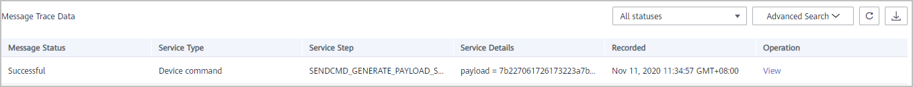
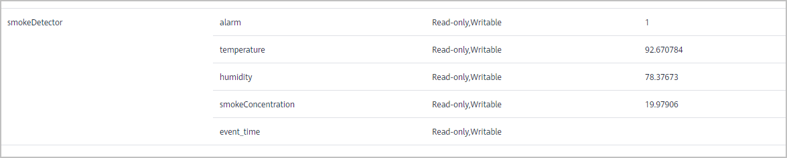
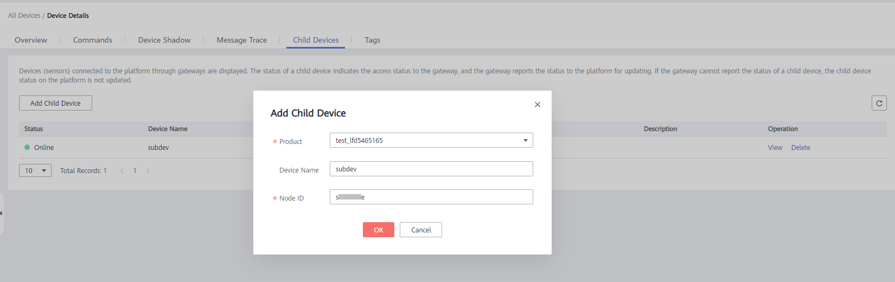
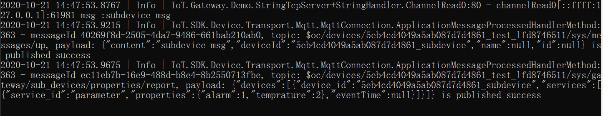

English | [简体中文](README_CN.md)

# iot-device-sdk-cSharp Development Guide

# Contents

<!-- TOC -->

- [Version Updates](#0)

- [About This Document](#1)

- [SDK Overview](#2)

- [Preparations](#3)

- [Uploading a Product Model and Registering a Device](#4)

- [Initializing a Device](#5)

- [Reporting Properties](#6)

- [Reporting a Message](#7)

- [Reading/Writing Properties](#8)

- [Delivering a Command](#9)

- [Using a Device Shadow](#10)

- [Performing an OTA Upgrade](#11)

- [Synchronizing Device Time](#12)

- [Object-Oriented Programming](#13)

- [Developing a Gateway](#14)

- [Open-Source Protocols](#15)

  <!-- /TOC -->

<h1 id="0">Version Updates</h1>


| Version | Change Type | Function Description                                                 |
| ------ | -------- | ------------------------------------------------------------ |
| 1.3.1 | bug fix              | fix problems such as null pointer exception, unreleased MQTT object                                                                       |
| 1.3.0  | New Function   | Software and firmware packages can be upgraded by OBS                 |
| 1.2.0  | New Function | Generic protocol function added |
| 1.1.1  | Function Enhancement   | Subdevices can be deleted from gateways and descriptions in both Chinese and English are improved.                                  |
| 1.1.0  | New Function | The gateway and product model functions are added |
| 1.0.0  | Publishment | Provides basic device access capabilities. The SDK is preconfigured with device access addresses and Huawei IoT platform CA certificates. |

<h1 id="1">About This Document</h1>
This document uses an example to describe how to use iot-device-sdk-cSharp (SDK for short) to quickly connect MQTT devices to the HUAWEI CLOUD IoT platform.
<h1 id="2">SDK Overview</h1>
The SDK is designed for embedded devices with powerful computing and storage capabilities. You can call SDK APIs to implement communication between devices and the platform. The SDK currently supports:
* Device message reporting, property reporting, property reading and writing, and command delivery
* Over-the-air (OTA) upgrades
* Secret authentication and certificate authentication for device access
* Topic customization
* Device shadow query
* Gateways and product models

**SDK Directory Structure**

iot-device-sdk-java: SDK code

iot-device-demo: demo code of a common directly connected device

iot-gateway-demo: demo code of a gateway device

iot-device-feature-test: project for calling a demo program

iot-tcp-device-test: project for starting up a child device instance

**Version of third-party class libraries**

MQTTnet: v3.0.11

MQTTnet.Extensions.ManagedClient: v3.0.11

Newtonsoft.Json: v12.0.3

NLog: v4.7

DotNetty.Codecs: v0.6.0

DotNetty.Transport: v0.6.0

<h1 id="3">Preparations</h1>
* Ensure that you have installed Microsoft Visual Studio 2017.

* .NET Standard version: 2.0 (You can refer to a [document](https://docs.microsoft.com/zh-cn/archive/blogs/benjaminperkins/how-to-install-net-standard-2-0) to upgrade Visual Studio for an easier installation of .NET Standard 2.0.)

<h1 id="4">Uploading a Product Model and Registering a Device</h1>
We provide a smoke detector product model for your experience. The smoke detector can report the smoke density, temperature, humidity, and smoke alarms, and execute the ring alarm command. The following procedures use the smoke detector as an example to show you SDK functions, such as message reporting and property reporting.

1. Visit [IoT Device Access (IoTDA)](https://www.huaweicloud.com/en-us/product/iothub.html) and click **Use Now** to access the IoTDA console.
2. View the MQTTS device access address, and save it. 
3. On the IoTDA console, choose **Products** in the navigation pane, and click **Create Product** in the upper right corner. On the displayed page, specify the product name, protocol, data type, manufacturer, industry, and device type, and click **Create**.
 - Set **Protocol** to **MQTT**.

 - Set **Data Type** to **JSON**. 

4. After the product is created, click **View** to access its details. On the **Model Definition** page, click **Import Local Profile** to upload the smoke detector product model [smokeDetector](https://support.huaweicloud.com/devg-iothub/resource/smokeDetector_cb097d20d77b4240adf1f33d36b3c278_smokeDetector.zip).
5. In the navigation pane, choose **Device** > **All Devices**. On the page displayed, click **Individual Register** in the upper right corner. On the page displayed, set device registration parameters and click **OK**.
 
6. After the device is registered, save the node ID, device ID, and secret.

<h1 id="5">Initializing a Device</h1>
1. Create a device.

   Secret authentication and certificate authentication are available for device access.
* If you use port 1883 for device access, write into the obtained device ID and secret.

   ```c#
   IoTDevice device = new IoTDevice("iot-mqtts.cn-north-4.myhuaweicloud.com", 1883, "5eb4cd4049a5ab087d7d4861_demo", "secret");
   ```

   If you use port 8883 for device access, place the platform certificate (**DigiCertGlobalRootCA.crt.pem**) in the root directory and write into the obtained device ID and secret.

   ```c#
   IoTDevice device = new IoTDevice("iot-mqtts.cn-north-4.myhuaweicloud.com", 8883, "5eb4cd4049a5ab087d7d4861_demo", "secret");
   ```
   **Note: To ensure secure access, you are advised to use port 8883. **

* Access using a certificate.

   The platform allows devices to use their own X.509 certificates for access authentication. Before using the X.509 certificate for access in the SDK, create a device certificate and place it in the root directory (**\iot-device-feature-test\bin\Debug\certificate**) of the calling program.   

   The access procedures are as follows:

   - Create a device CA commissioning certificate. For details, see <a href="https://support.huaweicloud.com/en-us/usermanual-iothub/iot_01_0055.html" target="_blank">Registering a Device Authenticated by an X.509 Certificate</a>.

   - After the commissioning certificate is created, refer to the following commands to convert its format to the one supported by C# for device access:

     ```c#
     openssl x509 -in deviceCert.pem -out deviceCert.crt // Generate a certificate in CRT format.
     openssl pkcs12 -export -out deviceCert.pfx - inkey deviceCert.key -in deviceCert.crt - certfile rootCA.pem;
     
     X509Certificate2 clientCert = new X509Certificate2(@"\\Test01\\deviceCert.pfx", "123456");// X509Certificate2 must be used.
     ```

   - Refer to the following example code to create a device:

     ```c#
     string deviceCertPath = Environment.CurrentDirectory + @"\certificate\deviceCert.pfx";
     if (!File.Exists(deviceCertPath))
     {
          Log.Error("Place the device certificate in the root directory. ");
     
         return;
     }
     
     X509Certificate2 deviceCert = new X509Certificate2(deviceCertPath, "123456");
     
     // Create a device, which accesses the platform using a certificate.
     IoTDevice device = new IoTDevice("iot-mqtts.cn-north-4.myhuaweicloud.com", 8883, "5eb4cd4049a5ab087d7d4861_demo", deviceCert);
     ```

2. Call the **init** function to connect the device and the platform. This is a blocking function and it returns **0** if the device and the platform are connected.

   ```c#
   if (device.Init() != 0)
   {
    return;
   }
   ```

3. After the connection is established, the device starts to communicate with the platform. Call the **GetClient** function of the **IoTDevice** class to obtain the device client, which provides communication APIs related to messages, properties, and commands.

<h1 id="6">Reporting Properties</h1>
Open the **PropertySample** class. In this example, the **alarm**, **temperature**, **humidity**, and **smokeConcentration** properties are reported.

```c#
public void FunPropertySample()
{
    // Create a device.
    IoTDevice device = new IoTDevice("iot-mqtts.cn-north-4.myhuaweicloud.com", 1883, "5eb4cd4049a5ab087d7d4861_demo", "secret");

    if (device.Init() != 0)
    {
     return;
    }

    Dictionary<string, object> json = new Dictionary<string, object>();
    Random rand = new Random();

    // Set properties based on the product model.
    json["alarm"] = 1;
    json["temperature"] = (float)rand.NextDouble() * 100.0f;
    json["humidity"] = (float)rand.NextDouble() * 100.0f;
    json["smokeConcentration"] = (float)rand.NextDouble() * 100.0f;

    ServiceProperty serviceProperty = new ServiceProperty();
    serviceProperty.properties = json;
    serviceProperty.serviceId = "smokeDetector"; // **serviceId** must be the same as that defined in the product model.

    List<ServiceProperty> properties = new List<ServiceProperty>();
    properties.Add(serviceProperty);

    device.GetClient().messagePublishListener = this;
    device.GetClient().Report(new PubMessage(properties));
}

public void OnMessagePublished(RawMessage message)
{
 Console.WriteLine("pubSuccessMessage:" + message.Payload);
 Console.WriteLine();
}

public void OnMessageUnPublished(RawMessage message)
{
 Console.WriteLine("pubFailMessage:" + message.Payload);
 Console.WriteLine();
}
```
Modify device information and call the **FunPropertySample** function of the **PropertySample** class in the main function to report device properties.

<h1 id="7">Reporting a Message</h1>
Message reporting refers to the process in which a device reports messages to the platform. In this example, custom topic message reporting and command delivery are also involved.

1. Call the **GetClient** function of the **IoTDevice** class to obtain the device client.

2. Call the **Report** function to report a device message.

   In the **MessageSample** example, a callback function is invoked if a message is reported or fails to report.

   ```c#
   public void FunMessageSample()
   {
       // Create a device.
       IoTDevice device = new IoTDevice("iot-mqtts.cn-north-4.myhuaweicloud.com", 1883, "5eb4cd4049a5ab087d7d4861_demo", "secret");
   
       if (device.Init() != 0)
       {
           return;
       }
   
       device.GetClient().Report(new PubMessage(new DeviceMessage("hello")));
       device.GetClient().deviceCustomMessageListener = this;
       device.GetClient().messagePublishListener = this;
   
       // Report a custom topic message. Ensure that a custom topic has been configured on the platform, and its prefix is specified and fixed at **$oc/devices/{device_id}/user/**. Use Postman to simulate the scenario that an application uses a custom topic to deliver a command.
       string suf_topic = "wpy";
       device.GetClient().SubscribeTopic(suf_topic);
   
       device.GetClient().Report(new PubMessage(CommonTopic.PRE_TOPIC + suf_topic, "hello raw message "));
   }
   
   public void OnMessagePublished(RawMessage message)
   {
       Console.WriteLine("pubSucessMessage:" + message.Payload);
       Console.WriteLine();
   }
   
   public void OnMessageUnPublished(RawMessage message)
   {
       Console.WriteLine("pubFailMessage:" + message.Payload);
       Console.WriteLine();
   }
   
   public void OnCustomMessageCommand(string message)
   {
       Console.WriteLine("onCustomMessageCommand , message = " + message);
   }
   ```

3. Select the device, click **View** to access its details, and start message tracing.

4.  Modify device information and call the **FunMessageSample** function of the **MessageSample** class in the main function to report messages.

5. Access the IoTDA console, choose **Devices** > **All Devices** to check whether the device is online. 

6. View the messages reported by the device. 

<h1 id="8">Reading/Writing Properties</h1>
Call the functions of the **PropertyListener** interface for setting and obtaining device properties. In the **PropertiesGetAndSetSample** example, the property reading/writing APIs are implemented.

- Writing a property: The SDK receives the property value.

- Reading a property: Convert the local property value and return one in JSON format.
- The property reading/writing APIs need to call the **Report** function to report the operation result.
- If the platform cannot directly read device properties, the **OnPropertiesGet** function can be left unimplemented.

```c#
private IoTDevice device;

/// <summary>
/// Query and set platform properties using Postman.
/// </summary>
public void FunPropertiesSample()
{
    // Create a device.
    device = new IoTDevice("iot-mqtts.cn-north-4.myhuaweicloud.com", 8883, "5eb4cd4049a5ab087d7d4861_demo", "secret");

    if (device.Init() != 0)
    {
        return;
    }

    device.GetClient().propertyListener = this;
}

public void OnPropertiesSet(string requestId, string services)
{
    Console.WriteLine("requestId Set:" + requestId);
    Console.WriteLine("services Set:" + services);

    device.GetClient().Report(new PubMessage(CommonTopic.TOPIC_SYS_PROPERTIES_SET_RESPONSE + "=" + requestId, "{\"result_code\": 0,\"result_desc\": \"success\"}"));
}

public void OnPropertiesGet(string requestId, string serviceId)
{
    Console.WriteLine("requestId Get:" + requestId);
    Console.WriteLine("serviceId Get:" + serviceId);

    Dictionary<string, object> json = new Dictionary<string, object>();
    Random rand = new Random();

    // Set properties based on the product model.
    json["alarm"] = 1;
    json["temperature"] = (float)rand.NextDouble() * 100.0f;
    json["humidity"] = (float)rand.NextDouble() * 100.0f;
    json["smokeConcentration"] = (float)rand.NextDouble() * 100.0f;

    ServiceProperty serviceProperty = new ServiceProperty();
    serviceProperty.properties = json;
    serviceProperty.serviceId = serviceId; // **serviceId** must be the same as that defined in the product model.

    List<ServiceProperty> properties = new List<ServiceProperty>();
    properties.Add(serviceProperty);

    device.GetClient().Report(new PubMessage(CommonTopic.TOPIC_SYS_PROPERTIES_GET_RESPONSE + "=" + requestId, properties));
}
```
<h1 id="9">Delivering a Command</h1>
Set a listener for receiving commands delivered by the platform. The commands need to be processed via a callback function and the device's responses to the platform's commands are reported.

In the **CommandSample** example, a command is processed and the message indicating that the command is received is displayed on the console. Then the **Report** function is called to report the device's response to the command.

```c#
private IoTDevice device;

public void FunCommandSample()
{
 // Create a device.
 device = new IoTDevice("iot-mqtts.cn-north-4.myhuaweicloud.com", 8883, "5eb4cd4049a5ab087d7d4861_demo", "secret");

if (device.Init() != 0)
{
 return;
}

 device.GetClient().commandListener = this;
}

public void OnCommand(string requestId, string serviceId, string commandName, Dictionary<string, object> paras)
{
 Console.WriteLine("onCommand, serviceId = " + serviceId);
 Console.WriteLine("onCommand, name = " + commandName);
 Console.WriteLine("onCommand, paras =  " + JsonUtil.ConvertObjectToJsonString(paras));

 //// Process a command.

 Dictionary<string, string> dic = new Dictionary<string, string>();
dic.Add("result", "success");

 // Send the device's response to the platform's command.
 device.GetClient().Report(new PubMessage(requestId, new CommandRsp(0, dic)));
}
```
<h1 id="10">Using a Device Shadow</h1>
1. A device requests the platform for the device shadow data.

   ```c#
   device.GetClient().deviceShadowListener = this;
   
   string guid = Guid.NewGuid().ToString();
   
   Console.WriteLine(guid);
   
   string topic = CommonTopic.TOPIC_SYS_SHADOW_GET + "=" + guid;
   
   device.GetClient().Report(new PubMessage(topic, string.Empty));
   ```

2. The device receives the device shadow data from the platform.

   ```c#
   public void OnShadowCommand(string requestId, string message)
   {
    Console.WriteLine(requestId);
    Console.WriteLine(message);
   }
   ```

<h1 id="11">Performing an OTA Upgrade</h1>
1.  Update software by following the instructions provided in <a href=" https://support.huaweicloud.com/en-us/usermanual-iothub/iot_01_0047.html#section3 " target="_blank">Uploading a Software Package</a>.

2.  Upgrade firmware by following the instructions provided in <a href=" https://support.huaweicloud.com/en-us/usermanual-iothub/iot_01_0027.html#section3 " target="_blank">Uploading a Firmware Package</a>.

3. The platform delivers a notification for obtaining the software/firmware version.

   ```c#
   /// <summary>
   /// Receive a notification of processing an OTA event.
   /// </summary>
   /// <param name="deviceEvent">Device event</param>
   public override void OnEvent(DeviceEvent deviceEvent)
   {
       if (otaListener == null)
       {
        Log.Info("otaListener is null");
        return;
       }
   
       if (deviceEvent.eventType == "version_query")
       {
        otaListener.OnQueryVersion();
       }
   }
   ```

4. The device reports the software/firmware version.

   ```C#
   /// <summary>
   /// Report the firmware version.
   /// </summary>
   /// <param name="version">Firmware version</param>
   public void ReportVersion(string version)
   {
       Dictionary<string, object> node = new Dictionary<string, object>();
   
       node.Add("fw_version", version);
       node.Add("sw_version", version);
   
       DeviceEvent deviceEvent = new DeviceEvent();
       deviceEvent.eventType = "version_report";
       deviceEvent.paras = node;
       deviceEvent.serviceId = "$ota";
       deviceEvent.eventTime = IotUtil.GetEventTime();
   
       iotDevice.GetClient().ReportEvent(deviceEvent);
   }
   ```

5. The platform delivers a notification of performing an OTA upgrade.

   ```c#
   public void OnNewPackage(OTAPackage otaPackage)
   {
       this.otaPackage = otaPackage;
       Log.Info("otaPackage = " + otaPackage.ToString());
   
       if (PreCheck(otaPackage) != 0)
       {
        Log.Error("preCheck failed");
        return;
       }
   
       DownloadPackage();
   }
   ```

6. The device requests to download the OTA package.

   ```c#
   private void DownloadPackage()
   {
       try
       {
           ServicePointManager.SecurityProtocol = SecurityProtocolType.Tls12;
   
           // Declare an HTTP request.
           HttpWebRequest myRequest = (HttpWebRequest)HttpWebRequest.Create(new Uri(otaPackage.url));
   
           // SSL certificate
           ServicePointManager.ServerCertificateValidationCallback = new RemoteCertificateValidationCallback((a, b, c, d) => { return true; });
   
           myRequest.ClientCertificates.Add(IotUtil.GetCert(@"\certificate\DigiCertGlobalRootCA.crt.pem"));
   
           WebHeaderCollection wc = new WebHeaderCollection();
           wc.Add("Authorization", "Bearer " + otaPackage.token);
           myRequest.Headers = wc;
   
           int nfileSize = 0;
           using (WebResponse webResponse = myRequest.GetResponse())
           {
               using (Stream myStream = webResponse.GetResponseStream())
               {
                   using (FileStream fs = new FileStream(packageSavePath, FileMode.Create))
                   {
                       using (BinaryWriter bw = new BinaryWriter(fs))
                       {
                           using (BinaryReader br = new BinaryReader(myStream))
                           {
                               // Send a request to the server for its response data stream.
                               byte[] nbytes = new byte[1024 * 10];
                               int nReadSize = 0;
                               nReadSize = br.Read(nbytes, 0, 1024 * 10);
                               nfileSize = nReadSize;
                               while (nReadSize > 0)
                               {
                                   bw.Write(nbytes, 0, nReadSize);
                                   nReadSize = br.Read(nbytes, 0, 1024 * 10);
                               }
                           }
                       }
                   }
               }
           }
   
           if (nfileSize == otaPackage.fileSize)
           {
               string strSHA256 = IotUtil.GetSHA256HashFromFile(packageSavePath);
               Log.Info("SHA256 = " + strSHA256);
   
               otaService.reportOtaStatus(OTAService.OTA_CODE_SUCCESS, 100, version, null);
               OnUpgradeSuccess(strSHA256);
           }
       }
       catch (WebException exp)
       {
           otaService.reportOtaStatus(OTAService.OTA_CODE_DOWNLOAD_TIMEOUT, 0, version, exp.Message);
           OnUpgradeFailure();
       }
       catch (Exception ex)
       {
           otaService.reportOtaStatus(OTAService.OTA_CODE_INNER_ERROR, 0, version, ex.Message);
           OnUpgradeFailure();
       }
   }
   ```

7. The device reports the upgrade state.

   ```c#
   /// <summary>
   /// Report the upgrade state.
   /// </summary>
   /// <param name="result">Upgrade result</param>
   /// <param name="progress">Upgrade progress 0-100</param>
   /// <param name="version">Current software or firmware version</param>
   /// <param name="description">Failure cause (optional)</param>
   public void ReportOtaStatus(int result, int progress, string version, string description)
   {
       Dictionary<string, object> node = new Dictionary<string, object>();
       node.Add("result_code", result);
       node.Add("progress", progress);
       if (description != null)
       {
        node.Add("description", description);
       }
   
       node.Add("version", version);
   
       DeviceEvent deviceEvent = new DeviceEvent();
       deviceEvent.eventType = "upgrade_progress_report";
       deviceEvent.paras = node;
       deviceEvent.serviceId = "$ota";
       deviceEvent.eventTime = IotUtil.GetEventTime();
   
       iotDevice.GetClient().ReportEvent(deviceEvent);
   }
   ```

<h1 id="12">Synchronizing Device Time</h1>
1. The device sends a request to the platform for time synchronization.

   ```c#
   public void RequestTimeSync()
   {
       Dictionary<string, object> node = new Dictionary<string, object>();
       node.Add("device_send_time", IotUtil.GetTimeStamp());
   
       DeviceEvent deviceEvent = new DeviceEvent();
       deviceEvent.eventType = "time_sync_request";
       deviceEvent.paras = node;
       deviceEvent.serviceId = "$time_sync";
       deviceEvent.eventTime = IotUtil.GetEventTime();
   
       iotDevice.GetClient().messagePublishListener = this;
       iotDevice.GetClient().ReportEvent(deviceEvent);
   }
   ```

2. The platform sends a response carrying the **device_send_time** parameter (recorded by the platform). **server_recv_time** indicates the time when the platform receives the device's request, and **server_send_time** indicates the time when the platform sends a response to the device (both are recorded by the platform).

   Assume that the time recorded by the device is **device_recv_time**, then the time recorded by the platform (the accurate time when the device receives the platform's response) is calculated using the following formula:

   (server_recv_time + server_send_time + device_recv_time - device_send_time) / 2

   ```c#
   public override void OnEvent(DeviceEvent deviceEvent)
   {
       if (listener == null)
       {
        return;
       }
   
       if (deviceEvent.eventType == "time_sync_response")
       {
           Dictionary<string, object> node = deviceEvent.paras;
           long device_send_time = Convert.ToInt64(node["device_send_time"]);
           long server_recv_time = Convert.ToInt64(node["server_recv_time"]);
           long server_send_time = Convert.ToInt64(node["server_send_time"]);
   
           listener.OnTimeSyncResponse(device_send_time, server_recv_time, server_send_time);
       }
   }
           
   public void OnTimeSyncResponse(long device_send_time, long server_recv_time, long server_send_time)
   {
       long device_recv_time = Convert.ToInt64(IotUtil.GetTimeStamp());
       long now = (server_recv_time + server_send_time + device_recv_time - device_send_time) / 2;
       Console.WriteLine("now is " + StampToDatetime(now));
   }
   ```

<h1 id="13">Object-Oriented Programming</h1>
Calling device client APIs to communicate with the platform is flexible but requires you to properly configure each API.

The SDK provides a simpler method, that is, object-oriented programming. You can use the product model capabilities provided by the SDK to define device services and call the property reading/writing API to access device services. In this way, the SDK can automatically communicate with the platform to synchronize properties and call commands.

Object-oriented programming enables the developers to focus only on services rather than communication with the platform. This method is much easier than calling client APIs and suitable for most scenarios.  

The **SmokeDetector** example demonstrates the process of object-oriented programming:

1. Define the service class and properties based on the product model. (If there are multiple services, you need to define multiple service classes.)

   ```c#
   public class SmokeDetectorService : AbstractService
   {
    public SmokeDetectorService()
    {
     this.SetDeviceService(this);
    }
   
    // Define a property based on the device model. Note that the name and type of the property must be the same as those set for the model.
    [Property(Name = "alarm", Writeable = true)]
    public int smokeAlarm { get; set; } = 1;
   
    [Property(Name = "smokeConcentration", Writeable = false)]
    public float concentration
    {
     get
     {
      return (float)new Random().NextDouble();
     }
    }
   
    [Property(Writeable = false)]
    public int humidity { get; set; }
   	
    [Property(Writeable = false)]
    public float temperature
    {
     get
     {
      // Simulate reading data from a sensor.
      return (float)new Random().NextDouble();
     }
    }
   }
   ```
   The **[Property()]** indicates a property. You can use **Name** to specify the property name, or use the field name.

   **Writeable** can be added to specify whether a property is writeable. **Writeable = false** indicates that the property can only be read. If **Writeable** is not added, then the property can be both read and written.

2. Define service commands. The SDK will automatically call service commands that the device received from the platform.

   The types of input parameters and return values are fixed and cannot be changed. Otherwise, errors may occur during running.

   Here a command named **ringAlarm** is defined.

    /// <summary>
    /// Define a command. Note that the types of input parameters and return values are fixed and cannot be changed. Otherwise, errors may occur during running.
    /// The name set for **DeviceCommand** should be the same as that defined in the product model.
    /// </summary>
    /// <param name="jsonParas"></param>
    /// <returns></returns>
    [DeviceCommand(Name = "ringAlarm")]
    public CommandRsp alarm(string jsonParas)
    {
     JObject obj = JObject.Parse(jsonParas);
     int value = (int)obj["value"];
   		
     return new CommandRsp(0);
    }

3. Create a service instance via the **FunSmokeDetector** function and add it to a device.

   ```c#
   // Create a device.
   IoTDevice device = new IoTDevice(serverUri, port, deviceId, deviceSecret);
   
   if (device.Init() != 0)
   {
    return;
   }
   
   // Create a device service.
   SmokeDetectorService smokeDetectorService = new SmokeDetectorService();
   device.AddService("smokeDetector", smokeDetectorService);
   ```

4. Enable periodic property reporting.

   ```c#
   // Enable automatic periodic property reporting.
   smokeDetectorService.EnableAutoReport(10000);
   ```

   Note: You can also call the **FirePropertiesChanged** function to manually trigger reporting.

   ```c#
   smokeDetectorService.FirePropertiesChanged();
   ```

   Start the iot-device-feature-test project to call the following program:

   ```c#
   SmokeDetector sd = new SmokeDetector();
   sd.FunSmokeDetector(serverUri, 8883, deviceId, deviceSecret);
   ```

   View the log reporting properties.
   

   View the device shadow on the platform.

   

   Change the value of **alarm** to **2** on the platform and view the device log that shows the request for property setting is received.

   

   Deliver the **ringAlarm** command whose value is **12**.

   View the device log that shows that the **ringAlarm** command is called and a response is reported.

   

<h1 id="14">Developing a Gateway</h1>
Gateways are special devices that provide child device management and message forwarding in addition to the functions of common devices. The SDK provides the **AbstractGateway** class to simplify gateway implementation. This class can obtain and save child device information (with a data persistence API), forward message (with a message forwarding API), and report the child device list, properties, states, and messages.

- **AbstractGateway Class**

  **SimpleGateway** inherits from this class. The child device information can be persisted via the constructor provided by the **AbstractGateway** class, and message forwarding is achieved via the abstract interface implemented by the **SimpleGateway** class.

  ```c#
  /// <summary>
  /// Deliver the platform's commands. A gateway forwards the commands to a child device. This function needs to be implemented by **SimpleGateway**.
  /// </summary>
  /// <param name="requestId">Request ID</param>
  /// <param name="command">Command</param>
  public abstract void OnSubdevCommand(string requestId, Command command);
  
  /// <summary>
  /// Set child device properties. A gateway forwards the platform's request for setting properties to a child device. This function needs to be implemented by **SimpleGateway**.
  /// </summary>
  /// <param name="requestId">Request ID</param>
  /// <param name="propsSet">Property settings</param>
  public abstract void OnSubdevPropertiesSet(string requestId, PropsSet propsSet);
  
  /// <summary>
  /// Read child device properties. A gateway forwards the platform's request for reading properties to a child device. This function needs to be implemented by **SimpleGateway**.
  /// </summary>
  /// <param name="requestId">Request ID</param>
  /// <param name="propsGet">Property query</param>
  public abstract void OnSubdevPropertiesGet(string requestId, PropsGet propsGet);
  
  /// <summary>
  /// Deliver the platform's messages to a child device. A gateway forwards the platform's messages to the child device. This function needs to be implemented by **SimpleGateway**.
  /// </summary>
  /// <param name="message">Device message</param>
  public abstract void OnSubdevMessage(DeviceMessage message);
  ```

- **iot-gateway-demo Code Overview**

  The iot-gateway-demo project implements a simple gateway used for TCP device access based on **AbstractGateway**. The key classes include:

  SimpleGateway: inherits from **AbstractGateway**, manages child devices and forwards the platform's messages.

  StringTcpServer: implements a TCP server based on **DotNetty**. In this example, the child device uses the TCP protocol, and the first message is an authentication message.

  SubDevicesFilePersistence: persists child device information, which is saved in a JSON file and cached in the memory.

  Session: stores the mapping between a device ID and a TCP channel.

- **SimpleGateway Class**

  **Adding or deleting a child device**

  Adding a child device: The child device information has been saved via the **OnAddSubDevices** function of the **AbstractGateway** class. Therefore, the **SimpleGateway** does not need to override the **OnAddSubDevices** function.

  Deleting the child device: Override the **OnDeleteSubDevices** function since you need to modify the persisted child device information and disconnect the current child device. Then, call the **OnDeleteSubDevices** function of the **AbstractGateway** class to delete the child device.  

- **Processing Downstream Messages**

  When receiving a message from the platform, the gateway needs to forward the message to a child device. The messages received from the platform include device messages, property reading/writing responses, and commands.

  - **Device message: **You can obtain the node ID based on the device ID, obtain a session based on the node ID, and obtain a channel based on the session. Then, you can send messages to the channel. You can choose whether to convert messages during forwarding.

    ```c#
    public override void OnSubdevMessage(DeviceMessage message)
    {
     if (message.deviceId == null)
     {
      return;
     }
    
        // The platform API provides a device ID, which contains both the product ID and the node ID.
        // deviceId = productId_nodeId
     string nodeId = IotUtil.GetNodeIdFromDeviceId(message.deviceId);
     if (nodeId == null)
     {
      return;
     }
    
         // Obtain a session based on the node ID, which is used to obtain a channel.
     Session session = nodeIdToSesseionDic[nodeId];
     if (session == null)
     {
      Log.Error("session is null ,nodeId:" + nodeId);
      return;
     }
    	
        // Directly forward the platform's message to a child device.
     session.channel.WriteAndFlushAsync(message.content);
     Log.Info("WriteAndFlushAsync " + message.content);
    }
    ```

  - **Reading/Writing properties:**

 

    Setting properties:
    
    ```c#
    public override void OnSubdevPropertiesSet(string requestId, PropsSet propsSet)
    {
     if (propsSet.deviceId == null)
     {
      return;
     }
    
     string nodeId = IotUtil.GetNodeIdFromDeviceId(propsSet.deviceId);
     if (nodeId == null)
     {
      return;
     }
    
     Session session = nodeIdToSesseionDic[nodeId];
     if (session == null)
     {
      Log.Error("session is null ,nodeId:" + nodeId);
      return;
     }
    
     // Convert an object to a string and send it to a child device. In actual scenarios, codec conversion may be required.
     session.channel.WriteAndFlushAsync(JsonUtil.ConvertObjectToJsonString(propsSet));
    
     // To simplify the processing, directly return the child device's response to the platform's request for setting properties. It could be better to return a response after the child device completes processing.
     GetClient().RespondPropsSet(requestId, IotResult.SUCCESS);
    
     Log.Info("WriteAndFlushAsync " + propsSet);
    }
    ```
    
    Querying properties:
    
    ```c#
    public override void OnSubdevPropertiesGet(string requestId, PropsGet propsGet)
    {
     // It is not recommended that the platform directly read child device properties. Here a failure message is returned.
     Log.Error("not support onSubdevPropertiesGet");
     GetClient().RespondPropsSet(requestId, IotResult.FAIL);
    }
    ```

  - **Commands: **The processing procedure is similar to that of a message. In actual scenarios, different codecs may be required.

    ```c#
    public override void OnSubdevCommand(string requestId, Command command)
    {
     if (command.deviceId == null)
     {
      return;
     }
    
     string nodeId = IotUtil.GetNodeIdFromDeviceId(command.deviceId);
     if (nodeId == null)
     {
      return;
     }
    
     Session session = nodeIdToSesseionDic[nodeId];
     if (session == null)
     {
      Log.Error("session is null ,nodeId is " + nodeId);
    
      return;
     }
    
     // Convert an object to a string and send it to a child device. In actual scenarios, codec conversion may be required.
     session.channel.WriteAndFlushAsync(JsonUtil.ConvertObjectToJsonString(command));
    
     // To simplify the processing, directly return the child device's response to the platform's command. It could be better to return a response after the child device completes processing.
     GetClient().RespondCommand(requestId, new CommandRsp(0));
     Log.Info("WriteAndFlushAsync " + command);
    }
    ```

- **Processing Upstream Messages**

  Process the upstream message via the **channelRead0** function of the **StringTcpServer** class. If no session exists, then create one.

  A session fails to create if the child device information does not exist.

  ```c#
  protected override void ChannelRead0(IChannelHandlerContext ctx, string msg)
  {
   IChannel incoming = ctx.Channel;
   Log.Info("channelRead0" + incoming.RemoteAddress + " msg :" + msg);
  
   // Create a session if the initial message is sent to a channel by a child device.
   Session session = simpleGateway.GetSessionByChannel(incoming.Id.AsLongText());
   if (session == null)
   {
    string nodeId = msg;
    session = simpleGateway.CreateSession(nodeId, incoming);
  
    // The session fails to create.
    if (session == null)
    {
     Log.Info("close channel");
     ctx.CloseAsync().Wait();
    }
    else
    {
     Log.Info(session.deviceId + " ready to go online.");
     simpleGateway.ReportSubDeviceStatus(session.deviceId, "ONLINE");
    }
   }
  }
  ```

  If a session exists, then messages can be forwarded.

  ```c#
  else
  {
   // After receiving the child device data, a gateway reports the data to the platform.
   // Both the message and property reporting are demonstrated. Choose either one of them in practice.
  
   // Report a child device message by calling **reportSubDeviceMessage**.
   DeviceMessage deviceMessage = new DeviceMessage(msg);
   deviceMessage.deviceId = session.deviceId;
   simpleGateway.ReportSubDeviceMessage(deviceMessage);
  
   // Report child device properties by calling **reportSubDeviceProperties**. The service ID and field name should be the same as those of the product model.
   ServiceProperty serviceProperty = new ServiceProperty();
   serviceProperty.serviceId = "parameter";
   Dictionary<string, object> props = new Dictionary<string, object>();
  
   // Fix the property values here. In practice, they are set based on the data reported by a child device.
   props.Add("alarm", 1);
   props.Add("temperature", 2);
   serviceProperty.properties = props;
  
   List<ServiceProperty> services = new List<ServiceProperty>();
   services.Add(serviceProperty);
   simpleGateway.ReportSubDeviceProperties(session.deviceId, services);
  }
  ```

  So far, the key code of a gateway has been introduced. For more information, see the source code. The demo is open-source and can be extended as required. For example, you can modify the information persistence mode, add message format conversion during forwarding, and support other device access protocols.

- **Using a Gateway**

  1. Register a gateway with the platform.

  2. Modify the device information in the iot-device-feature-test project and call the following function in the main function:

     ```c#
     new StringTcpServer(serverUri, 8883, deviceId, deviceSecret);
     ```

  3. Start the iot-device-feature-test project to call the **StringTcpServer** class. After the gateway is online on the platform, add a child device. 

     At this time, the following information is displayed in the log of the gateway:

  4. Start the iot-tcp-device-test project to call the **TcpDevice** class. After the connection between the child device and the platform is established, enter the node ID of the child device. 

  5. Check whether the child device is online on the platform. 

  6. The child device reports messages.

      The log shows that messages are reported.

  7. View the message trace.

      Find the gateway on the platform, and click **View** to open its details, and then click **Message Trace**. The child device continues to send data. After a while, the message trace information is displayed.

<h1 id="15">Open-Source Protocols</h1>
- Complying with the BSD-3 open-source license agreement
