English | [Simplified Chinese](./README_CN.md)

---

# iot-device-sdk-cSharp Development Guide

**Before starting to use other functions of the SDK, we recommend reading [Preparation](#2-preparation-work) and [Quick Experience](#3-quick-experience)**. At the same time, each function in this document has a corresponding demo demonstration. There will be a list containing `Demo source code` and `Demo name` at the beginning of each subsequent chapter that introduces the function. The example is as follows:

- Demo source code：[SmokeDetector.cs](iot-device-demo/CoreCapability/SmokeDetector.cs)
- Demo name: SmokeDetector

`Demo source code` can be used for your reference for the details of API usage. `Demo name` is used to specify which Demo to run in the configuration file. For details on how to use `Demo name` to run different Demo, please refer to the 2nd step of following [Configuration and starting demo](#33-configure-and-start-demo).


---


[TOC]

# Version update instructions

| Version number | Change type          | Function description                                                                                                                                                                    |
|----------------|----------------------|-----------------------------------------------------------------------------------------------------------------------------------------------------------------------------------------|
| 1.3.4          | Function enhancement | 1. Optimize log printing 2. SubscribeTopic starting with oc returns to topic 3. Demo optimization 4. Gateway interface bug fix 5. Upgrade the target framework. and other optimizations |
| 1.3.3          | New features         | OTA upgrade supports gateway mode                                                                                                                                                       |
| 1.3.2          | Function enhancement | Update server ca certificate                                                                                                                                                            |
| 1.3.1          | Fix                  | Fix issues such as null pointer exception, MQTT object not released, etc.                                                                                                               |
| 1.3.0          | New features         | Support software and firmware package upgrade through OBS                                                                                                                               |
| 1.2.0          | New features         | Added Generic-protocol functionality                                                                                                                                                    |
| 1.1.1          | Function enhancement | Add gateway deletion sub-device function, improve Chinese and English description                                                                                                       |
| 1.1.0          | New features         | Added gateway and object model functions                                                                                                                                                |
| 1.0.0          | First release        | Provides basic device access capabilities. The SDK is preset with device access addresses and CA certificates supporting the Huawei IoTDA platform                                      |

---

# 0.Preface

This article uses examples to describe how iot-device-sdk-cSharp (hereinafter referred to as SDK) helps users quickly connect devices to Huawei IoTDA services through the MQTT protocol.
> To learn more about the MQTT interface corresponding to the interface in this sdk, you can view
> [User Guide](https://support.huaweicloud.com/intl/en-us/usermanual-iothub/iot_01_0015.html).

# 1.SDK Introduction

## 1.1 SDK function support

The SDK is oriented to embedded terminal devices with strong computing and storage capabilities. By calling the SDK interface, developers can achieve two-way communication between the device and the IoTDA service (the "service" and "platform" that appear in the text below all refer to the IoTDA service). The functions currently supported by the SDK are:

| Function                                                                     | Description                                                                                                                                                                                                                                                                                                                                                                                                          |
|------------------------------------------------------------------------------|----------------------------------------------------------------------------------------------------------------------------------------------------------------------------------------------------------------------------------------------------------------------------------------------------------------------------------------------------------------------------------------------------------------------|
| [Equipment Provisioning](#5-equipment-distribution)                          | Divided into certificate authentication and key authentication. It is mainly used in scenarios where it is distributed to different sites and instances and dynamically completes the initial configuration of different batches of equipment.                                                                                                                                                                       |
| [Device Connection Authentication](#41-device-connection-authentication)     | As a client, use the MQTT protocol to access the platform. There are two authentication methods: [certificate authentication](#certificate-authentication) and [key authentication](#key-authentication).                                                                                                                                                                                                            |
| [Disconnection and reconnection](#416-message-retransmission)        | When the device is unstable due to network instability                                                                                                                                                                                                                                                                                                                                                               |
| [Message reporting](#43-device-messages)                                      | Used by devices to report customized data to the platform. The platform forwards the messages reported by the device to the application server or other Huawei Cloud cloud services for storage and processing.                                                                                                                                                                                                      |
| [Properties Report](#report-device-properties)                               | Used by the device to report properties data to the platform in the format defined in the product model.                                                                                                                                                                                                                                                                                                             |
| [Command delivery](#42-device-commands)                                       | Used by the platform to deliver device control commands to the device. After the platform issues a command, the device needs to return the execution result of the command to the platform in a timely manner.                                                                                                                                                                                                       |
| [Device Shadow](#obtain-the-device-shadow-data-of-the-platform-on-the-device-side) | Used to store the online status of the device, the device properties value last reported by the device, and the configuration expected to be delivered by the application server.                                                                                                                                                                                                                                    |
| [Software and firmware (OTA) upgrade](#46-software-and-firmware-upgrade)     | Used to download the OTA upgrade package in conjunction with the platform.                                                                                                                                                                                                                                                                                                                                           |
| [Time synchronization](#47-device-time-synchronization)                      | The device initiates a time synchronization request to the platform.                                                                                                                                                                                                                                                                                                                                                 |
| [Gateway and sub-device](#45-gateway-and-sub-device-management)              | Gateway device: A device directly connected to the platform through the protocol supported by the platform. Sub-device: For devices that do not implement the TCP/IP protocol stack, since they cannot communicate directly with the platform, they need to forward data through the gateway. Currently, only devices directly connected to the platform through the mqtt protocol are supported as gateway devices. |
| [File Upload/Download](#411-file-upload-and-download)                        | Support the device to upload operation logs, configuration information and other files to the platform, which facilitates users to perform log analysis, fault location, device data backup, etc.                                                                                                                                                                                                                    |
| [Anomaly Detection](#414-anomaly-detection)                                  | Provides security detection capabilities to continuously detect security threats to the device. Including: 1. Memory leak detection 2. Abnormal port detection 3. CPU usage detection 4. Disk space detection 5. Battery power detection                                                                                                                                                                             |
| [Rule Engine](#412-rule-engine)                                              | Through conditional triggering and based on preset rules, it triggers collaborative reactions of multiple devices to achieve device linkage and intelligent control. Currently, the platform supports two types of linkage rules: cloud rules and client-side rules.                                                                                                                                                 |
| [Remote Configuration](#410-remote-configuration)                            | Provides remote configuration function, which can be used by users to remotely update the system parameters, operating parameters and other configuration information of the device without interrupting the operation of the device.                                                                                                                                                                                |
| [Remote Login](#413-remote-login)                                            | Supports remote SSH login to the device through the console. You can enter the commands supported by the device on the console for function debugging and problem location, thereby conveniently realizing device management and remote operation and maintenance                                                                                                                                                    |
| [Generic-protocol access](#6-gnerice-protocol-access)                        | When third-party protocols other than HTTP, MQTT, LWM2M, etc. are accessed, protocol conversion needs to be completed outside the platform. It is recommended to use a gateway to complete protocol conversion and convert third-party protocols into MQTT protocols.                                                                                                                                                |

## 1.1 SDK directory structure

- iot-device-sdk-java: sdk code
- iot-device-demo: demo code for functional demonstration
- iot-tcp-device: used to simulate device demos connected through tcp in gateway and bridge scenarios.

# 2. Preparation work

* DotNet SDK 8.0 installed.
    * [Click here to view .NET installation instructions](https://learn.microsoft.com/en-us/dotnet/core/install/)
    * [Click here to download .NET 8.0](https://dotnet.microsoft.com/en-us/download/dotnet/8.0)
* The corresponding IDE has been installed (Visual Studio Code 2017+, Rider 17.0.6+). Theoretically, this SDK does not depend on IDE. Developers can choose IDE or use CLI directly according to their preference.

# 3. Quick experience

- Demo source code：[SmokeDetector.cs](iot-device-demo/CoreCapability/SmokeDetector.cs)
- Demo name: SmokeDetector

This chapter will use the `SmokeDetector` Demo to guide you to quickly experience the creation of the product model, the configuration and startup of the Demo, and the use of the basic functions of the SDK.

## 3.1 Create product model

In order to facilitate the experience, we provide a smoke sensor product model. The smoke sensor will report smoke value, temperature, humidity, smoke alarm, and also supports ring alarm commands.
The following sub-sections will take the smoke sensor as an example to experience functions such as message reporting and properties reporting.
For the process of creating product models below, you can also refer to [Quick Experience](https://support.huaweicloud.com/intl/en-us/qs-iothub/iot_05_00010.html).

1. Visit [IoTDA platform](https://console.huaweicloud.com/iotdm/?region=cn-north-4#/dm-portal/home) and enter the device access console. If this is the first time, Registration and login required.

2. Automatically jump after successful login. Select "Product" in the device access console, click "Create Product" in the upper right corner, and fill in the "Product Name", "Protocol Type", and "Data Format" in the pop-up page. ", "Manufacturer Name", "Industry", "Equipment Type" and other information, and then click "Create Now" in the lower right corner.
    - Select "MQTT" as the protocol type
    - Select "JSON" as the data format.

   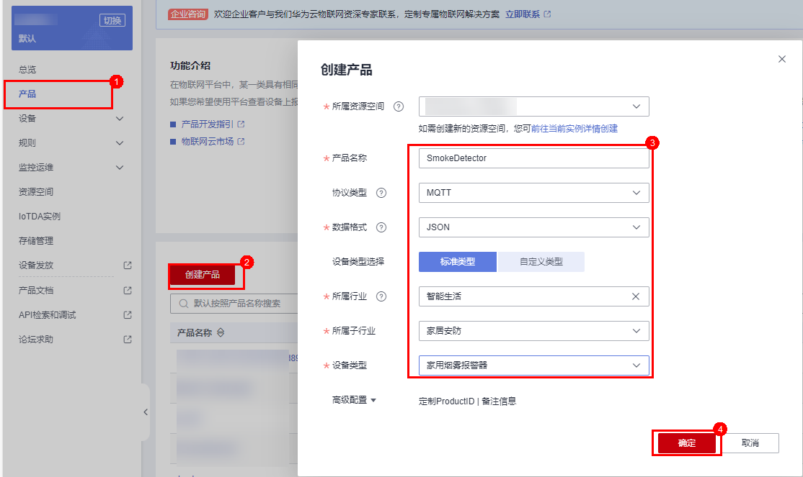

3. After the product is successfully created, click "Details" to enter the product details. On the function definition page, click "Upload Model File" to upload the [Smoke Detector Product Model](https://iot-developer.obs.cn-north-4.myhuaweicloud.com/smokeDetector.zip)
   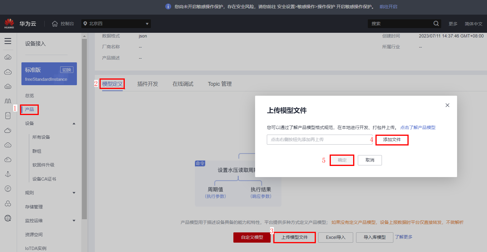

## 3.2 Create device

1. Click "Device", "All Devices", click "Register Device" in the upper right corner, select the "Resource Space" where the product is located, select the product created above, fill in the device identification code (usually IMEI, MAC address, etc.), customize the "Device Name", "Key" will be automatically generated by the platform if you do not customize it. After filling in everything, click "OK".
   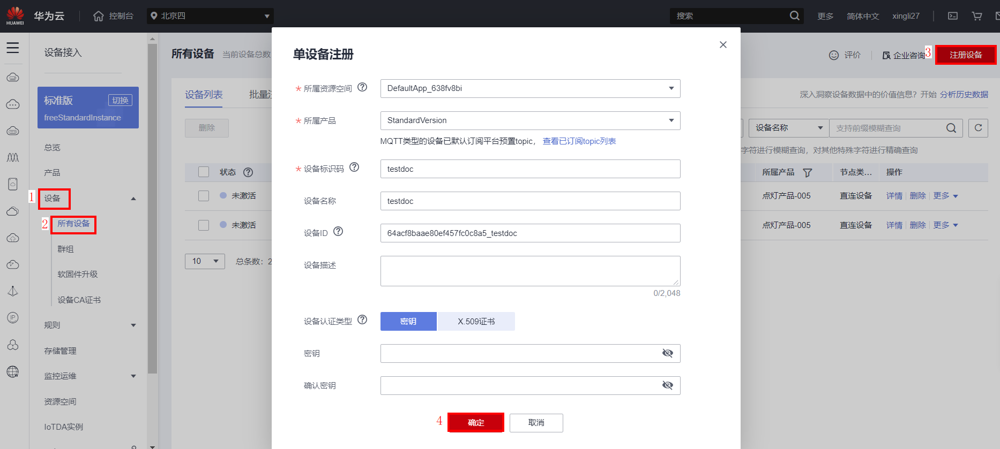

2. You can directly copy the device secret key. Click "Save and Close" to automatically download the device ID to the local computer in the form of txt text.
   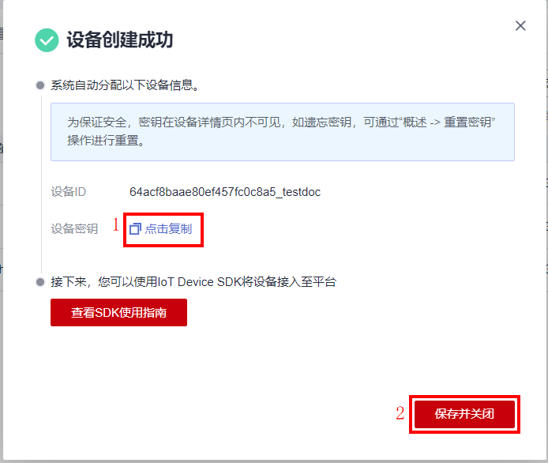

3. Click "Devices", "All Devices". At the top, you can see that the status of the device is inactive.
   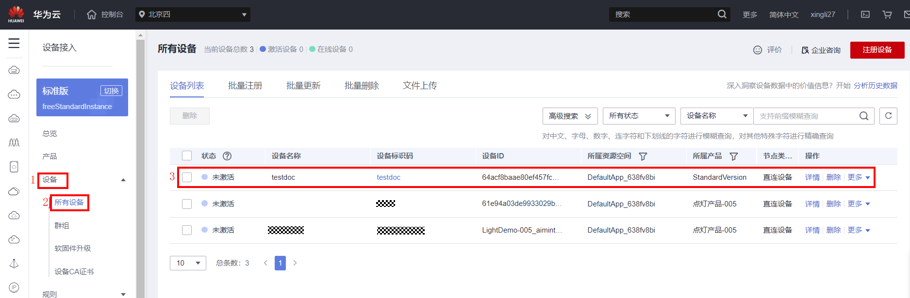

## 3.3 Configure and start Demo

1. Obtain the access address, which can be viewed in "Overview", "Access Information" on the console.
   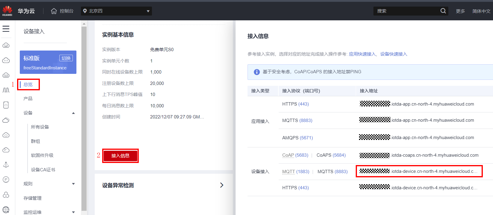

2. Open the file
   [iot-device-demo/config/DemoConfigDefault.json](iot-device-demo/config/DemoConfigDefault.json), fill in the previously obtained access address, device ID and device key into the corresponding positions, or configure Fill in the following template and then overwrite [iot-device-demo/config/DemoConfigDefault.json](iot-device-demo/config/DemoConfigDefault.json):

    ```json
    {
      "DemoName": "SmokeDetector",
      "AuthConfig": {
        "AuthUseCert": false,
        "ServerAddress": "Fill in the access address",
        "ServerPort": 8883,
        "DeviceId": "Fill in the device ID",
        "DeviceSecret": "Fill in the device secret"
      }
    }
    ```
   Among them, `DemoName` is used to specify the running Demo. Here, `SmokeDetector` specifies the object model programming Demo based on the smoke alarm product model. The Demo name that the Sdk can run can be found in the following chapters. The Demo name will be marked at the beginning of almost every function point introduction section. Or enter the sdk directory and run the following command to view a list of all Demo names:
    ```shell
    cd iot-device-demo
    dotnet run --project .\iot-device-demo.csproj
    ```
   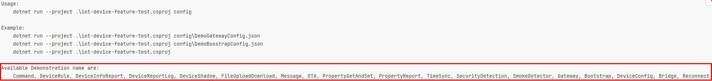

3. Compile &amp; run

   Enter the sdk directory and execute the following command to run the demo. Add the parameter at the end of the command as the configuration file path:
    ```shell
    cd iot-device-demo
    dotnet run --project .\iot-device-demo.csproj  .\config\DemoConfigDefault.json
    ```

   If you are using an older version 5.0+ SDK and cannot upgrade to .NET 8.0, you can modify the `TargetFramework` of the following file. But please note that [except for .NET 8.0 and .NET 6.0, which are long-term supported versions, other older versions are no longer supported](https://dotnet.microsoft.com/en-us/platform/support/policy/dotnet-core#lifecycle):
   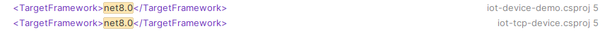
    - [iot-device-demo/CoreCapability/iot-device-demo.csproj](iot-device-demo/iot-device-demo.csproj)
    - [iot-tcp-device/iot-tcp-device.csproj](iot-tcp-device/iot-tcp-device.csproj)

   The above `run` command will automatically compile. If you want to manually compile a project, you can run the following command:
    ```shell
    dotnet clean
    dotnet build
    ```
   The output example is as follows. If there is `connect success` in the output, it means the connection is successful:
   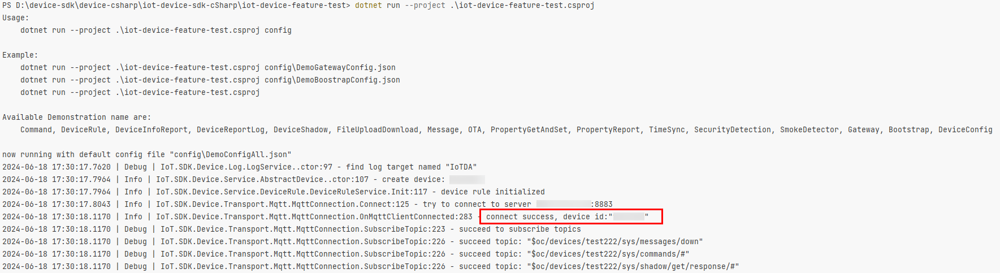

4. Check the operation status of the equipment

   Filter out the device in the console and enter the device details page
   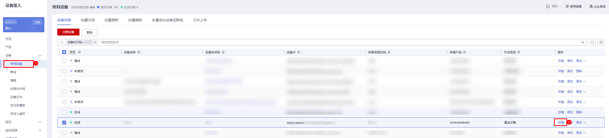
   On the details page, move to the "Object Model Data" page to see the latest reported data.
   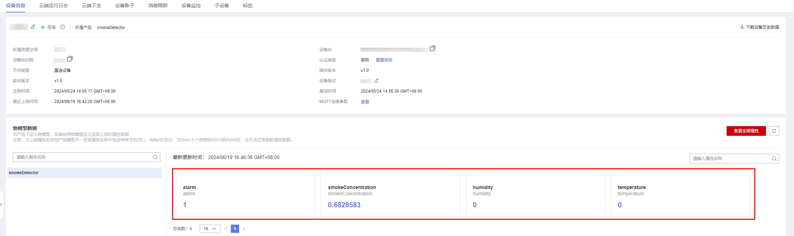

# 4.SDK function reference

## 4.1 Device connection authentication

> [Device Authentication Overview Online Document](https://support.huaweicloud.com/intl/en-us/usermanual-iothub/iot_01_0206.html)

### Key authentication

Key authentication supports mqtt(1883) and mqtts(8883) access. **For security reasons, it is recommended to use port 8883 to access the platform
**. When using port 8883 to access, you need to use [iot-device-demo/config/certificate/DigiCertGlobalRootCA.crt.pem](iot-device-demo/config/certificate/DigiCertGlobalRootCA.crt.pem). This file is preset by default. The root certificate of each region. If the connection fails, try [download the pem certificate corresponding to the region from here](https://support.huaweicloud.com/intl/en-us/devg-iothub/iot_02_1004.html#section3) and replace it.

The corresponding configuration items in the Demo configuration file [iot-device-demo/config/DemoConfigDefault.json](iot-device-demo/config/DemoConfigDefault.json) are as follows (irrelevant configuration items are omitted):

```json
{
  "AuthConfig": {
    "AuthUseCert": false,
    "ServerAddress": "your Access Address",
    "ServerPort": 8883,
    "DeviceId": "your Device Id",
    "DeviceSecret": "Device Secret"
  }
}
```

The parameters when instantiating a device object using the API are as follows:

```csharp
// Access address, access port, device ID, device key
IoTDevice device = new IoTDevice("Access Address", 8883, "Device Id", "Device Key");
```

### Certificate Authentication

The platform supports devices to use their own X.509 certificates for device access authentication. Before use, you need to register certificate-certified devices and preset the corresponding CA certificate in the device access console. For detailed guidance, please refer to [Registering X.509 Certificate-Authentication Devices](https://support.huaweicloud.com/intl/en-us/usermanual-iothub/iot_01_0055.html).

1. After creating the commissioning certificate, refer to the following command to convert it into pfx format:

   ```shell
    openssl x509 -in deviceCert.pem -out deviceCert.crt #Generate a certificate in crt format first
    openssl pkcs12 -export -out deviceCert.pfx -inkey deviceCert.key -in deviceCert.crt -certfile rootCA.pem
   ```

2. When using Demo, put
   Change `AuthUseCert` in [iot-device-demo/config/DemoConfigDefault.json](iot-device-demo/config/DemoConfigDefault.json) to true, and change `DeviceCert` to the generated certificate path. The example is as follows:

    ```json
    {
      "AuthConfig": {
        "AuthUseCert": true,
        "DeviceCert": "\\config\\certificate\\deviceCert.pfx"
      }
    }
    ```

> In the example, the certificate path is [config/certificate/deviceCert.pfx](iot-device-demo/config/certificate/deviceCert.pfx). Some IDEs (such as Rider) will run the program in the Debug file. You need to -device-demo/CoreCapability/iot-device-demo.csproj](iot-device-demo/iot-device-demo.csproj)Add a line
>
> `&lt;Content Include="config\certificate\deviceCert.pfx" CopyToOutputDirectory="PreserveNewest" />`
>
> The certificate will also be copied to the Debug directory during compilation.

> If you want to create a device programmatically, you can refer to the `CreateDevice` function in [iot-device-demo/DemoUtil/DemoDeviceHelper.cs](iot-device-demo/DemoUtil/DemoDeviceHelper.cs).

## 4.2 Device commands

> [Device command interface document](https://support.huaweicloud.com/intl/en-us/api-iothub/iot_06_v5_3014.html)

The device command consists of two steps:

1. Platform command issuance
2. Device command response

**Command issuance**

> Command delivery is sent from the platform to the device. Please refer to the delivery method.
> [Command delivery usage example](https://support.huaweicloud.com/intl/en-us/usermanual-iothub/iot_01_0339.html#section11),
> Or use [CreateCommand API](https://console.huaweicloud.com/apiexplorer/#/openapi/IoTDA/doc?api=CreateCommand).

- Demo source code：[iot-device-demo/CoreCapability/CommandSample.cs](iot-device-demo/CoreCapability/CommandSample.cs).
- Demo name: Command

When issuing commands, set the corresponding listener to receive commands issued by the platform:

```csharp
    public class CommandSample : DeviceSample, CommandListener
    {
        // ......
        protected override void BeforeInitDevice()
        {
            Device.GetClient().commandListener = this;
            // ......
```

Implement the callback interface `OnCommand` to process the command:

```csharp
        public void OnCommand(string requestId, string serviceId, string commandName, Dictionary&lt;string, object> paras)
        {
            LOG.Info("onCommand, serviceId = {}", serviceId);
            LOG.Info("onCommand, name = {}", commandName);
            LOG.Info("onCommand, paras = {}", JsonUtil.ConvertObjectToJsonString(paras));
            // ......
        }
```

**Command response**

- Demo source code：[iot-device-demo/CoreCapability/CommandSample.cs](iot-device-demo/CoreCapability/CommandSample.cs).
- Demo name: Command

Immediately after the command is processed, call `RespondCommand` to report the response to confirm the execution result:

```csharp
        public void OnCommand(string requestId, string serviceId, string commandName, Dictionary&lt;string, object> paras)
        {
            // ......
            // Sends a command response.
            Device.GetClient().RespondCommand(requestId, new CommandRsp(respCode, respParams));
        }
```

## 4.3 Device messages

### System Topic message reporting

> Whether the message can be reported to the platform
> [Message Tracking](https://support.huaweicloud.com/intl/en-us/usermanual-iothub/iot_01_0030_0.html) view,
> or use [ListDeviceMessages API](https://console.huaweicloud.com/apiexplorer/#/openapi/IoTDA/doc?api=ListDeviceMessages)，[ShowDeviceMessage API](https://console.huaweicloud.com/apiexplorer/#/openapi/IoTDA/doc?api=ShowDeviceMessage).

- Demo source code：[iot-device-demo/CoreCapability/MessageReportReceiveSample.cs](iot-device-demo/CoreCapability/MessageReportReceiveSample.cs)
- Demo name: Message
- Reference documents:
  [Device message reporting interface document](https://support.huaweicloud.com/intl/en-us/api-iothub/iot_06_v5_3016.html),
  [Introduction to device information reporting](https://support.huaweicloud.com/intl/en-us/usermanual-iothub/iot_01_0322.html)

Call `ReportDeviceMessage` to report a message in a predetermined format

```csharp
// {"content":"hello word","object_device_id":null,"name":null,"id":null}
Device.GetClient().ReportDeviceMessage(new DeviceMessage("hello word", testMqttV5Data));
```

Call `ReportRawDeviceMessage` to report messages in any format:

```csharp
// hello word
Device.GetClient().ReportRawDeviceMessage(new RawDeviceMessage("hello word", testMqttV5Data));
```

### System Topic message delivery

> Message delivery is sent from the platform to the device. Please refer to the delivery method.
> [Usage example of platform message delivery](https://support.huaweicloud.com/intl/en-us/usermanual-iothub/iot_01_0331.html?locale=zh-cn#section8),
> Or use [CreateMessage API](https://console.huaweicloud.com/apiexplorer/#/openapi/IoTDA/debug?api=CreateMessage).

- Demo source code：[iot-device-demo/CoreCapability/MessageReportReceiveSample.cs](iot-device-demo/CoreCapability/MessageReportReceiveSample.cs)
- Demo name: Message
- Reference documents:
  [Platform message delivery interface document](https://support.huaweicloud.com/intl/en-us/api-iothub/iot_06_v5_3017.html),
  [Introduction to platform message delivery](https://support.huaweicloud.com/intl/en-us/usermanual-iothub/iot_01_0331.html)


1. The following operations are required in the SDK:
   Implement the class of `RawDeviceMessageListener` and create an instance and set it to the corresponding listener to listen for messages:

   ```csharp
           protected override void BeforeInitDevice()
           {
               Device.GetClient().rawDeviceMessageListener = this;
           }
   ```
2. Implement message processing logic in `public void OnRawDeviceMessage(RawDeviceMessage message)`:

   ```csharp
           public void OnRawDeviceMessage(RawDeviceMessage message)
           {
               var deviceMessage = message.ToDeviceMessage();
               if (deviceMessage == null)
               {
                   //....
               }
               else
               {
                   //....
               }
   
           }
   ```

> `RawDeviceMessage` itself only stores binary payload. To facilitate user operation, this class provides the following methods:
>
> `public string StrPayload` encodes the string in UTF8 and stores it in the payload, or decodes the payload into a string in UTF8 and reads it.
>
> `public string ToUtf8String()` decodes the payload into a string using UTF8 and reads it.
>
> `public DeviceMessage ToDeviceMessage()` attempts to deserialize the payload into an object in the preset format `DeviceMessage`, and returns `null` if it fails.

### Custom topic message reporting

> To use a custom topic, the platform also needs to be configured accordingly. For details, please read [Customized Topic Communication Overview](https://support.huaweicloud.com/intl/en-us/usermanual-iothub/iot_02_9997.html). This SDK custom topic will automatically re-subscribe when the link is disconnected.
>
> Whether the message can be reported to the platform
> [Message Tracking](https://support.huaweicloud.com/intl/en-us/usermanual-iothub/iot_01_0030_0.html) function detection,
> or use [ListDeviceMessages API](https://console.huaweicloud.com/apiexplorer/#/openapi/IoTDA/doc?api=ListDeviceMessages)，[ShowDeviceMessage API](https://console.huaweicloud.com/apiexplorer/#/openapi/IoTDA/doc?api=ShowDeviceMessage)。

- Demo source code：[iot-device-demo/CoreCapability/MessageReportReceiveSample.cs](iot-device-demo/CoreCapability/MessageReportReceiveSample.cs)
- Demo name: Message
- Reference documents:
  [Custom Topic Communications](https://support.huaweicloud.com/intl/en-us/usermanual-iothub/iot_02_9992.html)

Custom topic messages are divided into `$oc` prefix and non-`$oc` prefix, both of which are specified by setting the `OcPrefix` member when creating `CustomMessageTopic`:

```csharp
// topic: "$oc/devices/{device-id}/user/ai"
private static readonly CustomMessageTopic OC_CUSTOM_TOPIC = new CustomMessageTopic
    { Suffix = "ai", OcPrefix = true };

// topic: "/ai/test/device/to/cloud"
private static readonly CustomMessageTopic NO_OC_CUSTOM_TOPIC = new CustomMessageTopic
    { Suffix = "/ai/test/device/to/cloud", OcPrefix = false };
```

Call `ReportRawDeviceMessage(RawDeviceMessage, CustomMessageTopic)` to report messages to a custom topic:

```csharp
         private void RunCustomTopicDemo()
        {
            //....
            // Reports a message with $oc custom topic.
            Device.GetClient()
                .ReportRawDeviceMessage(new RawDeviceMessage("hello $oc custom topic"), OC_CUSTOM_TOPIC);

            // Reports a message with non-$oc custom topic.
            Device.GetClient()
                .ReportRawDeviceMessage(new RawDeviceMessage("hello non-$oc custom topic"), NO_OC_CUSTOM_TOPIC);
        }
```

### Custom topic message delivery

> To use a custom topic, the platform also needs to be configured accordingly. For details, please read [Customized Topic Communication Overview](https://support.huaweicloud.com/intl/en-us/usermanual-iothub/iot_02_9997.html). This SDK custom topic will automatically re-subscribe when the link is disconnected.
>
> Customized topic message delivery is sent by the platform to the device. Please refer to the delivery method.
> [Usage example of platform message delivery](https://support.huaweicloud.com/intl/en-us/usermanual-iothub/iot_01_0331.html?locale=zh-cn#section8)
> Or use [CreateMessage API](https://console.huaweicloud.com/apiexplorer/#/openapi/IoTDA/debug?api=CreateMessage).

- Demo source code：[iot-device-demo/CoreCapability/MessageReportReceiveSample.cs](iot-device-demo/CoreCapability/MessageReportReceiveSample.cs)
- Demo name: Message
- Reference documents:
  [Custom Topic Communications](https://support.huaweicloud.com/intl/en-us/usermanual-iothub/iot_02_9992.html)

Before receiving messages from a custom topic, you need to use `SubscribeTopic(CustomMessageTopic)` to subscribe to the custom topic:

```csharp
        private void RunCustomTopicDemo()
        {
            // You must configure the custom topic on the platform and set the topic prefix to $oc/devices/{device_id}/user/.
            // Use Postman to simulate the scenario in which an application uses the custom topic to deliver a command.
            Device.GetClient().SubscribeTopic(NO_OC_CUSTOM_TOPIC);
            fullNoOcCustomTopic = Device.GetClient().SubscribeTopic(OC_CUSTOM_TOPIC);
            // ......
        }
```

Then implement the `RawDeviceMessageListener` interface, create its instance, and set it to the corresponding listener to listen for messages:

```csharp
        protected override void BeforeInitDevice()
        {
            Device.GetClient().rawDeviceMessageListener = this;
        }
```

Implement the message processing logic in `public void OnCustomRawDeviceMessage(string topic, bool topicStartsWithOc, RawDeviceMessage rawDeviceMessage)`:

```csharp
         void OnCustomRawDeviceMessage(string topic, bool topicStartsWithOc, RawDeviceMessage rawDeviceMessage)
        {
            LOG.Info("custom message received, topic:{}, topic starts with oc:{}, data:{}",
                topic, topicStartsWithOc, rawDeviceMessage.payload);
        }
```

## 4.4 Device Properties

### Report device properties

> The recently reported properties of the device can be viewed on the "Device Details" page. For details, please refer to [Instructions for reporting device properties](https://support.huaweicloud.com/intl/en-us/usermanual-iothub/iot_01_0326.html#section3)

- Demo source code：[iot-device-demo/CoreCapability/PropertyReportSample.cs](iot-device-demo/CoreCapability/PropertyReportSample.cs)
- Demo name: PropertyReport
- Reference document: [Device properties reporting interface document](https://support.huaweicloud.com/intl/en-us/api-iothub/iot_06_v5_3010.html)

Call `ReportProperties(List&lt;ServiceProperty>)` to report the properties data to the platform in the format defined in the product model:

```csharp
        Device.GetClient().ReportProperties(GenerateMockProperty());
```

A sample output log after successful reporting is as follows:

```text
2024-06-28 14:31:50.6884 | Info | IoT.Device.Demo.PropertyReportSample.OnMessagePublished:69 - pubSuccessMessage: "{"services":[{"service_id":"smokeDetector","properties":{"alarm":1,"temperature":23.45812,"humidity":56.89013,"smokeConcentration":89.5672},"eventTime":null}]}"
```

### Platform settings device properties

> The request to set device properties is issued by the platform and needs to be triggered through the [UpdateProperties API](https://console.huaweicloud.com/apiexplorer/#/openapi/IoTDA/doc?api=UpdateProperties).

- Demo source code：[iot-device-demo/CoreCapability/PropertyGetAndSetSample.cs](iot-device-demo/CoreCapability/PropertyGetAndSetSample.cs)
- Demo name: PropertyGetAndSet
- Reference document: [Platform Setting Device Properties](https://support.huaweicloud.com/intl/en-us/api-iothub/iot_06_v5_3008.html)

Implement the `PropertyListener` interface and create an instance, and set it to the corresponding listener to listen for requests to set properties:

```csharp
        protected override void BeforeInitDevice()
        {
            Device.GetClient().messagePublishListener = this;
        }
```

Then implement the logic of modifying the corresponding properties on the device in `void OnPropertiesSet(string requestId, List&lt;ServiceProperty> services)`. After the processing is completed, call `void RespondPropsSet(string requestId, IotResult iotResult)` to respond to the setting result:

```csharp
        public void OnPropertiesSet(string requestId, List&lt;ServiceProperty> services)
        {
            LOG.Info("set properties request id: {}", requestId);
            LOG.Info("set properties services: {}", JsonUtil.ConvertObjectToJsonString(services));

            Device.GetClient().RespondPropsSet(requestId, IotResult.SUCCESS);
        }
```

### Platform query device properties

> The request to query device properties is issued by the platform and needs to be triggered through [ListProperties API](https://console.huaweicloud.com/apiexplorer/#/openapi/IoTDA/doc?api=ListProperties).

- Demo source code：[iot-device-demo/CoreCapability/PropertyGetAndSetSample.cs](iot-device-demo/CoreCapability/PropertyGetAndSetSample.cs)
- Demo name: PropertyGetAndSet
- Reference document: [Platform Query Device Properties](https://support.huaweicloud.com/intl/en-us/api-iothub/iot_06_v5_3011.html)

1. Create a listener: Implement the `PropertyListener` interface and create an instance, and set it to the corresponding listener to listen for requests to set properties:
    ```csharp
            protected override void BeforeInitDevice()
            {
                Device.GetClient().messagePublishListener = this;
            }
    ```

2. Process the request to query device properties and respond: In `public void OnPropertiesGet(string requestId, string serviceId)`
   Implement the logic of obtaining the properties corresponding to serviceId, and then call `void RespondPropsGet(string requestId, List&lt;ServiceProperty> services)` to respond.

    ```csharp
            public void OnPropertiesGet(string requestId, string serviceId)
            {
                LOG.Info("requestId Get: {}", requestId);
                LOG.Info("serviceId Get: {}", serviceId);
                //.......
                Device.GetClient().RespondPropsGet(requestId, properties);
            }
    ```

### Obtain the device shadow data of the platform on the device side

- Demo source code：[iot-device-demo/CoreCapability/DeviceShadowSample.cs](iot-device-demo/CoreCapability/DeviceShadowSample.cs),
- Demo name: DeviceShadow
- Reference document: [Acquire device shadow data of the platform on the device side](https://support.huaweicloud.com/intl/en-us/api-iothub/iot_06_v5_3012.html)

1. Request device shadow: call `GetShadow(DeviceShadowRequest shadowRequest, string requestId = null)`
   The interface reports to obtain the device request. If `ServiceId` in `DeviceShadowRequest` is not filled in, it means to obtain the shadow data of all services. If `requestId` is not filled in, it will be automatically generated and used as the return value:

    ```csharp
            protected override void RunDemo()
            {
                var reqId = Device.GetClient().GetShadow(new DeviceShadowRequest
                {
                    ServiceId = null // service id in you product model, for example, "SmokeDetector"
                });
                LOG.Info("get shadow request id: {}", reqId);
            }
    ```

2. Receive shadow data: Implement the `DeviceShadowListener` interface and create an instance, and then set it to the corresponding listener to listen for requests to set properties:

    ```csharp
            protected override void BeforeInitDevice()
            {
                Device.GetClient().deviceShadowListener = this;
            }
    ```

3. Process shadow messages: The logic implemented in `OnShadowCommand(string requestId, string message)`:

    ```csharp
            public void OnShadowCommand(string requestId, string message)
            {
                LOG.Info("receive device shadow, request id:{}, message:{}", requestId, message);
            }
    ```

## 4.5 Gateway and sub-device management

- Demo source code: All source codes under [iot-device-demo/TcpServer/Gateway](iot-device-demo/TcpServer/Gateway).
- Demo name: Gateway
- Reference document: [Gateway and sub-device](https://support.huaweicloud.com/intl/en-us/usermanual-iothub/iot_01_0052.html)

The gateway is a special device. In addition to general device functions, it also has the functions of sub-device management and sub-device message forwarding. The SDK provides the AbstractGateway abstract class to simplify the implementation of the gateway. This class provides sub-device management functions, which need to obtain sub-device information from the platform and save it (the sub-class needs to provide the sub-device persistence interface), sub-device downlink message forwarding function (the sub-class needs to implement the forwarding processing interface), and report the sub-device List, reporting sub-device properties, reporting sub-device status, reporting sub-device messages and other interfaces.

### Gateway Demo Instructions for Use

Gateway Demo implements a simple TCP subdevice simulator and a corresponding gateway. On this basis, you can expand it as needed. For example, modify the persistence method, add message format conversion during forwarding, and implement other sub-device access protocols. The following will introduce the main classes in the sample gateway according to the usage steps and functional isolation.

1. Start Gateway

   It is the same as the command in [Configuration and Startup Demo](#33-configure-and-start-demo), you only need to change the name of the demo to `Gateway`. The implementation of Gateway is as follows:
    - [StringTcpServer](iot-device-demo/TcpServer/Gateway/GatewayTcpServer.cs) is responsible for TCP server responsibilities, which is implemented based on DotNetty.
    - [SimpleGateway](iot-device-demo/TcpServer/Gateway/SimpleGateway.cs) inherits from AbstractGateway to implement sub-device management and downlink message forwarding.
    - [SubDevicesFilePersistence.cs](iot-device-demo/TcpServer/Gateway/SubDevicesFilePersistence.cs)
      Responsible for the persistence of sub-device information, using json files to save sub-device information and caching it in memory.
    - [Session.cs](iot-device-demo/TcpServer/SessionManagement/Session.cs) as a backup session class saves the corresponding relationship between the device ID and the TCP channel.

   In addition, the configuration file provides additional `GatewayConfig` parameters for Gateway Demo:
    ```json
      {
         "GatewayConfig": {
            "ListenPort": 8081,
            "PreDeleteSubDeviceIds": [
               "device id of the device to be deleted"
            ],
            "PreAddSubDevice": [
               {
                 "node_id": "node id 1 of the device to be added",
                 "product_id": "产品id 1"
               },
               {
                 "node_id": "node id 2 of the device to be added",
                 "product_id": "产品id 2"
               }
            ]
         }
      }
    ```
   The parameters are introduced as follows:
    - `ListenPort`: listening port, used for sub-device simulator link
    - `PreDeleteSubDeviceIds`: The Gateway will demonstrate the function of deleting sub-devices immediately after startup, and the ID of the sub-device is configured here.
    - `PreAddSubDevice`: The gateway will demonstrate the function of adding a sub-device immediately after startup, and the information of the sub-device is configured here.
        - `node_id`: sub-device node_id, plus `product_id` prefix to generate device id
        - `product_id`: product id on the platform.

2. Start the TCP subdevice emulator:
   The TCP subdevice emulator is a simple TCP client responsible for connecting to the Gateway's port and sending user-entered messages to the Gateway:

    ```shell
       cd iot-tcp-device
       dotnet run --project .\iot-tcp-device.csproj localhost 8081 mySubDevice1
   ```

   The meanings of the next three parameters are:

    - Gateway ip. This is a locally started Gateway, so it is localhost
    - Gateway port. Fill in the same port as configured in the first step.
    - Child device id. The node-id (device identification code) of the child device used for simulation

   Switch back to the gateway's log. If the connection is successful, the following content will appear:
   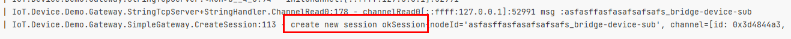

3. Return information:
   Return to the console of the device simulator and enter the following content to report the message:
   ```shell
   message: this is a random message
   ```

4. Send properties:
   In the console of the sub-device simulator, enter the content in the following format to report the properties:
    ```shell
   properties: smokeDetector, {"alarm":0,"temperature":10}
   ```
   Switch back to the gateway's log. If the report is successful, the following content will appear:
   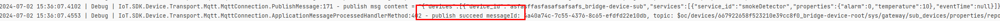

5. Command response:
   When issuing commands to sub-devices according to the operation in [Device Command](#42-device-commands), you need to manually reply to the command response in the sub-device simulator. The format is as follows:
    ```shell
   cmdresp: requestId, result
   ```
   Among them, `requestId` is the corresponding request id when the command is issued, and result is the command execution result. 0 represents success, and others represent failure. Examples are as follows,
   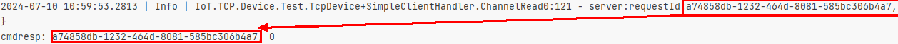

### AbstractGateway

[AbstractGateway.cs](iot-device-sdk-csharp/device/gateway/AbstractGateway.cs) provides sub-device message reporting, sub-device message delivery processing, and callbacks. [SimpleGateway](iot-device-demo/TcpServer/Gateway/SimpleGateway.cs) in the demo above inherits this class and implements related functions.

The following classification introduces which interfaces need to be implemented or called 1 to achieve complete sub-device management.

**Add or remove child device handling**

The gateway can actively initiate a request to the platform to delete or add sub-devices. The interface is as follows:

```csharp
  ReportAddSubDevice(List&lt;DeviceInfo> subDeviceInfo):void
  ReportDeleteSubDevice(List&lt;string> devicesId):void

```

At the same time, the platform will also send a response to delete or add sub-devices. Since `AbstractGateway` has already used [SubDevicesFilePersistence.cs](iot-device-demo/TcpServer/Gateway/SubDevicesFilePersistence.cs) class object to handle this part, you only need to Implement a [SubDevicesFilePersistence.cs](iot-device-demo/TcpServer/Gateway/SubDevicesFilePersistence.cs) subclass and pass it in when instantiating `AbstractGateway` (subclass).

**Download message processing**

When the gateway receives the platform downlink message, it needs to forward it to the sub-device. There are three types of platform downstream messages: device messages, propertie reading and writing, commands, and events. You need to implement the following abstract interfaces respectively to process the messages:

```csharp
/// The sub-device command is issued and processed. The gateway needs to forward it to the sub-device and needs to be implemented by a subclass.
public abstract void OnSubdevCommand(string requestId, Command command);
/// Sub-device properties settings, the gateway needs to forward to the sub-device, and needs to be implemented by a subclass
public abstract void OnSubdevPropertiesSet(string requestId, PropsSet propsSet);
/// Sub-device reads properties, the gateway needs to forward them to the sub-device, and needs to be implemented by a subclass
public abstract void OnSubdevPropertiesGet(string requestId, PropsGet propsGet);
/// Sub-device message delivery, the gateway needs to forward it to the sub-device, and needs to be implemented by a subclass
public abstract void OnSubdevMessage(DeviceMessage message);
/// Sub-device time is issued, the gateway needs to forward it to the sub-device, and a subclass is required to implement it.
OnSubdevEvent(string deviceId, DeviceEvent deviceEvent):void
```

**Upstream message processing**
All uplink messages reuse the original interface. You only need to fill in the deviceId of the corresponding sub-device. Take properties reporting as an example:

```csharp
var serviceProperty = new ServiceProperty
{
    properties = new Dictionary&lt;string, object>
    {
        // Sets properties based on the product model.
        { "alarm", 1 },
        { "temperature", 23.45812 },
        { "humidity", 56.89013 },
        { "smokeConcentration", 89.5672 }
    },
    serviceId = "smokeDetector" // The serviceId must be the same as that defined in the product model.
};

var deviceProperties = new DeviceProperties
{
    DeviceId = "Subdevice id",
    services = new List&lt;ServiceProperty> { serviceProperty }
};
Device.GetClient().ReportProperties(deviceProperties);
```

**other**

```csharp
//Report sub-device status
ReportSubDeviceStatus(List&lt;DeviceStatus> statuses):void
//Synchronize sub-device information
SyncSubDevices(bool syncAll):void
```

## 4.6 Software and firmware upgrade

- Demo source code：[OTASample.cs](iot-device-demo/CoreCapability/OTASample.cs)
- Demo name: OTA
- Reference document: [MQTT device OTA upgrade](https://support.huaweicloud.com/intl/en-us/usermanual-iothub/iot_01_0047.html),
  [MQTT protocol device OTA firmware upgrade](https://support.huaweicloud.com/bestpractice-iothub/iot_bp_0039.html)

Software and firmware upgrades require uploading the software and firmware to the platform and creating a task before the SDK receives the upgrade request and starts processing it. For detailed operations, please refer to [MQTT protocol device OTA firmware upgrade](https://support.huaweicloud.com/bestpractice-iothub/iot_bp_0039.html). By default, the files downloaded in the software and firmware upgrade examples will be downloaded to the `download` folder in the demo running path.

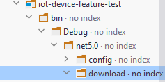

If you need to highly customize the software and firmware processing flow, you need to implement `OTAListener` to listen for software and firmware upgrade requests:

```csharp
public interface OTAListener
{
    void OnQueryVersion(OTAQueryInfo queryInfo);
    void OnNewPackage(OTAPackage pkg);
    void OnNewPackageV2(OTAPackageV2 pkgV2);
}
```

Then process the `url` in the request, and finally use the following interface to report the processing progress or results:

```csharp
class OtaService {
    ///.....
    ReportOtaStatus(int result, int progress, string version, string description)
}
```

## 4.7 Device time synchronization

- Demo source code：[iot-device-demo/CoreCapability/TimeSyncSample.cs](iot-device-demo/CoreCapability/TimeSyncSample.cs)
- Demo name: TimeSync
- Reference document: [Device Time Synchronization Request](https://support.huaweicloud.com/intl/en-us/api-iothub/iot_06_v5_3040.html),
  [Device time synchronization response](https://support.huaweicloud.com/intl/en-us/api-iothub/iot_06_v5_3041.html)

1. Request time synchronization: call `TimeService.RequestTimeSync` to request time synchronization
    ```csharp
    protected override void RunDemo()
    {
        Device.timeSyncService.RequestTimeSync();
    }
    ```
2. Receive time synchronization messages: implement the `TimeSyncListener` interface and create an instance, and then set it to the corresponding listener to listen for responses:

    ```csharp
        protected override void BeforeInitDevice()
        {
            Device.timeSyncService.listener = this;
        }
    ```

3. Process time synchronization messages: Implement the logic of setting the device clock in `OnTimeSyncResponse(string requestId, string message)`. The following is an example.

```csharp
        public void OnTimeSyncResponse(long deviceSendTime, long serverRecvTime, long serverSendTime)
        {
            long deviceRecvTime = Convert.ToInt64(IotUtil.GetTimeStamp());
            long now = (serverRecvTime + serverSendTime + deviceRecvTime - deviceSendTime) / 2;
            LOG.Info("now is {}", StampToDatetime(now));
        }
```

> The algorithm in the demo above comes from [Device Time Synchronization Response](https://support.huaweicloud.com/intl/en-us/api-iothub/iot_06_v5_3041.html).

## 4.8 Device information reporting

- Demo source code：[iot-device-demo/CoreCapability/DeviceInfoReportSample.cs](iot-device-demo/CoreCapability/DeviceInfoReportSample.cs)
- Demo name: DeviceInfoReport
- Reference document: [Device Information Reporting](https://support.huaweicloud.com/intl/en-us/api-iothub/iot_06_v5_3042.html)

Call `Device.GetClient().ReportDeviceInfo("Software Version", "Firmware Version")` to report device information:

```csharp
        protected override void RunDemo()
        {
            Device.GetClient().ReportDeviceInfo("v1.1", "v1.1");
        }
```

After the report is successful, you can see the corresponding software and firmware version information in the device details:
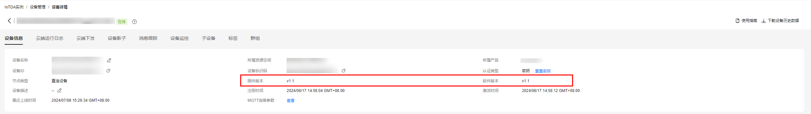

## 4.9 Device log collection

- Demo source code：[iot-device-demo/CoreCapability/DeviceReportLogSample.cs](iot-device-demo/CoreCapability/DeviceReportLogSample.cs)
- Demo name: DeviceReportLog
- Reference document: [Device Information Reporting](https://support.huaweicloud.com/intl/en-us/api-iothub/iot_06_v5_3042.html)

To use device logs, you need to configure the "Run Log" function on the platform first. Please refer to the document [Run Log Usage Instructions](https://support.huaweicloud.com/intl/en-us/usermanual-iothub/iot_01_0030_8.html#section2). After the running log is enabled, the corresponding API in the SDK can be called to upload the log to the platform. Operation log reporting supports two methods:

1. Display the call log upload interface.

   Use the `Device.LogService.ReportLog` interface to directly generate log messages and report them to the platform:
   ```csharp
     Device.LogService.ReportLog(DateTimeOffset.Now.ToUnixTimeSeconds().ToString(),
                   LogService.LogType.DeviceStatus, "ONLINE");
   ```

2. Capture the logs output by the NLog component and send them to the platform.

   The SDK uses the NLog logging component by default and reports it to IoTDA as a configurable `target`. Open [iot-device-demo/CoreCapability/NLog.config](iot-device-demo/NLog.config), first you can see a `target` named `IoTDA` and type `IoTDA`, here we The output format is mainly configured for this `target`:
   ```csharp
   &lt;target name="IoTDA" xsi:type="IoTDA" layout="${longdate} | ${level:uppercase=false} | ${callsite:fileName}:${callsite-linenumber} - ${message}${onexception:, error\: ${exception:format=type,message,method:innerExceptionSeparator= - :separator=. :maxInnerExceptionLevel=5:innerFormat=shortType,message,method} - stacktrace\: ${stacktrace}}" />
   ```
   The third `logger` in the `rules` below uses filtering rules to specify what logs will be written to `IoTDA`.
   ```csharp
     &lt;logger name="*" minlevel="Debug" writeTo="IoTDA">
         &lt;filters defaultAction='Ignore'>
             &lt;when condition="contains('${callsite:fileName}','DeviceReportLogSample') and not contains('${callsite:fileName}','DemoMessagePublishListener')" action="Log" />
         &lt;/filters>
     &lt;/logger>
   ```
   > Note that we mainly use the whitelist mechanism here, that is, "specify the logs that need to be collected." If filtering is not careful, it may lead to an infinite loop. For example, `public void OnMessagePublished(RawMessage message)` and `public void OnMessageUnPublished(RawMessage message)` in the demo monitor the results of message push and print the log with `NLog`, which means Author:
   > 1. As long as a message is pushed, logs will be generated in these two callback functions.
   > 2. If you do not use `not contains('${callsite:fileName}','DemoMessagePublishListener')` to exclude the logs here, then the messages here will be collected and reported by the logs.
   > 3. Regardless of whether the message push is successful or failed, these two callback functions will be triggered again.
   >
   > This leads to an infinite loop.

## 4.10 Remote configuration

- Demo source code：[DeviceConfigSample.cs](iot-device-demo/CoreCapability/DeviceConfigSample.cs).
- Demo name: DeviceConfig
- Reference documents: [Log collection notification issued by the platform](https://support.huaweicloud.com/intl/en-us/api-iothub/iot_06_v5_1303.html), [Log content reported by the device](https://support.huaweicloud.com/intl/en-us/api-iothub/iot_06_v5_1302.html)

To use remote configuration, you need to first create a remote configuration task in the device access console. For the operation steps, please refer to the above documents. At the same time, the corresponding listener needs to be configured in the SDK to handle callbacks.

1. Implement and set up `DeviceConfigListener`:

    ```csharp
        public class DeviceConfigSample : DeviceSample, DeviceConfigListener
       {
            protected override void BeforeInitDevice()
            {
                Device.DeviceConfigService.DeviceConfigListener = this;
            }
        }
    ```

2. Process the configuration in `OnDeviceConfig` and use the processing result of type `DeviceConfigResponse` as the return value:

    ```csharp
    public DeviceConfigResponse OnDeviceConfig(Dictionary&lt;string, object> configContent, string deviceId)
    {
        // use configuration to configure your device
        // ....
        return new DeviceConfigResponse { ResultCode = 0 };
    }
    ```

## 4.11 File upload and download

Before using this function, **You need to configure obs in the device access console**
. For detailed operations, refer to [File Upload](https://support.huaweicloud.com/intl/en-us/usermanual-iothub/iot_01_0033.html).

The `FileManagerService` class in the SDK provides an interface corresponding to the MQTT interface. However, for the convenience of users, the SDK also provides the `SimpleLocalFileManager` class, which contains a more convenient interface. If you want to use the `FileManagerService` interface directly, you can also refer to the source code of `SimpleLocalFileManager`. For usage details, please refer to [iot-device-demo/CoreCapability/FileUploadDownloadSample.cs](iot-device-demo/CoreCapability/FileUploadDownloadSample.cs). Here is a demonstration of how to use `SimpleLocalFileManager` to upload the local `Nlog.config` configuration to obs , and then download the file back from obs as it is.

### File Upload

- Demo source code：[iot-device-demo/CoreCapability/FileUploadDownloadSample.cs](iot-device-demo/CoreCapability/FileUploadDownloadSample.cs)
- Demo name: FileUploadDownload
- Reference document: [Temporary URL for file upload issued by the platform](https://support.huaweicloud.com/intl/en-us/api-iothub/iot_06_v5_3034.html),
  [Device reports to obtain file upload URL request](https://support.huaweicloud.com/intl/en-us/api-iothub/iot_06_v5_3033.html),
  [Device reports file upload results](https://support.huaweicloud.com/intl/en-us/api-iothub/iot_06_v5_3035.html)

1. Initialize the `SimpleLocalFileManager` object:

    ```csharp
            protected override void RunDemo()
            {
                var fsa = new SimpleLocalFileManager(Device.FileManagerService);
                //...
    ```

2. Call `UploadFile` to download the file, which receives the `SimpleLocalFileManager.FileTransferRequest` object as a parameter. The main parameters are as follows:
    - `Path`: the path of the file to be uploaded
    - `CompleteListener`: callback after file upload is completed (regardless of success or failure)
    - `FileName`: The file name uploaded to obs. If left blank, it will be automatically extracted from `Path` and a timestamp will be automatically added**:

    ```csharp
     var fileName = fsa.UploadFile(new SimpleLocalFileManager.FileTransferRequest
                {
                    Path = IotUtil.GetRootDirectory() + @"\Nlog.config",
                    CompleteListener = UploadCompleteListener
                });
    ```

### Download Document

- Demo source code：[iot-device-demo/CoreCapability/FileUploadDownloadSample.cs](iot-device-demo/CoreCapability/FileUploadDownloadSample.cs)
- Demo name: FileUploadDownload
- Reference document: [Device Report Obtain File Download URL Request](https://support.huaweicloud.com/intl/en-us/api-iothub/iot_06_v5_3036.html),
  [Temporary URL for file download issued by the platform](https://support.huaweicloud.com/intl/en-us/api-iothub/iot_06_v5_3037.html),
  [Device reports file download results](https://support.huaweicloud.com/intl/en-us/api-iothub/iot_06_v5_3038.html)

1. Initialize the `SimpleLocalFileManager` object:

   Same as in [File Upload](#file-upload).

2. Call `UploadFile` to download the file, which receives the `SimpleLocalFileManager.FileTransferRequest` object as a parameter. The main parameters are as follows:
    - `Path`: the storage path of the downloaded file
    - `CompleteListener`: callback after the file is downloaded (regardless of success or failure)
    - `FileName`: The file name in obs. If left blank, it will be automatically extracted from `Path`. Note that this is different from uploading. The automatically generated file name will not automatically add a timestamp:

    ```csharp
        // download the uploaded NLOG.config with generated new name(e.g. Nlog-20240527-034141-867.config)
        fsa.DownloadFile(new SimpleLocalFileManager.FileTransferRequest
        {
            FileName = req.FileName, // filename in obs
            Path = IotUtil.GetRootDirectory() + @"\" + req.FileName
        });
    ```

## 4.12 Rule engine

- Demo source code：[iot-device-demo/CoreCapability/DeviceRuleSample.cs](iot-device-demo/CoreCapability/DeviceRuleSample.cs)
- Demo name: DeviceRule,
- Reference document: [Introduction to Rule Engine](https://support.huaweicloud.com/intl/en-us/usermanual-iothub/iot_01_0022.html)

The client-side rule engine is an out-of-the-box function in the SDK. You only need to edit the rules in the console. No additional configuration is required in the SDK. There are two trigger conditions in the platform configuration end-side rule engine:

1. Timer conditions: The SDK will automatically set the timer according to the conditions and check whether other conditions (if any) are met after the timer triggers.
2. Properties condition: This condition will trigger a check when you call the `ReportProperties`[Device properties Report](#report-device-properties) interface or `Service` automatically reports properties in object model programming.

> Note: In order to visually see the effect, if you use [iot-device-demo/CoreCapability/DeviceRuleSample.cs](iot-device-demo/CoreCapability/FileUploadDownloadSample.cs) and update the rules in the cloud, ** then the demo The properties will be automatically reported 20 times in a row. The `Temperature` and `Humidity` properties values are set from 0 to 19** in the order of reporting, making it easier for you to observe the effect of properties conditions.

The rule engine on the end-side of the SDK provides additional interfaces to meet the following needs. Note that the following must be called before `AbstractDevice.Init()`:

1. Close the rules engine

   The rule engine is enabled by default. Use the following code in the Demo to turn off the rule engine:
    ```csharp
    Device.DeviceRuleService.EnableDeviceRule = false;
    ```

2. The rule engine supports caching the rule engine locally and preferentially reading rules from the local when restarting. The file path is configured with the following code:
    ```csharp
        Device.DeviceRuleService.DeviceRuleStoragePath = "rule.json";
    ```
3. By default, the rule engine will send the triggered command of this device to the `CommandListener` you set.
   Command callback, when the triggered command does not belong to this device, you need to set `DeviceRuleCommandListener` to handle it yourself:
    ```csharp
        private class DemoDeviceRuleCommandListener : DeviceRuleCommandListener
        {
            public void OnDeviceRuleCommand(string requestId, Command command)
            {
                LOG.Info("get command sent to another device:{}", command);
            }
        }
        //.....
       Device.DeviceRuleService.DeviceRuleCommandListener = new DemoDeviceRuleCommandListener();
    ```

## 4.13 Remote login

The SDK supports remote login and no additional configuration is required on the SDK side. For the operation steps on the platform, please refer to [Device Remote Login](https://support.huaweicloud.com/intl/en-us/usermanual-iothub/iot_01_00301.html).

## 4.14 Anomaly detection

- Demo source code：[iot-device-demo/CoreCapability/SecurityDetectionSample.cs](iot-device-demo/CoreCapability/SecurityDetectionSample.cs)
- Demo name: SecurityDetection
- Reference document: [Device Anomaly Detection](https://support.huaweicloud.com/intl/en-us/usermanual-iothub/iot_01_0030_5.html)

Before using this function **You need to configure anomaly detection in the device access console**, refer to [Operation Steps
](https://support.huaweicloud.com/intl/en-us/usermanual-iothub/iot_01_0030_5.html#section2)。

1. Implement the `SecurityInfoGetListener` interface.

   Implement the `SecurityInfoGetListener` interface so that the anomaly detection service can obtain system information regularly. The definitions of each method in the interface are as follows:
    - `void OnStart()`: is called when the anomaly detection service starts (any detection item is turned on). You may need to allocate resources in this function to obtain system information later.
    - `void OnStop()`: Called when the anomaly detection service stops (all detection items are turned off), you may need to release previously allocated resources in this function
    - `long OnGetMemoryTotalKb()`: Get the total memory size
    - `long OnGetMemoryUsedKb()`: Get the memory size in use
    - `IEnumerable&lt;int> OnGetUsedPort()`: Get the port being used
    - `int OnGetCpuPercentage()`: Get CPU usage
    - `long OnGetDiskTotalKb()`: Get the total size of all disks
    - `long OnGetDiskUsedKb()`: Get the total used size of all disks
    - `int OnGetBatteryPercentage()`: Get battery usage
    - `bool OnGetLocalLoginInfo()`: Get whether a user logs in to the device locally
    - `bool OnGetFileTamperInfo()`: Get whether any key files have been tampered with
    - `bool OnGetBruteForceLoginInfo()`: Get whether a user attempts to brute force login
    - `IEnumerable&lt;IPAddress> OnGetMaliciousIp()`: Get a list of all malicious IPs

   By default, the SDK provides [DefaultSecurityInfoGetListener](iot-device-sdk-csharp/device/service/Anomaly/DefaultSecurityInfoGetListener.cs) that implements most interfaces (except `OnGetLocalLoginInfo()`, `OnGetFileTamperInfo()`, `OnGetBruteForceLoginInfo()` ), this Listener can report Linux/Windows related information, you can refer to this Listener to implement related logic.

2. Set up Listener.
   Refer to the Demo and use the following code to set the Listener:
   ```csharp
   Device.SecurityDetectionService.SecurityInfoGetListener = new DemoSecurityInfoGetListener();
   ```
3. Configure the reporting cycle.

   Refer to the Demo and use the following code to set the reporting cycle:
   ```csharp
   Device.SecurityDetectionService.ReportPeriod = TimeSpan.FromSeconds(5);
   ```

## 4.15 Equipment tasks

Device tasks are not supported yet.

## 4.16 Message retransmission

- Demo source code：[iot-device-demo/CoreCapability/MessageRetransmitSample.cs](iot-device-demo/CoreCapability/MessageRetransmitSample.cs)
- Demo name: MessageRetransmit

**Message retransmission**
[mqtt's QoS](https://www.emqx.com/zh/blog/introduction-to-mqtt-qos) is used in the SDK to ensure message reliability. The default level is `Qos1`. If you need to modify it, please operate `Qos` parameter in [ClientConf](iot-device-sdk-csharp/device/client/ClientConf.cs).

After the demo starts, it will wait for the device to be disconnected. You can [turn on message tracking of the device](https://support.huaweicloud.com/intl/en-us/usermanual-iothub/iot_01_0030_0.html) and then disconnect the network or [freeze the device](https://support.huaweicloud.com/api-iothub/iot_06_v5_0094.html). At this time, after detecting a disconnection in the SDK, it will continuously try to reconnect and automatically report 5 device messages. After that, restore the device and network again. Since `QoS1` is used by default in the SDK, the 5 device messages can be reported successfully and can be seen in the message tracking.

## 4.17 Disconnect and reconnect

> To run the demo in this chapter, you need to turn off automatic reconnection.

- Demo source code：[iot-device-demo/CoreCapability/ReconnectSample.cs](iot-device-demo/CoreCapability/ReconnectSample.cs)
- Demo name: Reconnect

The SDK enables disconnection reconnection by default. If you need to turn it off, you need to modify `AutoReconnect` in [ClientConf](iot-device-sdk-csharp/device/client/ClientConf.cs) to `false`. You can use `ConnectListener` to sense the connection situation and use `Close` and `Connect` methods of `DeviceClient` to implement custom reconnection logic, or handle business logic, such as "do not try to send messages when the link is disconnected" , please refer to the demo code for details.

The reconnection interval uses exponential delay. The algorithm is roughly that the delay after each failure will increase exponentially until it reaches a maximum value. The core code is in [CustomReconnectDelayMqttClientProxy.cs](iot-device-sdk-csharp/device/transport/mqtt/CustomReconnectDelayMqttClientProxy.cs) file's `BackDelayGenerator` member variable.
There are several key parameters that can be modified:

- `MinBackoff`: Minimum backoff time, default is 1 second.
- `MaxBackoff`: Maximum backoff time, default is 5 minutes.
- `DefaultBackoff`: Backoff time base, default is 1000 seconds.

The specific algorithm is: If the current connection has failed n times in succession, each delay time is `backoff time base x amplification factor + minimum backoff time`, where the amplification coefficient is based on an exponential trend at `2^(n-1)*0.8` Choose one randomly between and `2^(n-1)*1.2`.
If the default parameters are brought in, they are `1 + 2^(n-1)*0.8` and `1 + 2^(n-1)*1.2`. The values ​​of the previous failed reconnection intervals are given below:

- Connection failed once: possible delay of 1.8 to 2.8 seconds
- Connection failed 2 times: possible delay of 2.6 to 3.4 seconds
- Connection failed 3 times: possible delay of 4.2 to 5.8 seconds
- and so on

# 5. Equipment distribution

The device provisioning service is mainly used for the provision, access and migration of devices in multiple IoT platform instances. The device only needs to burn an address when it leaves the factory, and then use [policy](https://support.huaweicloud.com/usermanual-iotps/iot_01_0003.html) on the platform to control different devices to access different IoT platforms. After the device is powered on, it receives the new platform connection address issued by the device and directly connects to the new address, eliminating the need to burn device information twice. It also supports initialized device information synchronization. Currently, the issuance of two major device types is supported, with the following functions:

- Register the device: Import the basic information of the device into the device distribution platform, and then distribute it to different IoT platforms.
- Registration group: **Self-registration** of batch devices can be realized, and the device can be connected to the cloud with one click of power on.

In addition, the following Demo types need to use `scopeId`. You can click `Device->Registration Group List` on the device distribution page to query:
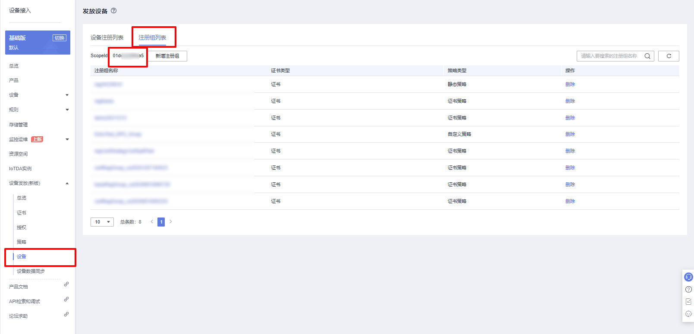

## Register device issuance

- Demo source code：[BootstrapSample.cs](iot-device-demo/Bootstrap/BootstrapSample.cs)
- Demo name: Bootstrap
- Reference document: [Register Device](https://support.huaweicloud.com/usermanual-iotps/iot_01_0008.html)

For device provisioning, you must first obtain the provisioning access address. For details, please refer to [Terminal Node](https://support.huaweicloud.com/endpoint-iotps/iot_04_0001.html).

1. Static strategy

   The static policy supports devices with both key and certificate access. Only key access is shown here. For certificate access, please refer to the "Certificate Policy" below.
   Change the following configuration [iot-device-demo/config/DemoConfigDefault.json](iot-device-demo/config/DemoConfigDefault.json)

    ``` json
    {
        "AuthConfig": {
            "AuthUseCert": true,
            "ServerAddress": "Issue access address",
            "ServerPort": 8883,
            "DeviceId": "Your device id",
            "DeviceSecret": "Your device secret",
        },
        "BootstrapConfig": {
            "ReportedData": "Static policy supports matching reported messages, you can fill in the keywords here"
        }
    }
    ```

   Or initialize `Bootstrapclient` programmatically:
    ```csharp
        new BootstrapClient(bootstrapUri, port, deviceId, deviceSecret, null)
    ```
2. Certificate policy

   The certificate policy requires the device to access through a certificate. For the certificate production process and console configuration, please refer to [MQTT X.509 Certificate Policy](https://support.huaweicloud.com/qs-iotps/iot_03_0007.html).

   Change the following configuration [iot-device-demo/config/DemoConfigDefault.json](iot-device-demo/config/DemoConfigDefault.json)

    ``` json
    {
        "AuthConfig": {
            "AuthUseCert": true,
            "ServerAddress": "Issue access address",
            "ServerPort": 8883,
            "DeviceId": "Your device id",
            "DeviceCert": "The pfx certificate you generated",
            "DeviceCertPassword": "pfx certificate password"
        },
        "BootstrapConfig": {
        }
    }
    ```

   Or initialize `Bootstrapclient` programmatically:
    ```csharp
        new BootstrapClient(bootstrapUri, port, deviceId, deviceCert, null)
    ```
3. Custom strategies

   This policy supports both key and certificate access devices. For usage, please refer to [Custom Policy](https://support.huaweicloud.com/usermanual-iotps/iot_01_0001.html).

## Registration group distribution

- Demo source code：[BootstrapSample.cs](iot-device-demo/Bootstrap/BootstrapSample.cs)
- Demo name: Bootstrap
- Reference document: [Registration Group](https://support.huaweicloud.com/usermanual-iotps/iot_01_0009.html)

1. Static strategy

   The static policy supports devices with both key and certificate access. Only key access is shown here. For certificate access, please refer to the "Certificate Policy" below.
   The key needs to be obtained when creating the registration group. For details, please refer to [MQTT Registration Group Key Authentication Static Policy Distribution Example](https://support.huaweicloud.com/qs-iotps/iot_03_00018.html).

   Change the following configuration [iot-device-demo/config/DemoConfigDefault.json](iot-device-demo/config/DemoConfigDefault.json)

    ``` json
    {
        "AuthConfig": {
            "AuthUseCert": true,
            "ServerAddress": "Issue access address",
            "ServerPort": 8883,
            "DeviceId": "Your device id",
            "DeviceSecret": "Attention! What you are filling in here now is the registration group key!",
        },
        "BootstrapConfig": {
            "ScopeId": "scopeId obtained above",
            "ReportedData": "Static policy supports matching reported messages, you can fill in the keywords here"
        }
    }
    ```

   Or initialize `Bootstrapclient` programmatically:
    ```csharp
        new BootstrapClient(bootstrapUri, port, deviceId, regGroupSecret, scopeId)
    ```
2. Certificate policy

   The certificate policy requires the device to access through a certificate. Please refer to the certificate production process and console configuration.
   [Example of issuing certificate policy for MQTT X.509 certificate authentication device](https://support.huaweicloud.com/qs-iotps/iot_03_0007.html).

   Change the following configuration [iot-device-demo/config/DemoConfigDefault.json](iot-device-demo/config/DemoConfigDefault.json)

    ``` json
    {
        "AuthConfig": {
            "AuthUseCert": true,
            "ServerAddress": "Issue access address",
            "ServerPort": 8883,
            "DeviceId": "Your device id",
            "DeviceCert": "The pfx certificate you generated",
            "DeviceCertPassword": "pfx certificate password"
        },
        "BootstrapConfig": {
            "ScopeId": "scopeId obtained above",
        }
    }
    ```

   Or initialize `Bootstrapclient` programmatically:
    ```csharp
        new BootstrapClient(bootstrapUri, port, deviceId, deviceCert, scopeId)
    ```
3. Custom strategies

   This policy supports both key and certificate access registration groups. For usage, please refer to [MQTT registration group custom policy distribution example](https://support.huaweicloud.com/qs-iotps/iot_03_0008.html).

# 6. Gnerice-protocol access

- Demo source code: All source codes under [iot-device-demo/TcpServer/Bridge](iot-device-demo/TcpServer/Bridge).
- Demo name: Bridge

In scenarios where third-party protocol devices cannot directly access the platform, Generic-protocol access provides the function of protocol conversion outside the platform. For detailed introduction, please refer to [Generic-protocol device access through protocol conversion gateway](https://support.huaweicloud.com/intl/en-us/bestpractice-iothub/iot_bp_0009.html)

## Create bridge

You need to [create a network bridge](https://support.huaweicloud.com/intl/en-us/api-iothub/AddBridge.html) before using Generic-protocol. If you want to create it through the platform interface, please refer to [Creating a Bridge].

## Start the bridge

Modify the access address [iot-device-demo/config/DemoConfigDefault.json](iot-device-demo/config/DemoConfigDefault.json) and fill in the previously obtained bridge access information into the corresponding position. The following is the template:

```json
{
  "DemoName": "Bridge",
  "AuthConfig": {
    "ServerAddress": "mqtt server address, obtain after consultation",
    "ServerPort": "mqtt server port, obtain after consultation",
    "DeviceId": "bridge Id",
    "DeviceSecret": "Bridge Secret"
  },
  "BridgeConfig": {
    "ListenPort": 8081
  }
}
```

Use the following command to start the bridge demo. After startup, the bridge will act as a tcp server and start listening for requests:

```shell
 cd iot-device-demo
 dotnet run --project .\iot-device-demo.csproj
```

The following log appears indicating successful startup:
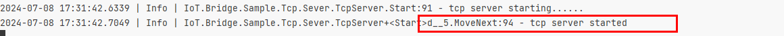

## Simulation device

1. Start the TCP device emulator:
   The TCP device emulator is a simple TCP client that is responsible for connecting to the Bridge's port and sending user-entered messages to the Bridge:

    ```shell
       cd iot-tcp-device
       dotnet run --project .\iot-tcp-device.csproj localhost 8081 myDeviceId myDeviceName
   ```

   The meanings of the next three parameters are:

   -Bridge's ip. This is the Bridge started locally, so it is localhost
    - Bridge port. Fill in the same port as configured in the first step.
    - device id. The device-id of the device used for simulation (prefix + underscore + device identification code)
    - Device key.

   Switch back to the gateway's log. If the connection is successful, the following content will appear:
   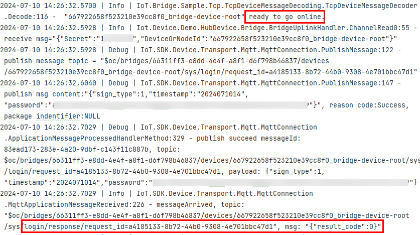

2. Return information:
   Return to the console of the device simulator and enter the following content to report the message:
   ```shell
   message: this is a random message
   ```
   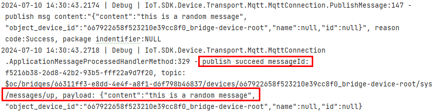

3. Send properties:
   In the console of the device simulator, enter the content in the following format to report the properties:
    ```shell
   properties: smokeDetector, {"alarm":1,"temperature":11.2}
   ```
   Switch back to the gateway's log. If the report is successful, the following content will appear:
   

4. Command response:
   When issuing commands to the device according to the operation in [Device Command](#42-device-commands), you need to manually reply to the command response in the device simulator. The format is as follows:
    ```shell
   cmdresp: requestId, result
   ```
   Among them, `requestId` is the corresponding request id when the command is issued, and result is the command execution result. 0 represents success, and others represent failure. Examples are as follows,
   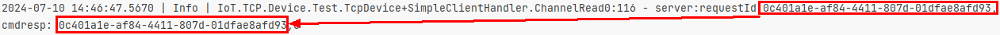

# 7. Open source agreement

- Follow the BSD-3 open source license agreement

