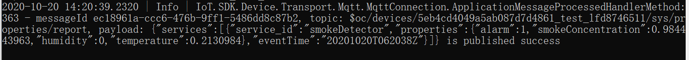
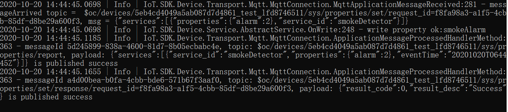
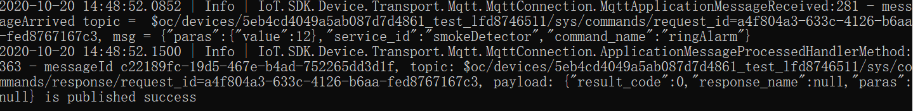
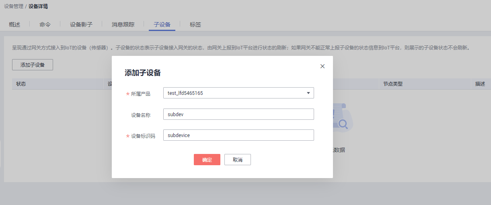
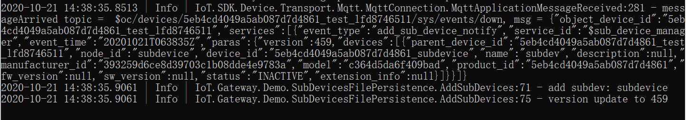
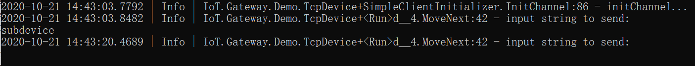
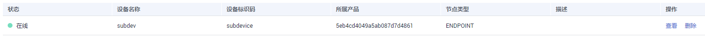
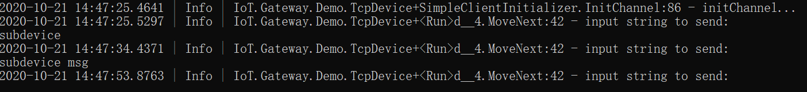
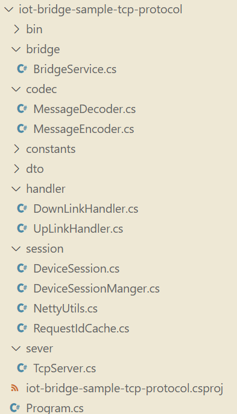

[English](./README.md) | 简体中文

# iot-device-sdk-cSharp开发指南

# 目录

<!-- TOC -->

- [修订记录](#0)

- [前言](#1)

- [SDK简介](#2)

- [准备工作](#3)

- [上传产品模型并注册设备](#4)

- [设备初始化](#5)

- [属性上报](#6)

- [消息上报](#7)

- [属性读写](#8)

- [命令下发](#9)

- [设备影子](#10)

- [OTA升级](#11)

- [设备时间同步](#12)

- [面向物模型编程](#13)

- [网关场景开发](#14)

- [泛协议开发](#15)

- [开源协议](#16)

  <!-- /TOC -->

<h1 id="0">修订记录</h1>
+ 文档版本03 支持泛协议接入功能（2022-11-22）
+ 文档版本02 增加网关和物模型功能（2020-10-25）
+ 文档版本01 第一次正式发布（2020-08-24）

<h1 id="1">前言</h1>
本文通过实例讲述iot-device-sdk-cSharp（以下简称SDK）帮助设备用MQTT协议快速连接到华为物联网平台。
<h1 id="2">SDK简介</h1>
SDK面向运算、存储能力较强的嵌入式终端设备，开发者通过调用SDK接口，便可实现设备与物联网平台的上下行通讯。SDK当前支持的功能有：
*  支持设备消息、属性上报、属性读写、命令下发
*  支持OTA升级
*  支持密码认证和证书认证两种设备接入方式
*  支持自定义topic
*  支持设备影子查询
*  支持网关和物模型

**SDK目录结构**

iot-device-sdk-csharp：sdk代码

iot-device-demo：普通直连设备的demo代码

iot-gateway-demo：网关设备的demo代码

iot-device-feature-test：调用demo程序的入口工程

iot-tcp-device-test：子设备实例启动工程

iot-bridge-sdk：泛协议sdk代码

iot-bridge-sample-tcp-protocol：泛协议demo代码

**第三方类库使用版本**

MQTTnet：v3.0.11

MQTTnet.Extensions.ManagedClient：v3.0.11

Newtonsoft.Json：v12.0.3

NLog：v4.7

DotNetty.Codecs：v0.6.0

DotNetty.Transport：v0.6.0

DotNetty.Handlers: v0.6.0

Microsoft.Extensions.Caching.Memory：v6.0.1

<h1 id="3">准备工作</h1>
*  已安装Microsoft Visual Studio 2017

*  .NET Standard 版本：2.0（为支持.NET Standard 2.0 安装升级了Visual Studio：指导路径https://docs.microsoft.com/zh-cn/archive/blogs/benjaminperkins/how-to-install-net-standard-2-0）

<h1 id="4">上传产品模型并注册设备</h1>
为了方便体验，我们提供了一个烟感的产品模型，烟感会上报烟雾值、温度、湿度、烟雾报警、还支持响铃报警命令。以烟感例，体验消息上报、属性上报等功能。

1.访问[设备接入服务](https://www.huaweicloud.com/product/iothub.html)，单击“立即使用”进入设备接入控制台。
2.访问管理控制台，查看MQTTS设备接入地址，保存该地址。
  
3.在设备接入控制台选择“产品”，单击右上角的“创建产品”，在弹出的页面中，填写“产品名称”、“协议类型”、“数据格式”、“厂商名称”、“所属行业”、“设备类型”等信息，然后点击右下角“立即创建”。

 - 协议类型选择“MQTT”；

 - 数据格式选择“JSON”。

4.产品创建成功后，单击“详情”进入产品详情，在功能定义页面，单击“上传模型文件”，上传烟感产品模型[smokeDetector](https://support.huaweicloud.com/devg-iothub/resource/smokeDetector_cb097d20d77b4240adf1f33d36b3c278_smokeDetector.zip)。
5.在左侧导航栏，选择“ 设备 > 所有设备”，单击右上角“注册设备”，在弹出的页面中，填写注册设备参数，然后单击“确定”。
 

6.设备注册成功后保存设备标识码、设备ID、密钥。

<h1 id="5">设备初始化</h1>
1. 创建设备。

   设备接入平台时，物联网平台提供密钥和证书两种鉴权方式。
* 如果您使用1883端口接入平台，需要写入获取的设备ID、密钥。

   ```c#
   IoTDevice device = new IoTDevice("iot-mqtts.cn-north-4.myhuaweicloud.com", 1883, "5eb4cd4049a5ab087d7d4861_demo", "secret");
   ```

   如果使用8883端口接入，需要把平台证书（DigiCertGlobalRootCA.crt.pem）放在根目录，并写入获取的设备ID、密钥。

   ```c#
   IoTDevice device = new IoTDevice("iot-mqtts.cn-north-4.myhuaweicloud.com", 8883, "5eb4cd4049a5ab087d7d4861_demo", "secret");
   ```
   **注：为安全起见，推荐使用8883端口接入平台。**

* 证书模式接入。

   华为物联网平台支持设备使用自己的X.509证书接入鉴权。在SDK中使用X.509证书接入时，需自行制作设备证书，并放到调用程序根目录下。SDK调用证书的根目录为\iot-device-feature-test\bin\Debug\certificate。

   接入步骤请参考：

   - 制作设备CA调测证书，详细指导请参考<a href="https://support.huaweicloud.com/usermanual-iothub/iot_01_0055.html" target="_blank">注册X.509证书认证的设备</a>。

   - 制作完调测证书后，参考以下命令转换成C#能接入的设备证书格式：

     ```c#
     openssl x509 -in deviceCert.pem -out deviceCert.crt //先生成crt格式的证书；
     openssl pkcs12 -export -out deviceCert.pfx -inkey deviceCert.key -in deviceCert.crt -certfile rootCA.pem
     
     X509Certificate2 clientCert = new X509Certificate2(@"\\Test01\\deviceCert.pfx", "123456");//必须使用X509Certificate2
     ```

   - 参考以下代码样例，创建设备。

     ```c#
     string deviceCertPath = Environment.CurrentDirectory + @"\certificate\deviceCert.pfx";
     if (!File.Exists(deviceCertPath))
     {
         Log.Error("请将设备证书放到根目录！");
     
         return;
     }
     
     X509Certificate2 deviceCert = new X509Certificate2(deviceCertPath, "123456");
     
     // 使用证书创建设备
     IoTDevice device = new IoTDevice("iot-mqtts.cn-north-4.myhuaweicloud.com", 8883, "5eb4cd4049a5ab087d7d4861_demo", deviceCert);
     ```

2. 调用init函数，建立连接。该函数是阻塞调用，如果建立连接成功会返回0。

   ```c#
   if (device.Init() != 0)
   {
   	return;
   }
   ```

3. 连接成功后，设备和平台之间开始通讯。调用IoTDevice 的GetClient函数获取设备客户端，客户端提供了消息、属性、命令等通讯接口。

<h1 id="6">属性上报</h1>
打开PropertySample类，这个例子中会上报alarm、temperature、humidity、smokeConcentration这四个属性。

```c#
public void FunPropertySample()
{
    // 创建设备
    IoTDevice device = new IoTDevice("iot-mqtts.cn-north-4.myhuaweicloud.com", 1883, "5eb4cd4049a5ab087d7d4861_demo", "secret");

    if (device.Init() != 0)
    {
    	return;
    }

    Dictionary<string, object> json = new Dictionary<string, object>();
    Random rand = new Random();

    // 按照物模型设置属性
    json["alarm"] = 1;
    json["temperature"] = (float)rand.NextDouble() * 100.0f;
    json["humidity"] = (float)rand.NextDouble() * 100.0f;
    json["smokeConcentration"] = (float)rand.NextDouble() * 100.0f;

    ServiceProperty serviceProperty = new ServiceProperty();
    serviceProperty.properties = json;
    serviceProperty.serviceId = "smokeDetector"; // serviceId要和物模型一致

    List<ServiceProperty> properties = new List<ServiceProperty>();
    properties.Add(serviceProperty);

    device.GetClient().messagePublishListener = this;
    device.GetClient().Report(new PubMessage(properties));
}

public void OnMessagePublished(RawMessage message)
{
	Console.WriteLine("pubSuccessMessage:" + message.Payload);
	Console.WriteLine();
}

public void OnMessageUnPublished(RawMessage message)
{
	Console.WriteLine("pubFailMessage:" + message.Payload);
	Console.WriteLine();
}
```
在iot-device-feature-test工程中修改设备信息，并在main函数中调用PropertySample类的FunPropertySample函数上报属性。

<h1 id="7">消息上报</h1>
消息上报是指设备向平台上报消息，本例还包含自定义Topic消息上报，以及自定义Topic命令下发功能。

1. 调用IoTDevice的GetClient接口获取客户端。

2. 调用客户端的Report接口上报设备消息。

   在MessageSample这个例子中上报消息，如果消息上报成功或者失败会进行函数回调：

   ```c#
   public void FunMessageSample()
   {
       // 创建设备
       IoTDevice device = new IoTDevice("iot-mqtts.cn-north-4.myhuaweicloud.com", 1883, "5eb4cd4049a5ab087d7d4861_demo", "secret");
   
       if (device.Init() != 0)
       {
           return;
       }
   
       device.GetClient().Report(new PubMessage(new DeviceMessage("hello")));
       device.GetClient().deviceCustomMessageListener = this;
       device.GetClient().messagePublishListener = this;
   
       // 上报自定义topic消息，注意需要先在平台配置自定义topic,并且topic的前缀已经规定好，固定为：$oc/devices/{device_id}/user/，通过Postman模拟应用侧使用自定义Topic进行命令下发。
       string suf_topic = "wpy";
       device.GetClient().SubscribeTopic(suf_topic);
   
       device.GetClient().Report(new PubMessage(CommonTopic.PRE_TOPIC + suf_topic, "hello raw message "));
   }
   
   public void OnMessagePublished(RawMessage message)
   {
       Console.WriteLine("pubSucessMessage:" + message.Payload);
       Console.WriteLine();
   }
   
   public void OnMessageUnPublished(RawMessage message)
   {
       Console.WriteLine("pubFailMessage:" + message.Payload);
       Console.WriteLine();
   }
   
   public void OnCustomMessageCommand(string message)
   {
       Console.WriteLine("onCustomMessageCommand , message = " + message);
   }
   ```

3. 选择对应设备，点击“查看”，在设备详情页面启动设备消息跟踪。

4.  在iot-device-feature-test工程中修改设备信息，并在main函数中调用MessageSample类的FunMessageSample函数上报消息。

5. 在设备接入控制台，选择“设备 > 所有设备”查看设备是否在线。

6. 平台收到设备上报的消息。

<h1 id="8">属性读写</h1>
调用客户端的PropertyListener接口来设置和获取属性的两个函数。在PropertiesGetAndSetSample这个例子中，我们实现了属性读写接口。

- 写属性处理：实现了属性的写操作，SDK收到属性值；

- 读属性处理：将本地属性值按照JSON格式进行拼装；
- 属性读写接口需要调用Report接口来上报操作结果；
- 如果设备不支持平台主动到设备读，OnPropertiesGet接口可以空实现；

```c#
private IoTDevice device;

/// <summary>
/// 通过Postman查询和设置平台属性
/// </summary>
public void FunPropertiesSample()
{
    // 创建设备
    device = new IoTDevice("iot-mqtts.cn-north-4.myhuaweicloud.com", 8883, "5eb4cd4049a5ab087d7d4861_demo", "secret");

    if (device.Init() != 0)
    {
        return;
    }

    device.GetClient().propertyListener = this;
}

public void OnPropertiesSet(string requestId, string services)
{
    Console.WriteLine("requestId Set:" + requestId);
    Console.WriteLine("services Set:" + services);

    device.GetClient().Report(new PubMessage(CommonTopic.TOPIC_SYS_PROPERTIES_SET_RESPONSE + "=" + requestId, "{\"result_code\": 0,\"result_desc\": \"success\"}"));
}

public void OnPropertiesGet(string requestId, string serviceId)
{
    Console.WriteLine("requestId Get:" + requestId);
    Console.WriteLine("serviceId Get:" + serviceId);

    Dictionary<string, object> json = new Dictionary<string, object>();
    Random rand = new Random();

    // 按照物模型设置属性
    json["alarm"] = 1;
    json["temperature"] = (float)rand.NextDouble() * 100.0f;
    json["humidity"] = (float)rand.NextDouble() * 100.0f;
    json["smokeConcentration"] = (float)rand.NextDouble() * 100.0f;

    ServiceProperty serviceProperty = new ServiceProperty();
    serviceProperty.properties = json;
    serviceProperty.serviceId = serviceId; // serviceId要和物模型一致

    List<ServiceProperty> properties = new List<ServiceProperty>();
    properties.Add(serviceProperty);

    device.GetClient().Report(new PubMessage(CommonTopic.TOPIC_SYS_PROPERTIES_GET_RESPONSE + "=" + requestId, properties));
}
```
<h1 id="9">命令下发</h1>
设置命令监听器用来接收平台下发的命令，在回调接口里，需要对命令进行处理，并上报响应。

在CommandSample例子中实现了命令的处理，收到命令后仅进行控制台显示，然后调用Report上报响应。

```c#
private IoTDevice device;

public void FunCommandSample()
{
	// 创建设备
	device = new IoTDevice("iot-mqtts.cn-north-4.myhuaweicloud.com", 8883, "5eb4cd4049a5ab087d7d4861_demo", "secret");

if (device.Init() != 0)
{
	return;
}

	device.GetClient().commandListener = this;
}

public void OnCommand(string requestId, string serviceId, string commandName, Dictionary<string, object> paras)
{
	Console.WriteLine("onCommand, serviceId = " + serviceId);
	Console.WriteLine("onCommand, name = " + commandName);
	Console.WriteLine("onCommand, paras =  " + JsonUtil.ConvertObjectToJsonString(paras));

	////处理命令

	Dictionary<string, string> dic = new Dictionary<string, string>();
dic.Add("result", "success");

	// 发送命令响应
	device.GetClient().Report(new PubMessage(requestId, new CommandRsp(0, dic)));
}
```
<h1 id="10">设备影子</h1>
1. 设备请求获取平台的设备影子数据，用于设备向平台获取设备影子数据。

   ```c#
   device.GetClient().deviceShadowListener = this;
   
   string guid = Guid.NewGuid().ToString();
   
   Console.WriteLine(guid);
   
   string topic = CommonTopic.TOPIC_SYS_SHADOW_GET + "=" + guid;
   
   device.GetClient().Report(new PubMessage(topic, string.Empty));
   ```

2. 设备接收平台返回的设备影子数据，用于接收平台返回的设备影子数据。

   ```c#
   public void OnShadowCommand(string requestId, string message)
   {
   	Console.WriteLine(requestId);
   	Console.WriteLine(message);
   }
   ```

<h1 id="11">OTA升级</h1>
1. 软件升级。参考<a href=" https://support.huaweicloud.com/usermanual-iothub/iot_01_0047.html#section3 " target="_blank">软件升级指导</a>上传软件包。

2. 固件升级。参考<a href=" https://support.huaweicloud.com/usermanual-iothub/iot_01_0027.html#section3 " target="_blank">固件升级</a>上传固件包。

3. 平台下发获取版本信息通知

   ```c#
   /// <summary>
   /// 接收OTA事件处理
   /// </summary>
   /// <param name="deviceEvent">服务事件</param>
   public override void OnEvent(DeviceEvent deviceEvent)
   {
       if (otaListener == null)
       {
       	Log.Info("otaListener is null");
       	return;
       }
   
       if (deviceEvent.eventType == "version_query")
       {
       	otaListener.OnQueryVersion();
       }
   }
   ```

4. 设备上报软固件版本。

   ```C#
   /// <summary>
   /// 上报固件版本信息
   /// </summary>
   /// <param name="version">固件版本</param>
   public void ReportVersion(string version)
   {
       Dictionary<string, object> node = new Dictionary<string, object>();
   
       node.Add("fw_version", version);
       node.Add("sw_version", version);
   
       DeviceEvent deviceEvent = new DeviceEvent();
       deviceEvent.eventType = "version_report";
       deviceEvent.paras = node;
       deviceEvent.serviceId = "$ota";
       deviceEvent.eventTime = IotUtil.GetEventTime();
   
       iotDevice.GetClient().ReportEvent(deviceEvent);
   }
   ```

5. 平台下发升级通知。

   ```c#
   public void OnNewPackage(OTAPackage otaPackage)
   {
       this.otaPackage = otaPackage;
       Log.Info("otaPackage = " + otaPackage.ToString());
   
       if (PreCheck(otaPackage) != 0)
       {
       	Log.Error("preCheck failed");
       	return;
       }
   
       DownloadPackage();
   }
   ```

6. 设备请求下载包。

   ```c#
   private void DownloadPackage()
   {
       try
       {
           ServicePointManager.SecurityProtocol = SecurityProtocolType.Tls12;
   
           // 声明HTTP请求
           HttpWebRequest myRequest = (HttpWebRequest)HttpWebRequest.Create(new Uri(otaPackage.url));
   
           // SSL安全通道认证证书
           ServicePointManager.ServerCertificateValidationCallback = new RemoteCertificateValidationCallback((a, b, c, d) => { return true; });
   
           myRequest.ClientCertificates.Add(IotUtil.GetCert(@"\certificate\DigiCertGlobalRootCA.crt.pem"));
   
           WebHeaderCollection wc = new WebHeaderCollection();
           wc.Add("Authorization", "Bearer " + otaPackage.token);
           myRequest.Headers = wc;
   
           int nfileSize = 0;
           using (WebResponse webResponse = myRequest.GetResponse())
           {
               using (Stream myStream = webResponse.GetResponseStream())
               {
                   using (FileStream fs = new FileStream(packageSavePath, FileMode.Create))
                   {
                       using (BinaryWriter bw = new BinaryWriter(fs))
                       {
                           using (BinaryReader br = new BinaryReader(myStream))
                           {
                               // 向服务器请求,获得服务器的回应数据流
                               byte[] nbytes = new byte[1024 * 10];
                               int nReadSize = 0;
                               nReadSize = br.Read(nbytes, 0, 1024 * 10);
                               nfileSize = nReadSize;
                               while (nReadSize > 0)
                               {
                                   bw.Write(nbytes, 0, nReadSize);
                                   nReadSize = br.Read(nbytes, 0, 1024 * 10);
                               }
                           }
                       }
                   }
               }
           }
   
           if (nfileSize == otaPackage.fileSize)
           {
               string strSHA256 = IotUtil.GetSHA256HashFromFile(packageSavePath);
               Log.Info("SHA256 = " + strSHA256);
   
               otaService.reportOtaStatus(OTAService.OTA_CODE_SUCCESS, 100, version, null);
               OnUpgradeSuccess(strSHA256);
           }
       }
       catch (WebException exp)
       {
           otaService.reportOtaStatus(OTAService.OTA_CODE_DOWNLOAD_TIMEOUT, 0, version, exp.Message);
           OnUpgradeFailure();
       }
       catch (Exception ex)
       {
           otaService.reportOtaStatus(OTAService.OTA_CODE_INNER_ERROR, 0, version, ex.Message);
           OnUpgradeFailure();
       }
   }
   ```

7. 设备上报升级状态。

   ```c#
   /// <summary>
   /// 上报升级状态
   /// </summary>
   /// <param name="result">升级结果</param>
   /// <param name="progress">升级进度0-100</param>
   /// <param name="version">当前软件或固件版本</param>
   /// <param name="description">具体失败的原因，可选参数</param>
   public void ReportOtaStatus(int result, int progress, string version, string description)
   {
       Dictionary<string, object> node = new Dictionary<string, object>();
       node.Add("result_code", result);
       node.Add("progress", progress);
       if (description != null)
       {
       	node.Add("description", description);
       }
   
       node.Add("version", version);
   
       DeviceEvent deviceEvent = new DeviceEvent();
       deviceEvent.eventType = "upgrade_progress_report";
       deviceEvent.paras = node;
       deviceEvent.serviceId = "$ota";
       deviceEvent.eventTime = IotUtil.GetEventTime();
   
       iotDevice.GetClient().ReportEvent(deviceEvent);
   }
   ```

<h1 id="12">设备时间同步</h1>
1. 设备向平台发起时间同步请求。  

   ```c#
   public void RequestTimeSync()
   {
       Dictionary<string, object> node = new Dictionary<string, object>();
       node.Add("device_send_time", IotUtil.GetTimeStamp());
   
       DeviceEvent deviceEvent = new DeviceEvent();
       deviceEvent.eventType = "time_sync_request";
       deviceEvent.paras = node;
       deviceEvent.serviceId = "$time_sync";
       deviceEvent.eventTime = IotUtil.GetEventTime();
   
       iotDevice.GetClient().messagePublishListener = this;
       iotDevice.GetClient().ReportEvent(deviceEvent);
   }
   ```

2. 平台向设备发送时间同步响应，携带设备发送时间参数device_send_time。当平台收到设备请求时间server_recv_time 后，向设备发送时间server_send_time 。

   假设设备收到的设备侧时间为device_recv_time ，则设备收到平台响应的真实时间为：

   (server_recv_time + server_send_time + device_recv_time - device_send_time) / 2

   ```c#
   public override void OnEvent(DeviceEvent deviceEvent)
   {
       if (listener == null)
       {
       	return;
       }
   
       if (deviceEvent.eventType == "time_sync_response")
       {
           Dictionary<string, object> node = deviceEvent.paras;
           long device_send_time = Convert.ToInt64(node["device_send_time"]);
           long server_recv_time = Convert.ToInt64(node["server_recv_time"]);
           long server_send_time = Convert.ToInt64(node["server_send_time"]);
   
           listener.OnTimeSyncResponse(device_send_time, server_recv_time, server_send_time);
       }
   }
           
   public void OnTimeSyncResponse(long device_send_time, long server_recv_time, long server_send_time)
   {
       long device_recv_time = Convert.ToInt64(IotUtil.GetTimeStamp());
       long now = (server_recv_time + server_send_time + device_recv_time - device_send_time) / 2;
       Console.WriteLine("now is " + StampToDatetime(now));
   }
   ```

<h1 id="13">面向物模型编程</h1>
前面介绍了直接调用设备客户端的接口和平台进行通讯的方法，这种方式比较灵活，但用户需要妥善处理每一个接口，实现比较复杂。

SDK提供了一种更简单的方式，即面向物模型编程。面向物模型编程指基于SDK提供的物模型抽象能力，设备代码按照物模型定义设备服务，然后可以直接访问设备服务（即调用设备服务的属性读写接口），SDK就能自动和平台通讯，完成属性的同步和命令的调用。

相比直接调用客户端接口和平台进行通讯，面向物模型编程更简单，它简化了设备侧代码的复杂度，让设备代码只需要关注业务，而不用关注和平台的通讯过程。这种方式适合多数场景。

SmokeDetector例子演示了如何面向物模型编程：

1. 按照物模型定义服务类和服务的属性（如果有多个服务，则需要定义多个服务类）：

   ```c#
   public class SmokeDetectorService : AbstractService
   {
   	public SmokeDetectorService()
   	{
   		this.SetDeviceService(this);
   	}
   
   	// 按照设备模型定义属性，注意属性的name和类型需要和模型一致
   	[Property(Name = "alarm", Writeable = true)]
   	public int smokeAlarm { get; set; } = 1;
   
   	[Property(Name = "smokeConcentration", Writeable = false)]
   	public float concentration
   	{
   		get
   		{
   			return (float)new Random().NextDouble();
   		}
   	}
   
   	[Property(Writeable = false)]
   	public int humidity { get; set; }
   	
   	[Property(Writeable = false)]
   	public float temperature
   	{
   		get
   		{
   			// 模拟从传感器读取数据
   			return (float)new Random().NextDouble();
   		}
   	}
   }
   ```
   用[Property()]特性来表示是一个属性，可以用Name指定属性名，如果不指定则使用字段名。

   属性可以加上Writeable来控制权限，如果属性只读，则加上Writeable= false，如果不加，默认认为可读写。

2. 定义服务的命令。设备收到平台下发的命令时，SDK会自动调用这里定义的命令。

   接口入参和返回值的类型是固定的不能修改，否则运行时会出现错误。

   这里定义的是一个响铃报警命令，命令名为ringAlarm。

   	/// <summary>
   	/// 定义命令，注意接口入参和返回值类型是固定的不能修改，否则运行时会出现错误
   	/// 方法名和模型命令一致
   	/// </summary>
   	/// <param name="jsonParas"></param>
   	/// <returns></returns>
   	[DeviceCommand(Name = "ringAlarm")]
   	public CommandRsp alarm(string jsonParas)
   	{
   		JObject obj = JObject.Parse(jsonParas);
   		int value = (int)obj["value"];
   		
   		return new CommandRsp(0);
   	}

3. 在FunSmokeDetector函数中创建服务实例并添加到设备。

   ```c#
   // 创建设备
   IoTDevice device = new IoTDevice(serverUri, port, deviceId, deviceSecret);
   
   if (device.Init() != 0)
   {
   	return;
   }
   
   // 创建设备服务
   SmokeDetectorService smokeDetectorService = new SmokeDetectorService();
   device.AddService("smokeDetector", smokeDetectorService);
   ```

4. 开启周期上报：

   ```c#
   // 启动自动周期上报
   smokeDetectorService.EnableAutoReport(10000);
   ```

   注：如果不想周期上报，也可以调用FirePropertiesChanged接口手工触发上报。

   ```c#
   smokeDetectorService.FirePropertiesChanged();
   ```

   直接运行iot-device-feature-test工程，调用程序：

   ```c#
   SmokeDetector sd = new SmokeDetector();
   sd.FunSmokeDetector(serverUri, 8883, deviceId, deviceSecret);
   ```

   查看日志在上报属性：
   

   在平台侧查看设备影子：

   

   在平台上修改属性alarm为2，查看设备日志收到属性设置：

   

   在平台下发ringAlarm命令value值为12：

   查看设备日志看到ringAlarm命令被调用，并且上报了响应：

   

<h1 id="14">网关场景开发</h1>
网关是一个特殊的设备，除具备一般设备功能之外，还具有子设备管理、子设备消息转发的功能。SDK提供了AbstractGateway抽象类来简化网关的实现。该类提供了子设备管理功能，需要从平台获取子设备信息并保存（需要子类提供子设备持久化接口）、子设备下行消息转发功能（需要子类实现转发处理接口）、以及上报子设备列表、上报子设备属性、上报子设备状态、上报子设备消息等接口。

- **使用AbstractGateway类**

  继承该类，在构造函数里提供子设备信息持久化接口，实现其下行消息转发的抽象接口：

  ```c#
  /// <summary>
  /// 子设备命令下发处理，网关需要转发给子设备，需要子类实现
  /// </summary>
  /// <param name="requestId">请求Id</param>
  /// <param name="command">命令</param>
  public abstract void OnSubdevCommand(string requestId, Command command);
  
  /// <summary>
  /// 子设备属性设置，网关需要转发给子设备，需要子类实现
  /// </summary>
  /// <param name="requestId">请求ID</param>
  /// <param name="propsSet">属性设置</param>
  public abstract void OnSubdevPropertiesSet(string requestId, PropsSet propsSet);
  
  /// <summary>
  /// 子设备读属性，网关需要转发给子设备，需要子类实现
  /// </summary>
  /// <param name="requestId">请求ID</param>
  /// <param name="propsGet">属性查询</param>
  public abstract void OnSubdevPropertiesGet(string requestId, PropsGet propsGet);
  
  /// <summary>
  /// 子设备消息下发，网关需要转发给子设备，需要子类实现
  /// </summary>
  /// <param name="message">设备消息</param>
  public abstract void OnSubdevMessage(DeviceMessage message);
  ```

- **iot-gateway-demo代码介绍**

  工程iot-gateway-demo基于**AbstractGateway**实现了一个简单的网关，它提供TCP设备接入能力。关键类：

  SimpleGateway：继承自AbstractGateway，实现子设备管理和下行消息转发

  StringTcpServer：基于DotNetty实现一个TCP server，本例中子设备采用TCP协议，并且首条消息为鉴权消息

  SubDevicesFilePersistence：子设备信息持久化，采用json文件来保存子设备信息，并在内存中做了缓存

  Session：设备会话类，保存了设备id和TCP的channel的对应关系

- **SimpleGateway类**

  **添加或删除子设备处理**

  添加子设备：AbstractGateway的OnAddSubDevices接口已经完成了子设备信息的保存。我们不需要再增加额外处理，因此SimpleGateway不需要重写OnAddSubDevices接口。

  删除子设备：我们不仅需要修改持久化信息，还需要断开当前子设备的连接。所以我们重写了OnDeleteSubDevices接口，然后调用父类的OnDeleteSubDevices。

- **下行消息处理**

  网关收到平台下行消息时，需要转发给子设备。平台下行消息分为三种：设备消息、属性读写、命令。

  - **设备消息：**这里我们需要根据deviceId获取nodeId，从而获取session，从session里获取channel，就可以往channel发送消息。在转发消息时，可以根据需要进行一定的转换处理。

    ```c#
    public override void OnSubdevMessage(DeviceMessage message)
    {
    	if (message.deviceId == null)
    	{
    		return;
    	}
    
        // 平台接口带的都是deviceId，deviceId是由nodeId和productId拼装生成的，即
        // deviceId = productId_nodeId
    	string nodeId = IotUtil.GetNodeIdFromDeviceId(message.deviceId);
    	if (nodeId == null)
    	{
    		return;
    	}
    
        // 通过nodeId获取session，进一步获取channel
    	Session session = nodeIdToSesseionDic[nodeId];
    	if (session == null)
    	{
    		Log.Error("session is null ,nodeId:" + nodeId);
    		return;
    	}
    	
        // 直接把消息转发给子设备
    	session.channel.WriteAndFlushAsync(message.content);
    	Log.Info("WriteAndFlushAsync " + message.content);
    }
    ```

  - **属性读写：**

    属性读写包括属性设置和属性查询。

    属性设置：

    ```c#
    public override void OnSubdevPropertiesSet(string requestId, PropsSet propsSet)
    {
    	if (propsSet.deviceId == null)
    	{
    		return;
    	}
    
    	string nodeId = IotUtil.GetNodeIdFromDeviceId(propsSet.deviceId);
    	if (nodeId == null)
    	{
    		return;
    	}
    
    	Session session = nodeIdToSesseionDic[nodeId];
    	if (session == null)
    	{
    		Log.Error("session is null ,nodeId:" + nodeId);
    		return;
    	}
    
    	// 这里我们直接把对象转成string发给子设备，实际场景中可能需要进行一定的编解码转换
     session.channel.WriteAndFlushAsync(JsonUtil.ConvertObjectToJsonString(propsSet));
    
    	// 为了简化处理，我们在这里直接回响应。更合理做法是在子设备处理完后再回响应
    	GetClient().RespondPropsSet(requestId, IotResult.SUCCESS);
    
    	Log.Info("WriteAndFlushAsync " + propsSet);
    }
    ```

    属性查询：

    ```c#
    public override void OnSubdevPropertiesGet(string requestId, PropsGet propsGet)
    {
    	// 不建议平台直接读子设备的属性，这里直接返回失败
    	Log.Error("not support onSubdevPropertiesGet");
    	GetClient().RespondPropsSet(requestId, IotResult.FAIL);
    }
    ```

  - **命令：**处理流程和消息类似，实际场景中可能需要不同的编解码转换。

    ```c#
    public override void OnSubdevCommand(string requestId, Command command)
    {
    	if (command.deviceId == null)
    	{
    		return;
    	}
    
    	string nodeId = IotUtil.GetNodeIdFromDeviceId(command.deviceId);
    	if (nodeId == null)
    	{
    		return;
    	}
    
    	Session session = nodeIdToSesseionDic[nodeId];
    	if (session == null)
    	{
    		Log.Error("session is null ,nodeId is " + nodeId);
    
    		return;
    	}
    
    	// 这里我们直接把command对象转成string发给子设备，实际场景中可能需要进行一定的编解码转换
    	session.channel.WriteAndFlushAsync(JsonUtil.ConvertObjectToJsonString(command));
    
    	// 为了简化处理，我们在这里直接回命令响应。更合理做法是在子设备处理完后再回响应
    	GetClient().RespondCommand(requestId, new CommandRsp(0));
    	Log.Info("WriteAndFlushAsync " + command);
    }
    ```

- **上行消息处理**

  上行处理在StringTcpServer的channelRead0接口里。如果会话不存在，需要先创建会话：

  如果子设备信息不存在，这里创建会话会失败。

  ```c#
  protected override void ChannelRead0(IChannelHandlerContext ctx, string msg)
  {
  	IChannel incoming = ctx.Channel;
  	Log.Info("channelRead0" + incoming.RemoteAddress + " msg :" + msg);
  
  	// 如果是首条消息，创建session
  	Session session = simpleGateway.GetSessionByChannel(incoming.Id.AsLongText());
  	if (session == null)
  	{
  		string nodeId = msg;
  		session = simpleGateway.CreateSession(nodeId, incoming);
  
  		// 创建会话失败
  		if (session == null)
  		{
  			Log.Info("close channel");
  			ctx.CloseAsync().Wait();
  		}
  		else
  		{
  			Log.Info(session.deviceId + " ready to go online.");
  			simpleGateway.ReportSubDeviceStatus(session.deviceId, "ONLINE");
  		}
  	}
  }
  ```

  如果会话存在，则进行消息转发：

  ```c#
  else
  {
  	// 网关收到子设备上行数据时，可以将数据上报到平台。
  	// 实际使用时根据需要选择一种即可，这里为了演示，两种类型都转发一遍
  
  	// 上报消息用reportSubDeviceMessage
  	DeviceMessage deviceMessage = new DeviceMessage(msg);
  	deviceMessage.deviceId = session.deviceId;
  	simpleGateway.ReportSubDeviceMessage(deviceMessage);
  
  	// 报属性则调用reportSubDeviceProperties，属性的serviceId和字段名要和子设备的产品模型保持一致
  	ServiceProperty serviceProperty = new ServiceProperty();
  	serviceProperty.serviceId = "parameter";
  	Dictionary<string, object> props = new Dictionary<string, object>();
  
  	// 属性值暂且写死，实际中应该根据子设备上报的进行组装
  	props.Add("alarm", 1);
  	props.Add("temperature", 2);
  	serviceProperty.properties = props;
  
  	List<ServiceProperty> services = new List<ServiceProperty>();
  	services.Add(serviceProperty);
  	simpleGateway.ReportSubDeviceProperties(session.deviceId, services);
  }
  ```

  到这里，网关的关键代码介绍完了，其他的部分看源代码。整个demo是开源的，用户可以根据需要进行扩展。比如修改持久化方式、转发中增加消息格式的转换、实现其他子设备接入协议。

- **网关的使用**

  1. 在平台上为网关注册开户。

  2. 在iot-device-feature-test工程中修改设备信息，并在main函数中调用如下函数：

     ```c#
     new StringTcpServer(serverUri, 8883, deviceId, deviceSecret);
     ```

  3. 启动iot-device-feature-test工程调用StringTcpServer类，在平台上看到该网关在线后，添加子设备。

     此时网关上日志打印：

  4. 启动iot-tcp-device-test工程调用TcpDevice类，建立连接后，输入子设备的nodeId。

  5. 在平台上看到子设备上线。

  6. 子设备上报消息

     查看日志看到上报成功

  7. 查看消息跟踪

     在平台上找到网关，选择 设备详情-消息跟踪，打开消息跟踪。继续让子设备发送数据，等待片刻后看到消息跟踪：


<h1 id="15">泛协议开发</h1>

目前平台支持基于MQTT/HTTP/LwM2M等标准协议接入，为解决用户自定义协议设备快速接入IoT平台的诉求。华为云IoT提供泛协议适配机制，您可使用泛协议对接SDK，快速构建协议插件，进行设备或平台与IoT的双向数据通信。

- **业务流程**
  

- **SDK接口说明**

  **泛协议SDK提供监听平台下行数据的接口说明**
  | 接口 | 说明 |
  | :---- | :---- |
  | BridgeCommandListener | 平台命令下发监听接口。泛协议插件可以通过该接口将平台的下行命令转发给第三方协议设备。 |
  | BridgeDeviceMessageListener | 平台消息下发监听接口。泛协议插件可以通过该接口将平台的下行消息转发给第三方协议设备。 |
  | BridgeDeviceDisConnListener | 平台通知网桥断开设备连接监听接口。泛协议插件可以通过该接口主动断开第三方协议设备的连接。 |
  | LoginListener | 网桥等待设备登录结果的监听接口。泛协议插件可以通过该接口监听设备是否登录成功。 |
  | LogoutListener | 网桥等待设备登出结果的监听接口。泛协议插件可以通过该接口监听设备是否登出成功。 |

  **泛协议SDK提供的相关类说明**
  | 类 | 说明 |
  | :---- | :---- |
  | BridgeClientConf | 泛协议SDK客户端配置类（包括泛协议SDK连接平台的地址、网桥ID、秘钥等参数） |
  | BridgeBootstrap | 泛协议SDK启动初始化类。 |
  | BridgeClient | 泛协议SDK网桥客户端实现类，实现同平台的通信（设备登录、设备消息上报、设备属性上报、设备登出等） |
  
- **项目结构说明**
  
  **项目结构图**

  

  **类相关说明**

  | 类名称 | 描述 |
  | :---- | :---- |
  | Program | 主启动类。 |
  | BridgeService | 网桥初始化：初始化同IoT平台的连接，设置平台下行数据监听 |
  | TcpServer | TCP协议服务端启动类。开启TCP协议监听端口，接收设备上报到服务端的消息。 |
  | MessageDecoder | 上行数据的消息解码，将TCP原始码流转换为具体JSON对象。 |
  | MessageEncoder | 下行数据的消息编码，将对象数据转换为TCP原始码流。 |
  | UpLinkHandler | 设备上行数据处理类。把TCP协议数据转成平台格式数据，并调用SDK接口进行上报 |
  | DownLinkHandler | IoT平台下发数据处理类。将平台下发数据转换为TCP协议数据，并下发给设备。 |
  | DeviceSessionManger | 设备会话管理。管理设备同服务端的连接。 |

- **初始化网桥SDK**
  
  创建BridgeBootstrap对象实例，调用InitBridge方法，在该方法中会读取环境变量的配置信息，并同IoT平台建立网桥连接。
  **环境变量说明**
  | 环境变量名称 | 参数说明 | 样例 |
  | :---- | :---- | :---- |
  | ENV_NET_BRIDGE_ID | 网桥ID | bridge001 |
  | ENV_NET_BRIDGE_SECRET | 网桥秘钥 | ******** |
  | ENV_NET_BRIDGE_SERVER_IP | IoTDA平台地址 | *****.iot-mqtts.cn-north-4.myhuaweicloud.com |
  | ENV_NET_BRIDGE_SERVER_PORT | IoTDA平台泛协议接入端口号 | 8883 |

  初始化成功后，需要设置平台下行数据的监听器，监听平台的下行数据。

  代码样例：
  ```c#
  public void Init()
  {
      // 网桥启动初始化
      BridgeBootstrap bridgeBootstrap = new BridgeBootstrap();

      // 从环境变量获取配置进行初始化
      bridgeBootstrap.InitBridge();

      bridgeClient = bridgeBootstrap.GetBridgeDevice().bridgeClient;

      // 设置平台下行数据监听器
      DownLinkHandler downLinkHandler = new DownLinkHandler(bridgeClient);
      bridgeClient.bridgeCommandListener = downLinkHandler;   // 设置平台命令下发监听器
      bridgeClient.bridgeDeviceMessageListener = downLinkHandler;    // 设置平台消息下发监听器
      bridgeClient.bridgeDeviceDisConnListener = downLinkHandler;   // 设置平台通知网桥主动断开设备连接的监听器
  }
  ```
- **设备登录上线**
  
  设备登录上线的实现样例如下：
  ```c#
  private void Login(IChannel channel, BaseMessage message)
  {

    if (!(message is DeviceLoginMessage)) {
        return;
    }

    string deviceId = message.msgHeader.deviceId;
    string secret = ((DeviceLoginMessage)message).secret;
    DeviceSession deviceSession = new DeviceSession();

    int resultCode = BridgeService.GetBridgeClient().LoginSync(deviceId, secret, 5000);

    // 登录成功保存会话信息
    if (resultCode == 0) {
        deviceSession.deviceId = deviceId;
        deviceSession.channel = channel;
        DeviceSessionManger.GetInstance().CreateSession(deviceId, deviceSession);
        NettyUtils.SetDeviceId(channel, deviceId);
    }
  }
  ```
  设备上线时，需要从原始设备消息中解析出鉴权信息（设备ID和秘钥），再调用SDK提供的login接口向平台发起登录请求，平台收到设备的login请求后，会对设备的鉴权信息进行认证，认证通过后会通过返回码告知网桥SDK设备的登录结果。您需要根据登录结果对设备进行记录会话信息、给设备返回响应等处理。

- **设备数据上报**
  
  设备登录成功后，收到设备的上行数据时，可调用SDK的reportProperties将解码后的数据上报到IoT平台。

  代码样例参考：
  ```c#
  private void ReportProperties(IChannel channel, BaseMessage message)
  {
      String deviceId = message.msgHeader.deviceId;
      DeviceSession deviceSession = DeviceSessionManger.GetInstance().GetSession(deviceId);
      if (deviceSession == null) {
          Log.Warn("device={} is not login", deviceId);
          SendResponse(channel, message, 1);
          return;
      }

      ServiceProperty serviceProperty = new ServiceProperty();
      serviceProperty.serviceId = "Location";
      serviceProperty.properties = JsonUtil.ConvertJsonStringToObject<Dictionary<string, object>>(JsonUtil.ConvertObjectToJsonString(message));

      List<ServiceProperty> properties = new List<ServiceProperty>();
      properties.Add(serviceProperty);
      // 调用网桥reportProperties接口，上报设备属性数据
      BridgeService.GetBridgeClient().ReportProperties(deviceId, properties);
  }
  ```
- **平台指令下发**
  
  网桥在初始化时向SDK注册了BridgeCommandListener的监听。当有下行指令时，网桥SDK就会回调BridgeCommandListener的OnCommand方法。您可在OnCommand中对平台的下行指令进行处理。

  代码样例参考：
  ```c#
  public void OnCommand(string deviceId, string requestId, BridgeCommand bridgeCommand)
  {
    Log.Info("onCommand deviceId={0}, requestId={1}, bridgeCommand={2}", deviceId, requestId, bridgeCommand);
    DeviceSession session = DeviceSessionManger.GetInstance().GetSession(deviceId);
    if (session == null) {
        Log.Warn("device={0} session is null", deviceId);
        return;
    }

    // 设置位置上报的周期
    if (bridgeCommand.command.commandName == "FREQUENCY_LOCATION_SET") {
        processLocationSetCommand(session, requestId, bridgeCommand);
    }
    bridgeClient.RespondCommand(deviceId, requestId, new CommandRsp(CommandRsp.SUCCESS));
  }
  ````
- **设备离线**

  网桥检查到设备到服务端的长连接断开时，需要调用SDK的logout接口通知平台设备离线。

  代码样例参考：
  ```c#
  public override void ChannelInactive(IChannelHandlerContext ctx)
  {
    string deviceId = NettyUtils.GetDeviceId(ctx.Channel);
    if (deviceId == null) {
        return;
    }
    DeviceSession deviceSession = DeviceSessionManger.GetInstance().GetSession(deviceId);
    if (deviceSession == null) {
        return;
    }

    // 调用网桥的logout接口，通知平台设备离线
    BridgeService.GetBridgeClient().LogoutAsync(deviceId, Guid.NewGuid().ToString());
    DeviceSessionManger.GetInstance().DeleteSession(deviceId);

    ctx.CloseAsync();
  }
  ```
- **测试验证**
  
  - **获取网桥接入信息**
    
    修改对应环境变量ENV_NET_BRIDGE_ID、ENV_NET_BRIDGE_SECRET、ENV_NET_BRIDGE_SERVER_IP、ENV_NET_BRIDGE_SERVER_PORT
  - **创建产品和设备**
  - **功能验证**
    
    均可参考https://support.huaweicloud.com/usermanual-iothub/iot_02_3.html实现

    启动TCP：运行iot-tcp-device-test工程模拟设备同网桥建立TCP连接，并发送登录请求。


    

<h1 id="16">开源协议</h1>
- 遵循BSD-3开源许可协议