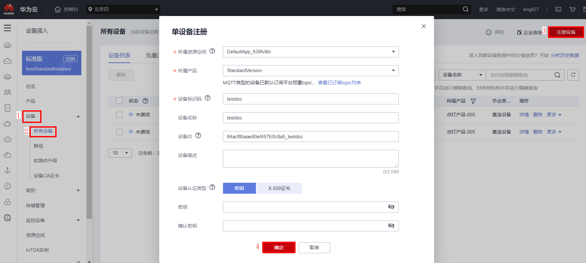
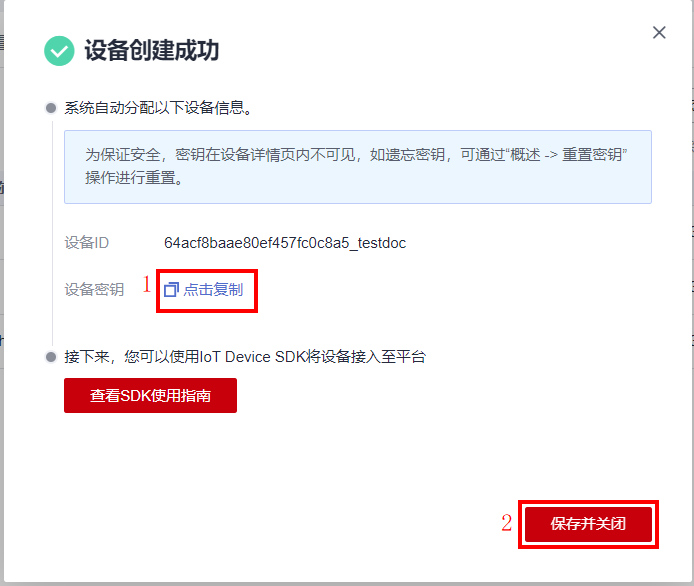
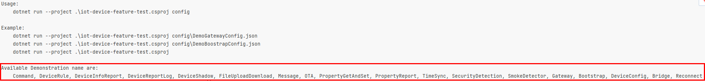
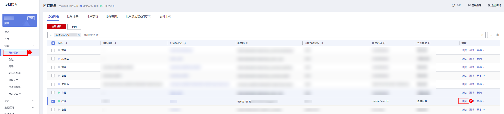
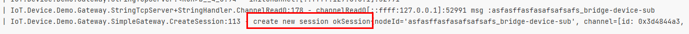
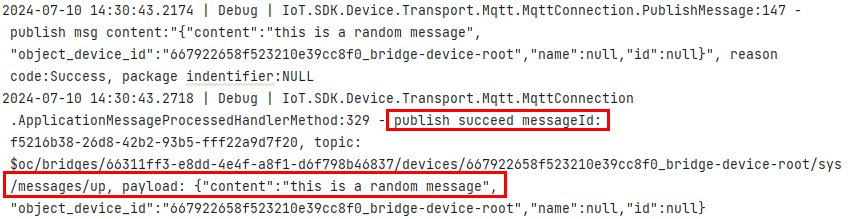
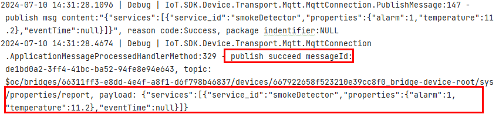

[English](./README.md) | 简体中文

---

# iot-device-sdk-cSharp开发指南

**在开始使用SDK其它功能之前，我们建议先阅读[准备工作](#2准备工作)和[快速体验](#3快速体验)**。同时，本文档中各个功能都有对应的demo演示，后面每个介绍功能的章节最前面会有一个包含`Demo源码`,`Demo名称`名称的列表，示例如下：

- Demo源码：[SmokeDetector.cs](iot-device-demo/CoreCapability/SmokeDetector.cs)
- Demo名称：SmokeDetector

`Demo源码`可以供您参考API使用的细节，`Demo名称`用于在配置文件里指定运行哪个Demo，具体如何使用`Demo名称`运行不同的Demo可参考后面的[配置与启动demo](#33-配置与启动demo)的第二步。


---


[TOC]

# 版本更新说明

| 版本号   | 变更类型  | 功能描述说明                                                                        |
|-------|-------|-------------------------------------------------------------------------------|
| 1.3.4 | 功能增强  | 1.优化日志打印 2.oc开头SubscribeTopic 返回 topic 3.demo优化 4.网关接口bug修复 5. 升级目标框架。 以及其它优化 |
| 1.3.3 | 新增功能  | OTA升级支持网关模式                                                                   |
| 1.3.2 | 功能增强  | 更新服务器ca证书                                                                     |
| 1.3.1 | 修复    | 修复空指针异常，MQTT对象未释放等问题                                                          |
| 1.3.0 | 新功能   | 支持通过OBS升级软固件包                                                                 |
| 1.2.0 | 新功能   | 增加泛协议功能                                                                       |
| 1.1.1 | 功能增强  | 添加网关删除子设备功能，完善中英文描述                                                           |
| 1.1.0 | 新功能   | 新增网关与物模型功能                                                                    |
| 1.0.0 | 第一次发布 | 提供基础的设备接入能力，sdk预置了设备接入地址及华为IoTDA平台配套的CA证书                                     |

---

# 0.前言

本文通过实例讲述iot-device-sdk-cSharp（以下简称SDK）帮助用户将设备经MQTT协议快速连接到华为IoTDA服务。
> 要进一步了解本sdk中的接口对应的MQTT接口，您可以查看
> [用户指南](https://support.huaweicloud.com/usermanual-iothub/iot_01_0015.html)。

# 1.SDK简介

## 1.1 SDK功能支持

SDK面向运算、存储能力较强的嵌入式终端设备，开发者通过调用SDK接口，便可实现设备与IoTDA服务（后续简出现的“服务”、“平台“均指IoTDA服务）双向行通讯。 SDK当前支持的功能有：

| 功能                      | 描述说明                                                                                                   |
|-------------------------|--------------------------------------------------------------------------------------------------------|
| [设备连接鉴权](#41-设备连接鉴权)    | 作为客户端使用MQTT协议接入到平台。分为[证书鉴权](#证书鉴权)与[密钥鉴权](#密钥鉴权)两种认证方式。                                                |
| [断线重连](#416-断线重连)       | 当设备由于网络不稳定                                                                                             |
| [消息上报](#消息上报)           | 用于设备将自定义数据上报给平台，平台将设备上报的消息转发给应用服务器或华为云其他云服务上进行存储和处理。                                                   |
| [属性上报](#设备属性上报)         | 用于设备按产品模型中定义的格式将属性数据上报给平台。                                                                             |
| [命令下发](#42-设备命令)        | 用于平台向设备下发设备控制命令。平台下发命令后，需要设备及时将命令的执行结果返回给平台。                                                           |
| [设备影子](#设备侧获取平台的设备影子数据) | 用于存储设备的在线状态、设备最近一次上报的设备属性值、应用服务器期望下发的配置。                                                               |
| [软固件（OTA）升级](#46-软固件升级) | 用于与平台配合下载OTA升级包。                                                                                       |
| [时间同步](#47-设备时间同步)      | 设备向平台发起时间同步请求。                                                                                         |
| [网关与子设备](#45-网关与子设备管理)  | 网关设备：通过平台支持的协议，直接连接到平台的设备。子设备：针对未实现TCP/IP协议栈的设备，由于无法直接同平台通信，它需要通过网关进行数据转发。当前仅支持通过mqtt协议直连到平台的设备作为网关设备。 |
| [文件上传/下载](#411-文件上传下载)  | 支持设备将运行日志，配置信息等文件上传至平台，便于用户进行日志分析、故障定位、设备数据备份等。                                                        |
| [异常检测](#414-异常检测)       | 提供安全检测能力，可持续检测设备的安全威胁。包括：1、内存泄漏检测 2、异常端口检测3、CPU使用率检测 4、磁盘空间检测 5、电池电量检测                                 |
| [规则引擎](#412-规则引擎)       | 通过条件触发，基于预设的规则，引发多设备的协同反应，实现设备联动、智能控制。目前平台支持两种联动规则：云端规则和端侧规则。                                          |
| [远程配置](#410-远程配置)       | 提供远程配置功能，用户可用于在不中断设备运行的情况下，远程更新设备的系统参数、运行参数等配置信息。                                                      |
| [远程登录](#413-远程登录)       | 支持通过控制台远程SSH登录设备，可在控制台输入设备支持的命令，进行功能调试及问题定位，从而方便地实现设备管理及远程运维                                           |
| [泛协议接入](#6泛协议接入)        | 当非HTTP、MQTT、LWM2M等第三方协议接入时，需要在平台外部完成协议转换。推荐使用网关来完成协议转换，将第三方协议转成MQTT协议。                                 |
| [设备发放](#5设备发放)          | 分为证书认证、密钥认证。主要用于分发到不同局点、实例的场景，动态完成不同批次设备初始化配置。                                                         |

## 1.1 SDK目录结构

- iot-device-sdk-java：sdk代码
- iot-device-demo：功能演示的demo代码
- iot-tcp-device：用于模拟网关、网桥场景下通过tcp连接的设备demo

# 2.准备工作

* 已安装 DotNet SDK 8.0。
    * [点此查看 .NET 安装指导](https://learn.microsoft.com/zh-cn/dotnet/core/install/)
    * [点此下载 .NET 8.0](https://dotnet.microsoft.com/zh-cn/download/dotnet/8.0)
* 已安装对应IDE（Visual Studio Code 2017+, Rider 17.0.6+）。理论上本SDK不依赖IDE，开发者可根据喜好选择IDE或者直接使用CLI。

# 3.快速体验

- Demo源码：[SmokeDetector.cs](iot-device-demo/CoreCapability/SmokeDetector.cs)
- Demo名称：SmokeDetector

本章将使用`SmokeDetector` Demo 指导您快速体验产品模型的创建、Demo的配置与启动、以及SDK基本功能的使用。

## 3.1 创建产品模型

为了方便体验，我们提供了一个烟感的产品模型，烟感会上报烟雾值、温度、湿度、烟雾报警、还支持响铃报警命令。
下面的子章节将以烟感为例，体验消息上报、属性上报等功能。
下面创建产品模型的流程也可以参考[向导式体验智慧烟感接入平台](https://support.huaweicloud.com/qs-iothub/iot_05_00010.html)。

1. 访问[IoTDA平台](https://console.huaweicloud.com/iotdm/?region=cn-north-4#/dm-portal/home)并进入设备接入控制台，如果是第一次使用需要注册并登录.

2. 登录成功后自动跳转，在设备接入控制台选择“产品”，单击右上角的“创建产品”，在弹出的页面中，填写“产品名称”、“协议类型”、“数据格式”、“厂商名称”、“所属行业”、“设备类型”等信息，然后点击右下角“立即创建”。
    - 协议类型选择“MQTT”
    - 数据格式选择“JSON”。

   

3. 产品创建成功后，单击“详情”进入产品详情，在功能定义页面，单击“上传模型文件”，上传[烟感产品模型](https://iot-developer.obs.cn-north-4.myhuaweicloud.com/smokeDetector.zip)
   

## 3.2 创建设备

1. 点击“设备”->
   “所有设备”，点击右上角“注册设备”，选择产品所在的“资源空间”，选择上方创建的产品，填写设备标识码（一般是IMEI、MAC地址等），自定义“设备名称”，“密钥”如果不自定义，平台会自动生成。全部填写完毕后，点击“确定”。
   

2. 可以直接复制设备秘钥，点击“保存并关闭”将自动将设备ID以txt文本形式下载到本地。
   

3. 点击”设备“->“所有设备”，在最上方可看到该设备的状态是未激活。
   

## 3.3 配置与启动Demo

1. 获取接入地址，可在控制台的“总览”->“接入信息”中查看。
   

2. 打开文件
   [iot-device-demo/config/DemoConfigDefault.json](iot-device-demo/config/DemoConfigDefault.json)，将之前获取到的接入地址、设备ID以及设备密钥填入对应位置，或者将配置填入下面模板后再覆盖[iot-device-demo/config/DemoConfigDefault.json](iot-device-demo/config/DemoConfigDefault.json)：

    ```json
    {
      "DemoName": "SmokeDetector",
      "AuthConfig": {
        "AuthUseCert": false,
        "ServerAddress": "填入接入地址",
        "ServerPort": 8883,
        "DeviceId": "填入设备ID",
        "DeviceSecret": "填入设备密钥"
      }
    }
    ```
   其中`DemoName`用于指定运行的Demo，此处为`SmokeDetector`指定基于烟雾报警器产品模型的物模型编程Demo。该Sdk能运行的Demo名称可以参后面章节，几乎每一个功能点介绍的小节最前面会标注Demo名称。或者进入sdk目录下运行下面命令查看所有Demo名称列表：
    ```shell
    cd iot-device-demo
    dotnet run --project .\iot-device-demo.csproj
    ```
   

3. 编译&运行

   进入sdk目录下，执行下面命令运行demo，命令末尾加参数为配置文件路径:
    ```shell
    cd iot-device-demo
    dotnet run --project .\iot-device-demo.csproj  .\config\DemoConfigDefault.json
    ```

   如果您使用旧版本5.0+的SDK并且无法升级到.NET 8.0，可以修改以下文件的`TargetFramework`。但请注意，[目前除了.NET 8.0和.NET 6.0属于长期支持的版本外，其它更旧版版本均已不再支持](https://dotnet.microsoft.com/zh-cn/platform/support/policy/dotnet-core#lifecycle)：
   
    - [iot-device-demo/CoreCapability/iot-device-demo.csproj](iot-device-demo/iot-device-demo.csproj)
    - [iot-tcp-device/iot-tcp-device.csproj](iot-tcp-device/iot-tcp-device.csproj)

   上面使用`run`命令会自动编译，如果要手动编译某一个project，可以行下面命令:
    ```shell
    dotnet clean
    dotnet build
    ```
   输出示例如下，如果输出里有`connect success`则表示连接成功：
   

4. 查看设备运行情况

   在控制台筛选出该设备并进入设备详情页面
   
   详情页下放”物模型数据“页面可以看到最新上报的数据
   

# 4.SDK功能参考

## 4.1 设备连接鉴权

> [设备鉴权概述在线文档](https://support.huaweicloud.com/usermanual-iothub/iot_01_0206.html)

### 密钥鉴权

密钥鉴权支持mqtt(1883)和mqtts(8883)接入，**为安全起见，推荐使用8883端口接入平台**。使用8883端口接入时需要用到[iot-device-demo/config/certificate/DigiCertGlobalRootCA.crt.pem](iot-device-demo/config/certificate/DigiCertGlobalRootCA.crt.pem)，该文件默认已预置各个region的根证书，如果连接不成功则尝试[从这里下载对应region的pem证书](https://support.huaweicloud.com/devg-iothub/iot_02_1004.html#section3)并替换。

使用Demo时时配置文件[iot-device-demo/config/DemoConfigDefault.json](iot-device-demo/config/DemoConfigDefault.json)中对应的配置项如下（无关配置项省略）：

```json
{
  "AuthConfig": {
    "AuthUseCert": false,
    "ServerAddress": "接入地址",
    "ServerPort": 8883,
    "DeviceId": "设备Id",
    "DeviceSecret": "设备密钥"
  }
}
```

使用API实例化设备对象时参数如下：

```csharp
//                                接入地址，接入端口，设备ID，  设备密钥
IoTDevice device = new IoTDevice("接入地址", 8883, "设备Id", "设备密钥");
```

### 证书鉴权

平台支持设备使用自己的X.509证书进行设备接入认证，使用前需要注册证书认证的设备并在设备接入控制台预置对应CA证书，详细指导请参考[注册X.509证书认证的设备](https://support.huaweicloud.com/usermanual-iothub/iot_01_0055.html)。

1. 制作完调测证书后，参考以下命令转换成pfx格式：

   ```shell
    openssl x509 -in deviceCert.pem -out deviceCert.crt  #先生成crt格式的证书
    openssl pkcs12 -export -out deviceCert.pfx -inkey deviceCert.key -in deviceCert.crt -certfile rootCA.pem
   ```

2. 使用Demo时，把
   [iot-device-demo/config/DemoConfigDefault.json](iot-device-demo/config/DemoConfigDefault.json)里的`AuthUseCert`改为true，同时`DeviceCert`改为生成的证书路径，示例如下：

    ```json
    {
      "AuthConfig": {
        "AuthUseCert": true,
        "DeviceCert": "\\config\\certificate\\deviceCert.pfx"
      }
    }
    ```

> 示例中证书路径为[config/certificate/deviceCert.pfx](iot-device-demo/config/certificate/deviceCert.pfx)，部分IDE(如Rider)会在Debug文件中运行程序，您需要在[iot-device-demo/CoreCapability/iot-device-demo.csproj](iot-device-demo/iot-device-demo.csproj)添加一行
>
> `<Content Include="config\certificate\deviceCert.pfx" CopyToOutputDirectory="PreserveNewest" />`
>
> 之后编译时证书也会被拷贝到Debug目录下。

> 如果要程序化创建设备，可以参考[iot-device-demo/DemoUtil/DemoDeviceHelper.cs](iot-device-demo/DemoUtil/DemoDeviceHelper.cs)中的`CreateDevice`函数。

## 4.2 设备命令

> [设备命令接口文档](https://support.huaweicloud.com/api-iothub/iot_06_v5_3014.html)

设备命令由两步骤组成：

1. 平台命令下发
2. 设备命令响应

**命令下发**

> 命令下发由平台向设备发送，下发方式参考
> [命令下发使用示例](https://support.huaweicloud.com/usermanual-iothub/iot_01_0339.html#section11)，
> 或则使用[CreateCommand API](https://console.huaweicloud.com/apiexplorer/#/openapi/IoTDA/doc?api=CreateCommand)。

- Demo源码：[iot-device-demo/CoreCapability/CommandSample.cs](iot-device-demo/CoreCapability/CommandSample.cs).
- Demo名称：Command

命令下发时设置对应listener用来接收平台下发的命令:

```csharp
    public class CommandSample : DeviceSample, CommandListener
    {
        // ......
        protected override void BeforeInitDevice()
        {
            Device.GetClient().commandListener = this;
            // ......
```

实现回调接口`OnCommand`对命令进行处理:

```csharp
        public void OnCommand(string requestId, string serviceId, string commandName, Dictionary<string, object> paras)
        {
            LOG.Info("onCommand, serviceId = {}", serviceId);
            LOG.Info("onCommand, name = {}", commandName);
            LOG.Info("onCommand, paras = {}", JsonUtil.ConvertObjectToJsonString(paras));
            // ......
        }
```

**命令响应**

- Demo源码：[iot-device-demo/CoreCapability/CommandSample.cs](iot-device-demo/CoreCapability/CommandSample.cs).
- Demo名称：Command

紧接着命令处理完毕后，调用`RespondCommand`上报响应用于确认执行结果：

```csharp
        public void OnCommand(string requestId, string serviceId, string commandName, Dictionary<string, object> paras)
        {
            // ......
            // Sends a command response.
            Device.GetClient().RespondCommand(requestId, new CommandRsp(respCode, respParams));
        }
```

## 4.3 设备消息

### 系统Topic消息上报

> 消息是否上报到平台可以通过
> [消息跟踪](https://support.huaweicloud.com/usermanual-iothub/iot_01_0030_0.html)查看，
> 或则使用[ListDeviceMessages API](https://console.huaweicloud.com/apiexplorer/#/openapi/IoTDA/doc?api=ListDeviceMessages)，[ShowDeviceMessage API](https://console.huaweicloud.com/apiexplorer/#/openapi/IoTDA/doc?api=ShowDeviceMessage)。

- Demo源码：[iot-device-demo/CoreCapability/MessageReportReceiveSample.cs](iot-device-demo/CoreCapability/MessageReportReceiveSample.cs)
- Demo名称：Message
- 参考文档：
  [设备消息上报接口文档](https://support.huaweicloud.com/api-iothub/iot_06_v5_3016.html),
  [设备消息上报介绍](https://support.huaweicloud.com/usermanual-iothub/iot_01_0322.html)

调用`ReportDeviceMessage`上报预定格式的消息

```csharp
// {"content":"hello word","object_device_id":null,"name":null,"id":null}
Device.GetClient().ReportDeviceMessage(new DeviceMessage("hello word", testMqttV5Data));
```

调用`ReportRawDeviceMessage`上报任意格式的消息：

```csharp
// hello word
Device.GetClient().ReportRawDeviceMessage(new RawDeviceMessage("hello word", testMqttV5Data));
```

### 系统Topic消息下发

> 消息下发由平台向设备发送，下发方式参考
> [平台消息下发使用示例](https://support.huaweicloud.com/usermanual-iothub/iot_01_0331.html?locale=zh-cn#section8)，
> 或则使用[CreateMessage API](https://console.huaweicloud.com/apiexplorer/#/openapi/IoTDA/debug?api=CreateMessage)。

- Demo源码：[iot-device-demo/CoreCapability/MessageReportReceiveSample.cs](iot-device-demo/CoreCapability/MessageReportReceiveSample.cs)
- Demo名称：Message
- 参考文档：
  [平台消息下发接口文档](https://support.huaweicloud.com/api-iothub/iot_06_v5_3017.html),
  [平台消息下发介绍](https://support.huaweicloud.com/usermanual-iothub/iot_01_0331.html)


1. SDK中需要进行以下操作：
   实现`RawDeviceMessageListener`的类并创建实例同时设置其到对应的listener以监听下发消息：

   ```csharp
           protected override void BeforeInitDevice()
           {
               Device.GetClient().rawDeviceMessageListener = this;
           }
   ```
2. 在`public void OnRawDeviceMessage(RawDeviceMessage message)`实现消息处理逻辑：

   ```csharp
           public void OnRawDeviceMessage(RawDeviceMessage message)
           {
               var deviceMessage = message.ToDeviceMessage();
               if (deviceMessage == null)
               {
                   //....
               }
               else
               {
                   //....
               }
   
           }
   ```

> `RawDeviceMessage` 本身只存储二进制payload，为了方便用户操作，此类提供下面的方法：
>
> `public string StrPayload` 以UTF8将字符串编码并存入payload，或则以UTF8解码payload为字符串并读取。
>
> `public string ToUtf8String()` 以UTF8解码payload为字符串并读取。
>
> `public DeviceMessage ToDeviceMessage()` 尝试将payload反序列化为预设格式`DeviceMessage`的对象，如果失败则返回`null`。

### 自定义topic消息上报

> 要使用自定topic，平台也需要进行相应配置，详细可阅读[自定义Topic通信概述](https://support.huaweicloud.com/usermanual-iothub/iot_02_9997.html)。本SDK自定义topic在断链时会自动重新订阅。
>
> 消息是否上报到平台可以通过
> [消息跟踪](https://support.huaweicloud.com/usermanual-iothub/iot_01_0030_0.html)功能检测，
> 或则使用[ListDeviceMessages API](https://console.huaweicloud.com/apiexplorer/#/openapi/IoTDA/doc?api=ListDeviceMessages)，[ShowDeviceMessage API](https://console.huaweicloud.com/apiexplorer/#/openapi/IoTDA/doc?api=ShowDeviceMessage)。

- Demo源码：[iot-device-demo/CoreCapability/MessageReportReceiveSample.cs](iot-device-demo/CoreCapability/MessageReportReceiveSample.cs)
- Demo名称：Message
- 参考文档：
  [自定义Topic通信概述](https://support.huaweicloud.com/usermanual-iothub/iot_02_9997.html),
  [$oc开头自定义Topic通信使用说明](https://support.huaweicloud.com/usermanual-iothub/iot_02_9998.html),
  [非$oc开头自定义Topic通信使用说明](https://support.huaweicloud.com/usermanual-iothub/iot_02_9999.html)

自定义topic消息分为`$oc`前缀和非`$oc`前缀两种，均通过创建`CustomMessageTopic`时通过设置`OcPrefix`成员指定:

```csharp
// topic: "$oc/devices/{device-id}/user/ai"
private static readonly CustomMessageTopic OC_CUSTOM_TOPIC = new CustomMessageTopic
    { Suffix = "ai", OcPrefix = true };

// topic: "/ai/test/device/to/cloud"
private static readonly CustomMessageTopic NO_OC_CUSTOM_TOPIC = new CustomMessageTopic
    { Suffix = "/ai/test/device/to/cloud", OcPrefix = false };
```

调用`ReportRawDeviceMessage(RawDeviceMessage, CustomMessageTopic)`可以上报消息到自定topic:

```csharp
         private void RunCustomTopicDemo()
        {
            //....
            // Reports a message with $oc custom topic.
            Device.GetClient()
                .ReportRawDeviceMessage(new RawDeviceMessage("hello $oc custom topic"), OC_CUSTOM_TOPIC);

            // Reports a message with non-$oc custom topic.
            Device.GetClient()
                .ReportRawDeviceMessage(new RawDeviceMessage("hello non-$oc custom topic"), NO_OC_CUSTOM_TOPIC);
        }
```

### 自定义topic消息下发

> 要使用自定topic，平台也需要进行相应配置，详细可阅读[自定义Topic通信概述](https://support.huaweicloud.com/usermanual-iothub/iot_02_9997.html)。本SDK自定义topic在断链时会自动重新订阅。
>
> 自定义topic消息下发由平台向设备发送，下发方式参考
> [平台消息下发使用示例](https://support.huaweicloud.com/usermanual-iothub/iot_01_0331.html?locale=zh-cn#section8)
> 或则使用[CreateMessage API](https://console.huaweicloud.com/apiexplorer/#/openapi/IoTDA/debug?api=CreateMessage)。

- Demo源码：[iot-device-demo/CoreCapability/MessageReportReceiveSample.cs](iot-device-demo/CoreCapability/MessageReportReceiveSample.cs)
- Demo名称：Message
- 参考文档：
  [自定义Topic通信概述](https://support.huaweicloud.com/usermanual-iothub/iot_02_9997.html),
  [$oc开头自定义Topic通信使用说明](https://support.huaweicloud.com/usermanual-iothub/iot_02_9998.html),
  [非$oc开头自定义Topic通信使用说明](https://support.huaweicloud.com/usermanual-iothub/iot_02_9999.html)

接收自定义topic的消息前需要使用`SubscribeTopic(CustomMessageTopic)`订阅自定义topic：

```csharp
        private void RunCustomTopicDemo()
        {
            // You must configure the custom topic on the platform and set the topic prefix to $oc/devices/{device_id}/user/.
            // Use Postman to simulate the scenario in which an application uses the custom topic to deliver a command.
            Device.GetClient().SubscribeTopic(NO_OC_CUSTOM_TOPIC);
            fullNoOcCustomTopic = Device.GetClient().SubscribeTopic(OC_CUSTOM_TOPIC);
            // ......
        }
```

然后实现`RawDeviceMessageListener`接口、创建其实例、设置其到对应的listener以监听下发消息：

```csharp
        protected override void BeforeInitDevice()
        {
            Device.GetClient().rawDeviceMessageListener = this;
        }
```

在`public void OnCustomRawDeviceMessage(string topic, bool topicStartsWithOc, RawDeviceMessage rawDeviceMessage)`中实现处理消息的逻辑：

```csharp
         void OnCustomRawDeviceMessage(string topic, bool topicStartsWithOc, RawDeviceMessage rawDeviceMessage)
        {
            LOG.Info("custom message received, topic:{}, topic starts with oc:{}, data:{}",
                topic, topicStartsWithOc, rawDeviceMessage.payload);
        }
```

## 4.4 设备属性

### 设备属性上报

> 设备最近上报的属性可以在“设备详情”页面查看，详细可参考[设备属性上报的使用说明](https://support.huaweicloud.com/usermanual-iothub/iot_01_0326.html#section3)

- Demo源码：[iot-device-demo/CoreCapability/PropertyReportSample.cs](iot-device-demo/CoreCapability/PropertyReportSample.cs)
- Demo名称：PropertyReport
- 参考文档： [设备属性上报接口文档](https://support.huaweicloud.com/api-iothub/iot_06_v5_3010.html)

调用`ReportProperties(List<ServiceProperty>)`按产品模型中定义的格式将属性数据上报给平台：

```csharp
        Device.GetClient().ReportProperties(GenerateMockProperty());
```

上报成功后输出日志样例如下：

```text
2024-06-28 14:31:50.6884 | Info | IoT.Device.Demo.PropertyReportSample.OnMessagePublished:69 - pubSuccessMessage: "{"services":[{"service_id":"smokeDetector","properties":{"alarm":1,"temperature":23.45812,"humidity":56.89013,"smokeConcentration":89.5672},"eventTime":null}]}"
```

### 平台设置设备属性

> 设置设备属性请求由平台下发，需要通过[UpdateProperties API](https://console.huaweicloud.com/apiexplorer/#/openapi/IoTDA/doc?api=UpdateProperties)触发。

- Demo源码：[iot-device-demo/CoreCapability/PropertyGetAndSetSample.cs](iot-device-demo/CoreCapability/PropertyGetAndSetSample.cs)
- Demo名称：PropertyGetAndSet
- 参考文档：[平台设置设备属性](https://support.huaweicloud.com/api-iothub/iot_06_v5_3008.html)

实现`PropertyListener`接口并创建实例，同时设置其到对应的listener以监听设置属性的请求：

```csharp
        protected override void BeforeInitDevice()
        {
            Device.GetClient().messagePublishListener = this;
        }
```

再在`void OnPropertiesSet(string requestId, List<ServiceProperty> services)`中实现修改设备上对应属性的逻辑。 处理完成后调用`void RespondPropsSet(string requestId, IotResult iotResult)`响应设置结果：

```csharp
        public void OnPropertiesSet(string requestId, List<ServiceProperty> services)
        {
            LOG.Info("set properties request id: {}", requestId);
            LOG.Info("set properties services: {}", JsonUtil.ConvertObjectToJsonString(services));

            Device.GetClient().RespondPropsSet(requestId, IotResult.SUCCESS);
        }
```

### 平台查询设备属性

> 查询设备属性请求由平台下发，需要通过[ListProperties API](https://console.huaweicloud.com/apiexplorer/#/openapi/IoTDA/doc?api=ListProperties)触发。

- Demo源码：[iot-device-demo/CoreCapability/PropertyGetAndSetSample.cs](iot-device-demo/CoreCapability/PropertyGetAndSetSample.cs)
- Demo名称：PropertyGetAndSet
- 参考文档：[平台查询设备属性](https://support.huaweicloud.com/api-iothub/iot_06_v5_3011.html)

1. 创建监听器：实现`PropertyListener`接口并创建实例，同时设置其到对应的listener以监听设置属性的请求：
    ```csharp
            protected override void BeforeInitDevice()
            {
                Device.GetClient().messagePublishListener = this;
            }
    ```

2. 处理查询设备属性请求并响应： 在`public void OnPropertiesGet(string requestId, string serviceId)`
   中实现获取serviceId对应属性的逻辑，之后调用`void RespondPropsGet(string requestId, List<ServiceProperty> services)`响应。

    ```csharp
            public void OnPropertiesGet(string requestId, string serviceId)
            {
                LOG.Info("requestId Get: {}", requestId);
                LOG.Info("serviceId Get: {}", serviceId);
                //.......
                Device.GetClient().RespondPropsGet(requestId, properties);
            }
    ```

### 设备侧获取平台的设备影子数据

- Demo源码：[iot-device-demo/CoreCapability/DeviceShadowSample.cs](iot-device-demo/CoreCapability/DeviceShadowSample.cs),
- Demo名称：DeviceShadow
- 参考文档：[设备侧获取平台的设备影子数据](https://support.huaweicloud.com/api-iothub/iot_06_v5_3012.html)

1. 请求设备影子：调用`GetShadow(DeviceShadowRequest shadowRequest, string requestId = null)`
   接口上报获取设备请求，`DeviceShadowRequest`中的`ServiceId`不填时表示获取所有服务的影子数据，`requestId`不填时会自动生成并作为返回值：

    ```csharp
            protected override void RunDemo()
            {
                var reqId = Device.GetClient().GetShadow(new DeviceShadowRequest
                {
                    ServiceId = null // service id in you product model, for example, "SmokeDetector"
                });
                LOG.Info("get shadow request id: {}", reqId);
            }
    ```

2. 接收影子数据：实现`DeviceShadowListener`接口并创建实例，然后设置其到对应的listener以监听设置属性的请求：

    ```csharp
            protected override void BeforeInitDevice()
            {
                Device.GetClient().deviceShadowListener = this;
            }
    ```

3. 处理影子消息：在`OnShadowCommand(string requestId, string message)`中实现的逻辑：

    ```csharp
            public void OnShadowCommand(string requestId, string message)
            {
                LOG.Info("receive device shadow, request id:{}, message:{}", requestId, message);
            }
    ```

## 4.5 网关与子设备管理

- Demo源码：[iot-device-demo/TcpServer/Gateway](iot-device-demo/TcpServer/Gateway) 下的所有源码。
- Demo名称：Gateway
- 参考文档：[网关与子设备](https://support.huaweicloud.com/usermanual-iothub/iot_01_0052.html)

网关是一个特殊的设备，除具备一般设备功能之外，还具有子设备管理、子设备消息转发的功能。SDK提供了AbstractGateway抽象类来简化网关的实现。 该类提供了子设备管理功能，需要从平台获取子设备信息并保存（需要子类提供子设备持久化接口）、子设备下行消息转发功能（需要子类实现转发处理接口）、 以及上报子设备列表、上报子设备属性、上报子设备状态、上报子设备消息等接口。

### Gateway Demo使用说明

Gateway Demo实现了一个简单TCP子设备模拟器、和一个对应的的网关，在此基础上您可以根据需要进行扩展。比如修改持久化方式、转发中增加消息格式的转换、实现其他子设备接入协议。 下面将按照使用步骤和功能阻隔介绍示例网关里的主要类。

1. 启动Gateway

   与[配置与启动Demo](#33-配置与启动demo)中的命令相同，只需要将demo的名字改为`Gateway`即可。 Gateway的实现如下：
    - [StringTcpServer](iot-device-demo/TcpServer/Gateway/GatewayTcpServer.cs)负责TCP server职责，其基于DotNetty实现。
    - [SimpleGateway](iot-device-demo/TcpServer/Gateway/SimpleGateway.cs)中的继承自AbstractGateway，实现子设备管理和下行消息转发。
    - [SubDevicesFilePersistence.cs](iot-device-demo/TcpServer/Gateway/SubDevicesFilePersistence.cs)
      负责子设备信息持久化，采用json文件来保存子设备信息，并在内存中做了缓存。
    - [Session.cs](iot-device-demo/TcpServer/SessionManagement/Session.cs)作为备会话类保存了设备id和TCP的channel的对应关系。

   另外配置文件针对Gateway Demo提供额外的`GatewayConfig`参数：
    ```json
      {
         "GatewayConfig": {
            "ListenPort": 8081,
            "PreDeleteSubDeviceIds": [
               "要删除的设备的device id"
            ],
            "PreAddSubDevice": [
               {
                 "node_id": "要添加的设备的node id 1",
                 "product_id": "产品id 1"
               },
               {
                 "node_id": "要添加的设备的node id 2",
                 "product_id": "产品id 2"
               }
            ]
         }
      }
    ```
   参数介绍如下：
    - `ListenPort`: 监听端口，子设备模拟器链接用
    - `PreDeleteSubDeviceIds`: Gateway启动后会立即演示删除子设备功能，子设备的id则放在这里配置
    - `PreAddSubDevice`: Gateway启动后会立即演示添加子设备功能，子设备的信息则放在这里配置
        - `node_id`：子设备node_id，加上`product_id`前缀后生成device id
        - `product_id`：平台上的产品id。

   一个完整的配置**示例**可以参考[iot-device-demo/config/DemoGatewayConfig.json](iot-device-demo/config/DemoGatewayConfig.json)

2. 启动TCP子设备模拟器：
   TCP子设备模拟器是一个简单的TCP客户端，负责连接Gateway的端口并将用户输入的消息发送给Gateway:

    ```shell
       cd iot-tcp-device
       dotnet run --project .\iot-tcp-device.csproj localhost 8081 mySubDevice1
   ```

   后面三个参数含义分别是：

    - Gateway的ip。这里是本地启动的Gateway，所以是localhost
    - Gateway的端口。和第一步中配置的端口填写成一样
    - 子设备id。用于模拟的子设备的node-id（设备标识码）

   切换回网关的日志，如果连接成功将会出现以下内容：
   

3. 返送消息：
   返回到设备模拟器的console，输入下面的内容上报消息：
   ```shell
   message: this is a random message
   ```

4. 发送属性：
   在子设备模拟器的console，输入以下格式的内容上报属性：
    ```shell
   properties: smokeDetector, {"alarm":0,"temperature":10}
   ```
   切换回网关的日志，如果上报成功将会出现以下内容：
   

5. 命令响应：
   按照[设备命令](#42-设备命令)中操作向子设备下发命令时需要在子设备模拟器中手动回复命令响应，格式如下：
    ```shell
   cmdresp: requestId, result
   ```
   其中`requestId`为命令下发时对应的请求id，result则是命令执行结果，0代表成功，其它代表失败。示例如下，
   

### AbstractGateway

[AbstractGateway.cs](iot-device-sdk-csharp/device/gateway/AbstractGateway.cs)提供了子设备消息上报、子设备消息下发处理，回调。上Demo中的[SimpleGateway](iot-device-demo/TcpServer/Gateway/SimpleGateway.cs)就是继承该类，实现了相关功能。

下面分类介绍哪些接口需要被实现或调用1以实现完整的子设备管理。

**添加或删除子设备处理**

网关可以主动向平台发起删除或添加子设备请求，接口如下：

```csharp
  ReportAddSubDevice(List<DeviceInfo> subDeviceInfo):void
  ReportDeleteSubDevice(List<string> devicesId):void

```

同时平台也会下发删除或添加子设备的响应，由于`AbstractGateway`中已经用[SubDevicesFilePersistence.cs](iot-device-demo/TcpServer/Gateway/SubDevicesFilePersistence.cs)类对象处理这一部分，您只需要实现一个[SubDevicesFilePersistence.cs](iot-device-demo/TcpServer/Gateway/SubDevicesFilePersistence.cs)子类并在实例化`AbstractGateway`（的子类）时传入即可。

**下行消息处理**

网关收到平台下行消息时，需要转发给子设备。平台下行消息分为三种：设备消息、属性读写、命令、事件，您需要分别实现以下几个抽象接口以便处理消息：

```csharp
/// 子设备命令下发处理，网关需要转发给子设备，需要子类实现
public abstract void OnSubdevCommand(string requestId, Command command);
/// 子设备属性设置，网关需要转发给子设备，需要子类实现
public abstract void OnSubdevPropertiesSet(string requestId, PropsSet propsSet);
/// 子设备读属性，网关需要转发给子设备，需要子类实现
public abstract void OnSubdevPropertiesGet(string requestId, PropsGet propsGet);
/// 子设备消息下发，网关需要转发给子设备，需要子类实现
public abstract void OnSubdevMessage(DeviceMessage message);
/// 子设备时间下发，网关需要转发给子设备，需要子类实现
OnSubdevEvent(string deviceId, DeviceEvent deviceEvent):void
```

**上行消息处理**
上行消息均复用原有接口，仅需将对应子设备得devieId填入即可，以属性上报为例：

```csharp
var serviceProperty = new ServiceProperty
{
    properties = new Dictionary<string, object>
    {
        // Sets properties based on the product model.
        { "alarm", 1 },
        { "temperature", 23.45812 },
        { "humidity", 56.89013 },
        { "smokeConcentration", 89.5672 }
    },
    serviceId = "smokeDetector" // The serviceId must be the same as that defined in the product model.
};

var deviceProperties = new DeviceProperties
{
    DeviceId = "子设备id",
    services = new List<ServiceProperty> { serviceProperty }
};
Device.GetClient().ReportProperties(deviceProperties);
```

**其它**

```csharp
//上报子设备状态
ReportSubDeviceStatus(List<DeviceStatus> statuses):void
//同步子设备信息 
SyncSubDevices(bool syncAll):void
```

## 4.6 软固件升级

- Demo源码：[OTASample.cs](iot-device-demo/CoreCapability/OTASample.cs)
- Demo名称：OTA
- 参考文档：[MQTT设备OTA升级](https://support.huaweicloud.com/usermanual-iothub/iot_01_0047.html),
  [MQTT协议设备OTA固件升级](https://support.huaweicloud.com/bestpractice-iothub/iot_bp_0039.html)

软固件升级需要在平台先上传软固件并创建任务，然后SDK才会接收到升级请求并开始处理。详细操作可以参考[MQTT协议设备OTA固件升级](https://support.huaweicloud.com/bestpractice-iothub/iot_bp_0039.html)。默认情况下，软固件升级示例中下载的文件将被统一下载到demo运行路径下的`download`文件夹中。


如果您需要高度自定义软固件处理流程，您需要实现`OTAListener`以监听软固件升级请求:

```csharp
public interface OTAListener
{
    void OnQueryVersion(OTAQueryInfo queryInfo);
    void OnNewPackage(OTAPackage pkg);
    void OnNewPackageV2(OTAPackageV2 pkgV2);
}
```

然后处理请求中的`url`，最后再使用下面接口上报处理进度或结果：

```csharp
class OtaService {
    ///.....
    ReportOtaStatus(int result, int progress, string version, string description)
}
```

## 4.7 设备时间同步

- Demo源码：[iot-device-demo/CoreCapability/TimeSyncSample.cs](iot-device-demo/CoreCapability/TimeSyncSample.cs)
- Demo名称：TimeSync
- 参考文档：[设备时间同步请求](https://support.huaweicloud.com/api-iothub/iot_06_v5_3040.html),
  [设备时间同步响应](https://support.huaweicloud.com/api-iothub/iot_06_v5_3041.html)

1. 请求时间同步：调用`TimeService.RequestTimeSync`请求时间同步
    ```csharp
    protected override void RunDemo()
    {
        Device.timeSyncService.RequestTimeSync();
    }
    ```
2. 接收时间同步消息：实现`TimeSyncListener`接口并创建实例，然后设置其到对应的listener以监听响应：

    ```csharp
        protected override void BeforeInitDevice()
        {
            Device.timeSyncService.listener = this;
        }
    ```

3. 处理时间同步消息：在`OnTimeSyncResponse(string requestId, string message)`中实现设置设备时钟的逻辑，下面为示例

```csharp
        public void OnTimeSyncResponse(long deviceSendTime, long serverRecvTime, long serverSendTime)
        {
            long deviceRecvTime = Convert.ToInt64(IotUtil.GetTimeStamp());
            long now = (serverRecvTime + serverSendTime + deviceRecvTime - deviceSendTime) / 2;
            LOG.Info("now is {}", StampToDatetime(now));
        }
```

> 上面demo中的算法来自[设备时间同步响应](https://support.huaweicloud.com/api-iothub/iot_06_v5_3041.html)。

## 4.8 设备信息上报

- Demo源码：[iot-device-demo/CoreCapability/DeviceInfoReportSample.cs](iot-device-demo/CoreCapability/DeviceInfoReportSample.cs)
- Demo名称：DeviceInfoReport
- 参考文档：[设备信息上报](https://support.huaweicloud.com/api-iothub/iot_06_v5_3042.html)

调用`Device.GetClient().ReportDeviceInfo("软件版本", "固件版本")`上报设备信息：

```csharp
        protected override void RunDemo()
        {
            Device.GetClient().ReportDeviceInfo("v1.1", "v1.1");
        }
```

上报成功后可以在设备详情里看到对应的软固件版本信息：


## 4.9 设备日志收集

- Demo源码：[iot-device-demo/CoreCapability/DeviceReportLogSample.cs](iot-device-demo/CoreCapability/DeviceReportLogSample.cs)
- Demo名称：DeviceReportLog
- 参考文档：[设备信息上报](https://support.huaweicloud.com/api-iothub/iot_06_v5_3042.html)

使用设备日志需要您先在平台配置“运行日志”功能，请参考文档[运行日志使用说明](https://support.huaweicloud.com/usermanual-iothub/iot_01_0030_8.html#section2)。运行日志开启之后调用SDK中对应的API才能将日志上传到平台。运行日志上报支持两种方式：

1. 显示调用日志上传接口。

   使用`Device.LogService.ReportLog`接口直接生成日志消息并上报到到平台：
   ```csharp
     Device.LogService.ReportLog(DateTimeOffset.Now.ToUnixTimeSeconds().ToString(),
                   LogService.LogType.DeviceStatus, "ONLINE");
   ```

2. 将经过NLog组件输出的日志抓发到平台。

   SDK默认使用NLog日志组件并将上报到IoTDA作为一个可配置的`target`。打开[iot-device-demo/CoreCapability/NLog.config](iot-device-demo/NLog.config),首先您可以看到一个名字为`IoTDA`类型为`IoTDA`的`target`，在这里我们主要为这个`target`配置了输出格式：
   ```csharp
   <target name="IoTDA" xsi:type="IoTDA" layout="${longdate} | ${level:uppercase=false} | ${callsite:fileName}:${callsite-linenumber} - ${message}${onexception:, error\: ${exception:format=type,message,method:innerExceptionSeparator= - :separator=. :maxInnerExceptionLevel=5:innerFormat=shortType,message,method} - stacktrace\: ${stacktrace}}" />
   ```
   在下面的`rules`里的第三个`logger`则使用过滤规则指定了什么日志将被写入`IoTDA`。
   ```csharp
     <logger name="*" minlevel="Debug" writeTo="IoTDA">
         <filters defaultAction='Ignore'>
             <when condition="contains('${callsite:fileName}','DeviceReportLogSample') and not contains('${callsite:fileName}','DemoMessagePublishListener')" action="Log" />
         </filters>
     </logger>
   ```
   > 注意我们这里这里主要使用的是白名单机制，即“指定需要收集的日志”。 如果过滤不慎则可能导致死循环，例如demo里的`public void OnMessagePublished(RawMessage message)`和`public void OnMessageUnPublished(RawMessage message)`监听了消息推送的结果同时用`NLog`打印了日志，这意味着：
   >  1. 只要有消息被推送，这两个回调函数里就会产生日志。
   >  2. 如果不使用`not contains('${callsite:fileName}','DemoMessagePublishListener')`排除这里的日志，那么这里的消息又会被日志收集上报。
   >  3. 无论消息推送成功或失败，会再次触发这两个回调函数。
   >
   > 从而导致死循环。

## 4.10 远程配置

- Demo源码：[DeviceConfigSample.cs](iot-device-demo/CoreCapability/DeviceConfigSample.cs).
- Demo名称：DeviceConfig
- 参考文档：[平台下发日志收集通知](https://support.huaweicloud.com/api-iothub/iot_06_v5_1303.html)，[设备上报日志内容
  ](https://support.huaweicloud.com/api-iothub/iot_06_v5_1302.html)

使用远程配置需要先在设备接入控制台创建远程配置任务，操作步骤可以参考上列文档。 同时，SDK中需要配置对应的监听器处理回调。

1. 实现并设置`DeviceConfigListener`：

    ```csharp
        public class DeviceConfigSample : DeviceSample, DeviceConfigListener
       {
            protected override void BeforeInitDevice()
            {
                Device.DeviceConfigService.DeviceConfigListener = this;
            }
        }
    ```

2. 在`OnDeviceConfig`中处理配置，并以`DeviceConfigResponse`类型的处理结果作为返回值：

    ```csharp
    public DeviceConfigResponse OnDeviceConfig(Dictionary<string, object> configContent, string deviceId)
    {
        // use configuration to configure your device
        // ....
        return new DeviceConfigResponse { ResultCode = 0 };
    }
    ```

## 4.11 文件上传下载

在使用该功能前， **您其需要先在设备接入控制台配置obs**
。详细操作参考[文件上传](https://support.huaweicloud.com/usermanual-iothub/iot_01_0033.html)。

SDK中`FileManagerService`类提供与MQTT接口一一对应的接口。但为了用户方便使用，SDK中还提供了`SimpleLocalFileManager`类，其包含了更加便捷的接口。如果您想直接使用`FileManagerService`接口，也可以参考`SimpleLocalFileManager`的源码。 使用详情可以参考[iot-device-demo/CoreCapability/FileUploadDownloadSample.cs](iot-device-demo/CoreCapability/FileUploadDownloadSample.cs)，这里演示了如何使用`SimpleLocalFileManager`将本地`Nlog.config`配置上传到obs、然后再将文件原样从obs下载回来的例子。

### 文件上传

- Demo源码：[iot-device-demo/CoreCapability/FileUploadDownloadSample.cs](iot-device-demo/CoreCapability/FileUploadDownloadSample.cs)
- Demo名称：FileUploadDownload
- 参考文档：[平台下发文件上传临时URL](https://support.huaweicloud.com/api-iothub/iot_06_v5_3034.html),
  [设备上报获取文件上传URL请求](https://support.huaweicloud.com/api-iothub/iot_06_v5_3033.html),
  [设备上报文件上传结果](https://support.huaweicloud.com/api-iothub/iot_06_v5_3035.html)

1. 初始化`SimpleLocalFileManager`对象：

    ```csharp
            protected override void RunDemo()
            {
                var fsa = new SimpleLocalFileManager(Device.FileManagerService);
                //...
    ```

2. 调用`UploadFile`下载文件，其接收`SimpleLocalFileManager.FileTransferRequest`对象作为参数，主要参数如下：
    - `Path`：要上传的文件路径
    - `CompleteListener`：文件上传完毕后的回调（无论成功或失败）
    - `FileName`：上传到obs的文件名，不填时会自动从`Path`里提取**并自动添加上时间戳**：

    ```csharp
     var fileName = fsa.UploadFile(new SimpleLocalFileManager.FileTransferRequest
                {
                    Path = IotUtil.GetRootDirectory() + @"\Nlog.config",
                    CompleteListener = UploadCompleteListener
                });
    ```

### 文件下载

- Demo源码：[iot-device-demo/CoreCapability/FileUploadDownloadSample.cs](iot-device-demo/CoreCapability/FileUploadDownloadSample.cs)
- Demo名称：FileUploadDownload
- 参考文档：[设备上报获取文件下载URL请求](https://support.huaweicloud.com/api-iothub/iot_06_v5_3036.html),
  [平台下发文件下载临时URL](https://support.huaweicloud.com/api-iothub/iot_06_v5_3037.html),
  [设备上报文件下载结果](https://support.huaweicloud.com/api-iothub/iot_06_v5_3038.html)

1. 初始化`SimpleLocalFileManager`对象：

   与同[文件上传](#文件上传)里相同。

2. 调用`UploadFile`下载文件，其接收`SimpleLocalFileManager.FileTransferRequest`对象作为参数，主要参数如下：
    - `Path`：下载文件的存储路径
    - `CompleteListener`：文件下载完毕后的回调（无论成功或失败）
    - `FileName`：obs里的文件名，不填时会自动从`Path`里提取。注意这里和上传不同，自动生成的文件名不会**自动添加上时间戳**：

    ```csharp
        // download the uploaded NLOG.config with generated new name(e.g. Nlog-20240527-034141-867.config)
        fsa.DownloadFile(new SimpleLocalFileManager.FileTransferRequest
        {
            FileName = req.FileName, // filename in obs
            Path = IotUtil.GetRootDirectory() + @"\" + req.FileName
        });
    ```

## 4.12 规则引擎

- Demo源码：[iot-device-demo/CoreCapability/DeviceRuleSample.cs](iot-device-demo/CoreCapability/DeviceRuleSample.cs)
- Demo名称：DeviceRule,
- 参考文档：[规则引擎介绍](https://support.huaweicloud.com/usermanual-iothub/iot_01_0022.html)

端侧规则引擎在SDK中属于开箱即用功能，您只需在控制台编辑规则即可，SDK里只需通过开关开启该功能即可。在平台配置端侧规则引擎里有两种触发条件：

1. 定时器条件：SDK会自动根据条件设置定时器并再定时器触发后检查其它条件（如果有）是否满足。
2. 属性条件：该条件会在由您在调用`ReportPorperties`[设备属性上报](#设备属性上报)接口或者物模型编程里`Service`自动上报属性时触发检查。

> 注意：为了直观地看出效果，如果您使用[iot-device-demo/CoreCapability/DeviceRuleSample.cs](iot-device-demo/CoreCapability/FileUploadDownloadSample.cs)并在云端更新规则，**则该demo中会自动连续上报20次属性，`Temperature`,`Humidity`属性值则是随上报顺序被设置为从0到19**，方便您观察属性条件的效果。

SDK中端侧规则引擎提供额外接口满足以下需求。注意，下面均需在`AbstractDevice.Init()`前调用：

1. 开启规则引擎

   规则引擎默认关闭，在Demo中使用以下代码开启规则引擎：
    ```csharp
    Device.DeviceRuleService.EnableDeviceRule = true;
    ```

2. 规则引擎支持将规则引擎缓存到本地并在重启时优先从本地读取规则，文件路径使用下面代码配置：
    ```csharp
        Device.DeviceRuleService.DeviceRuleStoragePath = "rule.json";
    ```
3. 规则引擎默认将触发的本设备命令发送到您设置的`CommandListener`
   命令回调，当触发的命令不属于本设备时，您需要设置`DeviceRuleCommandListener`自行处理：
    ```csharp
        private class DemoDeviceRuleCommandListener : DeviceRuleCommandListener
        {
            public void OnDeviceRuleCommand(string requestId, Command command)
            {
                LOG.Info("get command sent to another device:{}", command);
            }
        }
        //.....
       Device.DeviceRuleService.DeviceRuleCommandListener = new DemoDeviceRuleCommandListener();
    ```

## 4.13 远程登录

SDK支持远程登录且SDK端无需额外配置，平台上的操作步骤参考[设备远程登录](https://support.huaweicloud.com/usermanual-iothub/iot_01_00301.html)。

## 4.14 异常检测

- Demo源码：[iot-device-demo/CoreCapability/SecurityDetectionSample.cs](iot-device-demo/CoreCapability/SecurityDetectionSample.cs)
- Demo名称：SecurityDetection
- 参考文档：[设备异常检测](https://support.huaweicloud.com/usermanual-iothub/iot_01_0030_5.html)

在使用该功能前**您需要在设备接入控制台配置异常检测**，参考[操作步骤
](https://support.huaweicloud.com/usermanual-iothub/iot_01_0030_5.html#section2)。

1. 实现`SecurityInfoGetListener`接口。

   实现`SecurityInfoGetListener`接口以便异常检测服务定时获取系统信息，接口中各个方法的定义如下：
    - `void OnStart()`: 当异常检测服务启动时（任一检测项被开启）被调用，您可能需要在这个函数里分配资源以便后续获取系统信息
    - `void OnStop()`: 当异常检测服务停止时（所有检测项被关闭）被调用，您可能需要在这个函数里释放前面分配的资源
    - `long OnGetMemoryTotalKb()`: 获取内存总大小
    - `long OnGetMemoryUsedKb()`:  获取使用中的内存大小
    - `IEnumerable<int> OnGetUsedPort()`: 获取正在被使用的端口
    - `int OnGetCpuPercentage()`: 获取CPU使用率
    - `long OnGetDiskTotalKb()`: 获取所有磁盘的总大小
    - `long OnGetDiskUsedKb()`: 获取所有磁盘的总使用大小
    - `int OnGetBatteryPercentage()`: 获取电池使用率
    - `bool OnGetLocalLoginInfo()`: 获取是否有用户通过本地方式登录设备
    - `bool OnGetFileTamperInfo()`: 获取是否有关键文件被篡改
    - `bool OnGetBruteForceLoginInfo()`: 获取是否有用户尝试暴力破解登录
    - `IEnumerable<IPAddress> OnGetMaliciousIp()`: 获取所有恶意IP列表

   SDK默认提供了实现大部分接口的[DefaultSecurityInfoGetListener](iot-device-sdk-csharp/device/service/Anomaly/DefaultSecurityInfoGetListener.cs)（除了`OnGetLocalLoginInfo()`, `OnGetFileTamperInfo()`, `OnGetBruteForceLoginInfo()`），该Listener可以上报Linux/Windows相关信息，您可以参考该Listener实现相关逻辑。

2. 设置Listener。
   参考Demo，使用下面代码设置Listener:
   ```csharp
   Device.SecurityDetectionService.SecurityInfoGetListener = new DemoSecurityInfoGetListener();
   ```
3. 配置上报周期。

   参考Demo，使用下面代码设置上报周期:
   ```csharp
   Device.SecurityDetectionService.ReportPeriod = TimeSpan.FromSeconds(5);
   ```

## 4.15 设备任务

设备任务暂不支持。

## 4.16 消息重传

- Demo源码：[iot-device-demo/CoreCapability/MessageRetransmitSample.cs](iot-device-demo/CoreCapability/MessageRetransmitSample.cs)
- Demo名称：MessageRetransmit

**消息重传**
SDK中使用[mqtt的QoS](https://www.emqx.com/zh/blog/introduction-to-mqtt-qos)来保障消息可靠性，默认等级为`Qos1`，若需要修改则请操作[ClientConf](iot-device-sdk-csharp/device/client/ClientConf.cs)中的`Qos`参数。

demo启动后会等待设备断链，您可以[打开设备的消息跟踪](https://support.huaweicloud.com/usermanual-iothub/iot_01_0030_0.html)后再将网络断开或者[冻结设备](https://support.huaweicloud.com/api-iothub/iot_06_v5_0094.html)。此时SDK中探测到断链后会不断尝试重连并自动上报5条设备消息。之后重新恢设备和网络，由于SDK中默认使用`QoS1`，那5条设备消息也能上报成功并且可以在消息跟踪中看到。

## 4.17 断线重连

> 运行本章节demo需要**关闭自动重连**。

- Demo源码：[iot-device-demo/CoreCapability/ReconnectSample.cs](iot-device-demo/CoreCapability/ReconnectSample.cs)
- Demo名称：Reconnect

SDK默认开启断线重连，如果需要关闭则需要修改作[ClientConf](iot-device-sdk-csharp/device/client/ClientConf.cs)中的`AutoReconnect`为`false`。您可以使用`ConnectListener`来感知连接情况并使用`DeviceClient`的`Close`和`Connect`方法实现自定义重连逻辑，或则处理业务上的逻辑，如”重新订阅自定义topic“，详细可参考demo代码。

重连间隔使用指数延时，算法大致为每次失败后的延时将以指数级增长直到达到一个最大值，核心代码在[CustomReconnectDelayMqttClientProxy.cs](iot-device-sdk-csharp/device/transport/mqtt/CustomReconnectDelayMqttClientProxy.cs)文件的`BackDelayGenerator`成员变量。
其中有几个关键参数可以修改：

- `MinBackoff`: 最小退避时间，默认是1秒。
- `MaxBackoff`: 最大退避时间，默认是5分钟。
- `DefaultBackoff`: 退避时间基数，默认为1000秒。

具体算法为：如果当前已经连续连接失败n次，每次延迟时间是`退避时间基数x放大系数+最小退避时间`, 其中放大系数是按指数趋势在`2^(n-1)*0.8` 和 `2^(n-1)*1.2`之间随机选一个。
如果带入默认参数，则为 `1 + 2^(n-1)*0.8`和`1 + 2^(n-1)*1.2`，下面给出前几次失败重连间隔的值：

- 连接失败1次：可能延时1.8到2.8秒
- 连接失败2次：可能延时2.6到3.4秒
- 连接失败3次：可能延时4.2到5.8秒
- 以此类推

# 5.设备发放

设备发放服务主要用于设备在多个IoT平台实例的发放、接入和迁移。设备在出厂时只需要烧录一个地址，然后在平台上通过[策略](https://support.huaweicloud.com/usermanual-iotps/iot_01_0003.html)制不同的设备接入不同的IoT平台。 设备上电后收到设备发放下发的新的平台连接地址，直接连接新的地址，免去二次烧录设备信息，同时还支持初始化的设备信息同步。 目前支持两大种设备类型的发放，功能如下：

- 注册设备：将设备基本信息导入设备发放平台中，后续发放至不同的IoT平台。
- 注册组： 可以实现批量设备的**自注册**，实现设备一键上电即可上云的动作。

另外，下面的Demo种都需要用到`scopeId`, 您可以在设备发放页面点击`设备->注册组列表`查询：


## 注册设备发放

- Demo源码：[BootstrapSample.cs](iot-device-demo/Bootstrap/BootstrapSample.cs)
- Demo名称：Bootstrap
- 参考文档：[注册设备](https://support.huaweicloud.com/usermanual-iotps/iot_01_0008.html)

设备发放需先**获取发放接入地址**，具体可参考[终端节点](https://support.huaweicloud.com/endpoint-iotps/iot_04_0001.html)。

1. 静态策略

   静态策略同时支持密钥和证书接入的设备，这里仅展示密钥接入，证书接入可以参考下面的“证书策略“。
   更改以下配置[iot-device-demo/config/DemoConfigDefault.json](iot-device-demo/config/DemoConfigDefault.json)

    ``` json
    {
        "AuthConfig": {
            "AuthUseCert": true,
            "ServerAddress": "发放接入地址",
            "ServerPort": 8883,
            "DeviceId": "你的设备id",
            "DeviceSecret": "你的设备密钥",
        },
        "BootstrapConfig": {
            "ReportedData": "静态策略支持匹配上报消息，可以把关键字填到这里"
        }
    }
    ```

   或者以程序化的方式初始化`Bootstrapclient`:
    ```csharp
        new BootstrapClient(bootstrapUri, port, deviceId, deviceSecret, null)
    ```
2. 证书策略

   证书策略需要设备通过证书接入，证书制作过程和控制台配置可以参考[MQTT X.509证书认证设备使用证书策略发放示例](https://support.huaweicloud.com/qs-iotps/iot_03_0007.html)。

   更改以下配置[iot-device-demo/config/DemoConfigDefault.json](iot-device-demo/config/DemoConfigDefault.json)

    ``` json
    {
        "AuthConfig": {
            "AuthUseCert": true,
            "ServerAddress": "发放接入地址",
            "ServerPort": 8883,
            "DeviceId": "你的设备id",
            "DeviceCert": "你生成的pfx证书",
            "DeviceCertPassword": "pfx证书密码"
        },
        "BootstrapConfig": {
        }
    }
    ```

   或者以程序化的方式初始化`Bootstrapclient`:
    ```csharp
        new BootstrapClient(bootstrapUri, port, deviceId, deviceCert, null)
    ```
3. 自定义策略

   该策略同时支持密钥和证书接入的设备，使用方式参考[自定义策略](https://support.huaweicloud.com/usermanual-iotps/iot_01_0001.html)。

## 注册组发放

- Demo源码：[BootstrapSample.cs](iot-device-demo/Bootstrap/BootstrapSample.cs)
- Demo名称：Bootstrap
- 参考文档：[注册组](https://support.huaweicloud.com/usermanual-iotps/iot_01_0009.html)

1. 静态策略

   静态策略同时支持密钥和证书接入的设备，这里仅展示密钥接入，证书接入可以参考下面的“证书策略“。
   密钥需要在创建注册组时获取，详细可参考[MQTT 注册组密钥认证静态策略发放示例](https://support.huaweicloud.com/qs-iotps/iot_03_00018.html)。

   更改以下配置[iot-device-demo/config/DemoConfigDefault.json](iot-device-demo/config/DemoConfigDefault.json)

    ``` json
    {
        "AuthConfig": {
            "AuthUseCert": true,
            "ServerAddress": "发放接入地址",
            "ServerPort": 8883,
            "DeviceId": "你的设备id",
            "DeviceSecret": "注意！这里现在填的时注册组密钥!",
        },
        "BootstrapConfig": {
            "ScopeId": "上面获取到的scopeId",
            "ReportedData": "静态策略支持匹配上报消息，可以把关键字填到这里"
        }
    }
    ```

   或者以程序化的方式初始化`Bootstrapclient`:
    ```csharp
        new BootstrapClient(bootstrapUri, port, deviceId, regGroupSecret, scopeId)
    ```
2. 证书策略

   证书策略需要设备通过证书接入，证书制作过程和控制台配置可以参考
   [MQTT X.509证书认证设备使用证书策略发放示例](https://support.huaweicloud.com/qs-iotps/iot_03_0007.html)。

   更改以下配置[iot-device-demo/config/DemoConfigDefault.json](iot-device-demo/config/DemoConfigDefault.json)

    ``` json
    {
        "AuthConfig": {
            "AuthUseCert": true,
            "ServerAddress": "发放接入地址",
            "ServerPort": 8883,
            "DeviceId": "你的设备id",
            "DeviceCert": "你生成的pfx证书",
            "DeviceCertPassword": "pfx证书密码"
        },
        "BootstrapConfig": {
            "ScopeId": "上面获取到的scopeId",
        }
    }
    ```

   或者以程序化的方式初始化`Bootstrapclient`:
    ```csharp
        new BootstrapClient(bootstrapUri, port, deviceId, deviceCert, scopeId)
    ```
3. 自定义策略

   该策略同时支持密钥和证书接入的注册组，使用方式参考[MQTT 注册组自定义策略发放示例](https://support.huaweicloud.com/qs-iotps/iot_03_0008.html)。

# 6.泛协议接入

- Demo源码：[iot-device-demo/TcpServer/Bridge](iot-device-demo/TcpServer/Bridge) 下的所有源码。
- Demo名称：Bridge

在第三方协议设备不能直接接入平台场景下，泛协议接入提供了在平台外部协议转换的功能。详细介绍可参考[通过协议转换网关实现泛协议设备接入](https://support.huaweicloud.com/intl/zh-cn/bestpractice-iothub/iot_bp_0009.html)

## 创建网桥

在使用泛协议之前您需要[创建网桥](https://support.huaweicloud.com/intl/zh-cn/api-iothub/AddBridge.html)。如果要通过平台界面创建，请参考[创建网桥]。

## 启动网桥

修改接入地址[iot-device-demo/config/DemoConfigDefault.json](iot-device-demo/config/DemoConfigDefault.json)，将之前获取到的网桥接入信息填入对应位置，下面为模板：

```json
{
  "DemoName": "Bridge",
  "AuthConfig": {
    "ServerAddress": "mqtt server地址，咨询后获取",
    "ServerPort": "mqtt server端口，咨询后获取",
    "DeviceId": "网桥id",
    "DeviceSecret": "网桥密钥"
  },
  "BridgeConfig": {
    "ListenPort": 8081
  }
}
```

使用下面命令启动网桥demo，启动后网桥将作为一个tcp服务端开始监听请求：

```shell
 cd iot-device-demo
 dotnet run --project .\iot-device-demo.csproj
```

出现下面日志表示启动成功：


## 模拟设备

1. 启动TCP设备模拟器：
   TCP设备模拟器是一个简单的TCP客户端，负责连接Bridge的端口并将用户输入的消息发送给Bridge:

    ```shell
       cd iot-tcp-device
       dotnet run --project .\iot-tcp-device.csproj localhost 8081 myDeviceId myDeviceName
   ```

   后面三个参数含义分别是：

    - Bridge的ip。这里是本地启动的Bridge，所以是localhost
    - Bridge的端口。和第一步中配置的端口填写成一样
    - 设备id。用于模拟的设备的device-id（前缀+下划线+设备标识码）
    - 设备密钥。

   切换回网关的日志，如果连接成功将会出现以下内容：
   

2. 返送消息：
   返回到设备模拟器的console，输入下面的内容上报消息：
   ```shell
   message: this is a random message
   ```
   

3. 发送属性：
   在设备模拟器的console，输入以下格式的内容上报属性：
    ```shell
   properties: smokeDetector, {"alarm":1,"temperature":11.2}
   ```
   切换回网关的日志，如果上报成功将会出现以下内容：
   

4. 命令响应：
   按照[设备命令](#42-设备命令)中操作向设备下发命令时需要在设备模拟器中手动回复命令响应，格式如下：
    ```shell
   cmdresp: requestId, result
   ```
   其中`requestId`为命令下发时对应的请求id，result则是命令执行结果，0代表成功，其它代表失败。示例如下，
   

# 7.开源协议

- 遵循BSD-3开源许可协议